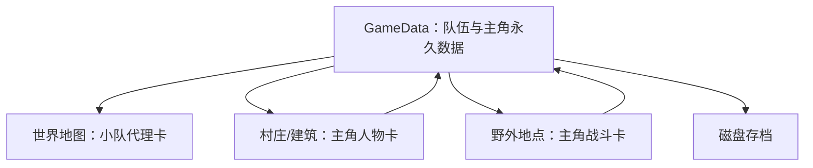

# 主角持久化与成长系统技术实现方案 v0.1

## 1. 文档目的

本方案用于把当前“旅行者/小队代表卡”升级为贯穿整局游戏的唯一主角，并在不推翻现有 StackCraft 卡牌、地点、装备、战斗和存档系统的前提下，补齐以下能力：

- 主角拥有稳定且唯一的身份。
- 主角跨世界地图、村庄、建筑和野外地点时保留完整状态。
- 世界地图只显示一张小队卡，局部地点展开主角与伙伴。
- 主角参与战斗后获得经验并提升等级。
- 主角生命归零进入濒死；确认死亡后结束本局。
- 主角不能被出售、收进背包、作为材料消耗或被地点刷新误删。

本方案对应策划案 v0.2 的以下设计支柱：

- 玩家从一张角色卡开始。
- 世界地图只显示地点与队伍。
- 队伍上限为主角加三名伙伴。
- 主角死亡结束本局。
- 身份由装备、许可证、资产和行为形成，不使用固定职业选择界面。
- 首版继续复用现有实时自动战斗。

## 2. 当前状态评估

### 2.1 已有基础

当前项目已经具备一部分跨场景人物保存能力：

- `GameData.PartyMembers` 保存跨世界地图与地点场景传递的小队成员。
- `CardData` 已保存：
  - 卡牌定义 ID。
  - `PersistentId`。
  - 当前生命。
  - 当前饱食度。
  - 耐久/剩余次数。
  - 已装备卡牌。
  - 装备导致的原始人物定义变化。
- `CardManager.RestoreCardFromData` 可以根据 `CardData` 重新生成卡牌并恢复装备。
- `LocationSceneController` 离开地点时会收集玩家阵营人物并写回 `PartyMembers`。
- 现有战斗系统已经支持生命、攻击、防御、攻击速度、命中、闪避和暴击。

因此本系统属于对现有流程的扩展，不需要重新制作人物卡牌或自动战斗。

### 2.2 当前主要问题

#### 2.2.1 没有明确的主角身份

`GameData` 只有 `PartyMembers`，没有主角标识。部分代码直接取队伍中的第一名成员：

```csharp
partyMembers?.FirstOrDefault(member => member != null)
```

这在加入伙伴、调整队伍顺序、角色死亡或旧存档迁移后都不可靠。

#### 2.2.2 世界地图小队卡正在承担人物数据

当前从世界地图进入地点时，会根据小队卡临时创建一份旅行者数据，只复制：

- 定义 ID。
- 剩余次数。
- 当前生命。
- 当前饱食度。

该流程没有完整复制：

- `PersistentId`。
- 装备。
- 未来增加的等级、经验、精力和状态效果。
- 多名队伍成员。

这意味着世界地图小队卡并非单纯的显示代理，而是可能反向覆盖真正的人物数据。

#### 2.2.3 没有成长字段

当前 `CardData` 不包含：

- 等级。
- 当前经验。
- 精力。
- 濒死状态。
- 角色状态效果。

现有 `CardDefinition` 中的战斗属性属于静态基础数值；装备可以添加修正，但尚未提供主角等级修正。

#### 2.2.4 普通死亡流程不适用于主角

普通卡牌生命归零后直接执行 `CardInstance.Kill()`：

- 通知卡牌死亡事件。
- 卸下装备。
- 生成掉落。
- 销毁卡牌。

主角需要先进入濒死，并在确认死亡后触发本局结束，不能直接走普通卡牌销毁流程。

#### 2.2.5 地点刷新会造成刷经验漏洞

低语森林目前在玩家返回世界地图后再次进入时，会重新生成资源和敌人。加入经验后，玩家可以不断进出地点刷新史莱姆和哥布林。

敌人刷新需要由“每次进入”调整为“按世界时间刷新”。

## 3. 设计结论

### 3.1 唯一数据源

主角的身份与成长数据保存在 `GameData` 中。世界地图小队卡和局部地点人物卡都只是这份数据的表现形式。



禁止同时维护“小队卡生命”和“主角生命”两份权威状态。

### 3.2 不保留跨场景 GameObject

不使用 `DontDestroyOnLoad` 保留主角卡牌实体。

原因：

- 不同地点使用不同棋盘边界。
- 卡牌需要重新绑定当前摄像机、碰撞体和卡牌管理器。
- 跨场景保留实体容易产生重复卡牌。
- 战斗框、装备面板和堆叠关系属于场景级对象。

正确流程是保存数据、销毁旧表现、在新场景重新生成表现。

### 3.3 小队卡和主角卡分工

| 表现 | 使用场景 | 职责 |
| --- | --- | --- |
| 小队卡 | 世界地图 | 旅行、依附地点、显示队伍概况 |
| 主角卡 | 村庄、建筑、野外 | 对话、工作、拖拽、装备、战斗 |
| 伙伴卡 | 局部地点 | 战斗、工作、互动 |

小队卡不参与装备、制作和战斗，也不直接保存人物状态。

## 4. 推荐数据结构

### 4.1 保留现有队伍结构

为降低迁移和接入成本，继续使用 `GameData.PartyMembers` 保存完整队伍，不立即拆成另一套 `PartyData`。

新增稳定主角标识：

```csharp
[System.Serializable]
public class GameData
{
    public string ProtagonistPersistentId;
    public List<CardData> PartyMembers = new();
}
```

任何系统查找主角时必须按 `ProtagonistPersistentId` 匹配，不依赖：

- 队伍索引。
- 卡牌标题。
- `CardDefinition.Id`。
- 当前装备产生的职业外观。

### 4.2 扩展人物存档数据

第一版建议直接扩展 `CardData`，以继续复用现有卡牌恢复流程：

```csharp
[System.Serializable]
public class CardData
{
    // 现有字段略
    public int Level = 1;
    public int Experience;
    public int CurrentEnergy = 4;
    public int MaxEnergy = 4;
    public bool IsDowned;
    public List<CharacterStatusData> StatusEffects = new();
}
```

这些字段只对人物卡生效。普通物品、建筑和敌人的默认值不会影响原有存档。

第一版不保存永久的“职业”字段。职业倾向继续由装备、许可证、资产和行为记录决定。

### 4.3 主角识别接口

建议集中提供主角查询，避免各系统重复写判断：

```csharp
public bool IsProtagonist(CardInstance card);
public bool IsProtagonist(CardData data);
public CardData GetProtagonistData();
public CardInstance FindActiveProtagonistCard();
```

可先放入 `GameDirector`，后续队伍系统扩大时再迁移到 `PartyManager`。

### 4.4 新游戏初始化

新游戏创建时：

1. 创建一份旅行者 `CardData`。
2. 为其生成稳定 `PersistentId`。
3. 设置：
   - 等级 1。
   - 经验 0。
   - 当前生命 15。
   - 精力 4/4。
4. 写入 `GameData.PartyMembers`。
5. 将该 ID 写入 `GameData.ProtagonistPersistentId`。
6. 世界地图根据该数据生成小队代理卡。

主角 ID 只在创建新游戏或迁移旧存档时生成一次。

## 5. 跨场景状态流

### 5.1 世界地图进入地点

当前做法是从小队卡重新创建一份旅行者数据。应改为：

1. 检查小队是否停靠在目标地点。
2. 保存当前世界地图状态。
3. 不读取小队代理卡的战斗数据。
4. 将 `GameData.PartyMembers` 作为完整队伍数据传入地点。
5. `LocationSceneController` 按成员数据依次生成主角和伙伴。

需要移除或替换 `WorldMapBootstrap.TryEnterPartyLocation` 中根据小队卡创建 `expandedMember` 的逻辑。

### 5.2 地点返回世界地图

1. 收集当前地点内所有玩家队伍成员。
2. 将每名人物转换为 `CardData`。
3. 按 `PersistentId` 更新 `GameData.PartyMembers`。
4. 确认主角 ID 仍存在。
5. 保存地点状态。
6. 切换世界地图。
7. 根据主角与队伍数据生成小队代理卡。

如果主角正在濒死，不能通过普通返回按钮绕过死亡处理。

### 5.3 地点进入建筑

地点进入旅馆、市场等子地点时沿用相同流程：

- 父地点先保存队伍。
- 子地点读取相同 `PartyMembers`。
- 返回父地点时更新同一份数据。
- 不因为进入建筑而重新生成主角身份。

### 5.4 保存与读档

存档必须覆盖：

- 主角永久 ID。
- 等级与经验。
- 生命与精力。
- 装备。
- 濒死与状态效果。
- 队伍成员。
- 当前地点和父地点历史。

在地点中直接读档时，主角应恢复到保存时的位置和状态；跨地点恢复时只要求状态一致，位置由地点出生点决定。

## 6. 主角卡特殊规则

主角卡增加统一保护判断：

| 行为 | 主角规则 |
| --- | --- |
| 出售 | 禁止，并提示“主角不能出售” |
| 收进背包 | 禁止 |
| 制作材料 | 禁止 |
| 配方消耗 | 禁止 |
| 普通地点刷新 | 不参与清理 |
| 自动合并 | 只允许合法组队，不与普通人物合并成资源堆 |
| 普通死亡掉落 | 禁止 |
| 普通卡牌容量 | 不计入普通物品容量 |

这些限制应通过统一接口判断，不能分别写死在市场、背包、配方和地点代码中。

## 7. 身份与装备表现

### 7.1 主角身份保持不变

主角应始终保持：

- 稳定姓名。
- 稳定头像。
- 主角专属边框或徽记。
- 稳定永久 ID。

装备剑、弓或法杖时，只改变：

- 战斗属性。
- 攻击类型。
- 装备图标。
- 卡面角标或副标题。

不建议继续让主角直接从“旅行者”变成另一张“战士/游侠/法师”定义。否则装备会同时改变身份、基础属性和存档定义，容易破坏主角连续性。

### 7.2 与现有职业变化兼容

第一阶段可以保留普通伙伴的职业变化，但主角禁用 `ClassChangeResult` 引起的定义替换，只应用装备提供的属性修正。

后续若需要职业称号，可以根据当前装备计算显示文本，例如：

- 旅行者·持剑
- 旅行者·弓手
- 旅行者·施法者

称号属于显示结果，不写成永久职业。

## 8. 等级与经验

### 8.1 定位

新增“旅人等级”，代表主角的基础生存与战斗经验。

旅人等级不是职业等级：

- 不锁定商旅、冒险或店主路线。
- 不提供复杂技能树。
- 不替代装备、伙伴和世界关系。
- 只提供适度的基础成长和阶段反馈。

第一版只有主角获得等级。伙伴通过装备、关系任务和个人能力成长。

### 8.2 初始数值

| 参数 | 数值 |
| --- | ---: |
| 初始等级 | 1 |
| 等级上限 | 10 |
| 初始生命 | 15 |
| 初始攻击 | 2 |
| 初始防御 | 1 |
| 初始精力 | 4 |

与当前旅行者基础战斗数值保持一致。

### 8.3 升级经验

每一级所需经验：

```text
升级所需经验 = 15 +（当前等级 - 1）× 10
```

示例：

| 当前等级 | 升到下一级所需经验 |
| ---: | ---: |
| 1 | 15 |
| 2 | 25 |
| 3 | 35 |
| 4 | 45 |

达到等级上限后停止累积可用经验，避免显示无意义的大数字。

### 8.4 每级成长

- 每级最大生命 `+2`。
- 偶数等级攻击 `+1`。
- 3、5、7、9级防御 `+1`。
- 升级时当前生命只增加本次获得的生命上限，不直接完全恢复。

示例：

| 等级 | 最大生命 | 基础攻击 | 基础防御 |
| ---: | ---: | ---: | ---: |
| 1 | 15 | 2 | 1 |
| 2 | 17 | 3 | 1 |
| 3 | 19 | 3 | 2 |
| 4 | 21 | 4 | 2 |
| 5 | 23 | 4 | 3 |

以上是原型数值，后续根据森林战斗时长调整。

### 8.5 属性应用顺序

角色恢复时按以下顺序计算：

1. 从基础 `CardDefinition` 创建战斗属性。
2. 应用主角等级修正。
3. 恢复并应用装备修正。
4. 恢复当前生命。
5. 将当前生命限制在最终生命上限内。
6. 刷新卡面和详情面板。

等级修正不能直接永久写回 `CardDefinition`，否则会修改所有使用同一定义的村民或伙伴。

## 9. 战斗经验结算

### 9.1 经验来源

第一版经验主要来自：

- 击败敌人。
- 完成战斗悬赏。
- 击败精英和首领。

建议初始奖励：

| 内容 | 经验 |
| --- | ---: |
| 史莱姆 | 5 |
| 哥布林 | 10 |
| 普通野兽 | 8–12 |
| 精英敌人 | 20–30 |
| 新手史莱姆悬赏 | 10 |

新手流程可设计为：

```text
击败史莱姆获得 5 经验
→ 回村交付悬赏获得 10 经验
→ 主角升到 2 级
```

### 9.2 结算条件

经验按参与战斗计算，不按最后一击计算。

主角满足以下条件时获得经验：

- 本次战斗中存在玩家阵营参与者。
- 主角实际加入过本次战斗。
- 主角在敌人死亡时尚未确认死亡。
- 同一敌人只结算一次经验。

自动战斗不适合争夺最后一击，因此不能把经验只给造成致命伤的角色。

### 9.3 推荐接入点

不要只监听现有 `CardManager.OnCardKilled`，因为该事件只提供死亡卡牌，无法可靠判断战斗参与者和重复结算。

建议在 `CombatTask` 中：

1. 敌人生命归零。
2. 记录死亡敌人的经验奖励。
3. 根据本次战斗参与者判断主角是否参与。
4. 调用 `CharacterProgressionService.GrantExperience`。
5. 再执行敌人掉落和普通死亡流程。

敌人经验值可以新增到 `CardDefinition`：

```csharp
[SerializeField, Min(0)]
private int experienceReward;
```

建筑、物品和中立 NPC 默认经验为 0。

## 10. 升级反馈

升级不弹出复杂技能选择界面，避免打断当前自动战斗。

第一版反馈：

- 主角卡短暂发光。
- 卡牌上方显示“升级！”。
- 左下角消息栏显示本次变化。
- 等级和经验条立即更新。

示例：

```text
旅行者升到 2 级
最大生命 +2
攻击 +1
```

3、6、9级的天赋选择可以作为后续版本，不进入第一阶段。

## 11. 濒死与本局结束

### 11.1 濒死流程

主角生命归零时：

1. 拦截普通 `Kill()`。
2. 设置 `IsDowned = true`。
3. 主角停止攻击和行动进度。
4. 卡面变灰并显示濒死标志。
5. 显示“救援”与“撤退”上下文操作。

### 11.2 救援

满足以下任意条件可救援：

- 队伍中有仍可行动的伙伴并持有治疗物品。
- 使用指定救援药品。
- 触发允许救援的 NPC 或地点能力。

第一版可以只实现“伙伴使用药品救援”，其他方式后续扩展。

救援成功后：

- 主角恢复至少 1 点生命。
- 清除濒死状态。
- 本场战斗中不立刻重新获得满额行动进度。

### 11.3 撤退

撤退始终可见，但根据地点产生代价：

- 消耗世界时间。
- 丢失少量金币或普通货物。
- 返回最近安全地点。

主角单独行动且没有救援手段时，允许最后一次撤退确认，避免一次误拖拽直接结束长时间存档。

### 11.4 确认死亡

主角确认死亡后：

- 结束全部战斗。
- 禁止继续保存为可恢复的活动存档。
- 生成本局纪事。
- 记录死亡原因、地点、等级、任务、伙伴、资产和终局准备度。
- 封存本局并返回标题界面。

伙伴死亡不立即结束本局，但永久离开当前队伍。

## 12. 野外地点刷新调整

### 12.1 新规则

低语森林等野外地点不再每次从世界地图进入都刷新。

建议第一版：

- 首次进入时生成随机内容。
- 同一天重复进入时恢复原有地点状态。
- 每个新自然日首次进入时刷新普通资源和普通敌人。
- 精英、任务敌人、宝箱和兴趣点由独立世界状态控制。
- 进入建筑或子地点后返回父地点绝不刷新。

### 12.2 刷新标记

地点状态增加：

```csharp
public int LastRandomRefreshDay;
public int RandomSeed;
```

当 `CurrentWorldDay > LastRandomRefreshDay` 时才允许重新生成随机内容。

这样可以同时解决：

- 反复进出刷经验。
- 反复进出刷资源。
- 地点状态缺乏连续感。

## 13. UI方案

### 13.1 主角卡

卡面只显示必要信息：

- 主角姓名。
- `Lv.数字`。
- 当前生命。
- 主角专属金青色徽记或边框。

装备和状态通过小图标表达，长文本放入详情面板。

### 13.2 左下角主角详情

选中主角时显示：

- 头像与姓名。
- 等级和经验条。
- 当前生命/最大生命。
- 当前精力/最大精力。
- 攻击和防御。
- 已装备武器与护甲。
- 流血、中毒、疲劳等状态。

### 13.3 世界地图小队信息

世界地图仍显示一张小队卡。左下角显示：

```text
旅行者  Lv.3
生命 17/19
精力 3/4
队伍 2/4
所在地点：河湾村
```

小队卡生命条读取主角数据，不读取代理卡自身的独立生命。

### 13.4 战斗反馈

战斗结束后显示：

```text
击败史莱姆
获得 5 经验
距离下一等级：10/15
```

如果一次战斗击败多名敌人，可合并为一次结算提示，避免消息刷屏。

## 14. 旧存档迁移

旧存档没有主角 ID、等级和经验。加载时执行一次迁移：

1. 如果 `ProtagonistPersistentId` 已存在，不迁移。
2. 在 `PartyMembers` 中优先寻找原旅行者/村民基础定义。
3. 如果找到：
   - 保留其现有 `PersistentId`。
   - 如果没有 ID，生成一个。
   - 设置为主角。
4. 如果队伍为空：
   - 创建默认旅行者数据。
5. 缺失成长字段使用默认值：
   - 等级 1。
   - 经验 0。
   - 精力 4/4。
   - 非濒死。
6. 保存时写入新版本数据。

迁移不得覆盖旧存档中的生命、装备和饱食度。

## 15. 推荐代码结构

建议新增：

```text
Assets/StackCraft/Scripts/Core/
├── CharacterProgressionService.cs
├── ProtagonistRules.cs
└── ProtagonistStatePresenter.cs
```

职责：

### `CharacterProgressionService`

- 计算升级所需经验。
- 增加经验。
- 处理连续升级。
- 计算等级属性修正。
- 发出经验和升级事件。

### `ProtagonistRules`

- 判断卡牌是否为主角。
- 判断是否允许出售、收纳、消耗和销毁。
- 处理主角濒死入口。

### `ProtagonistStatePresenter`

- 把主角等级、经验、生命和精力同步到卡面与 UI。
- 不保存数据，只负责显示。

需要修改的主要文件：

- `Assets/StackCraft/Scripts/SaveSystem/GameData.cs`
- `Assets/StackCraft/Scripts/Core/GameDirector.cs`
- `Assets/StackCraft/Scripts/Core/WorldMapBootstrap.cs`
- `Assets/StackCraft/Scripts/Core/LocationSceneController.cs`
- `Assets/StackCraft/Scripts/Card/CardInstance.cs`
- `Assets/StackCraft/Scripts/Card/CardManager.cs`
- `Assets/StackCraft/Scripts/Card/Components/CardEquipper.cs`
- `Assets/StackCraft/Scripts/Combat/CombatTask.cs`
- `Assets/StackCraft/Scripts/UI/WorldMapPartyStatusView.cs`

## 16. 分阶段实施

### P0：唯一身份与跨场景状态

- 新游戏生成稳定主角 ID。
- 旧存档迁移主角 ID。
- 世界地图小队卡改为纯代理。
- 进入地点时展开完整 `PartyMembers`。
- 往返场景后保留生命、装备和永久 ID。

完成判定：世界地图、河湾村、旅馆、市场和低语森林之间连续往返，主角始终是同一个人物。

### P1：经验和等级

- `CardData` 增加等级与经验。
- 敌人定义增加经验奖励。
- 战斗结算接入参与式经验。
- 应用等级属性修正。
- 增加卡面等级和详情经验条。

完成判定：击败史莱姆并交付悬赏后可升到2级，切换场景和读档后状态不变。

### P2：主角保护规则

- 禁止出售、收进背包、配方消耗和普通销毁。
- 主角装备不替换永久身份。
- 地点刷新不清理主角。

完成判定：所有普通卡牌操作都不能造成主角消失或身份改变。

### P3：濒死与本局结束

- 主角零生命进入濒死。
- 伙伴药品救援。
- 撤退代价。
- 确认死亡和本局纪事。

完成判定：主角死亡能够正确结束本局，不损坏其他存档。

### P4：地点按日刷新

- 地点记录刷新日期与随机种子。
- 同日往返不刷新敌人。
- 新一天重新生成普通资源和敌人。

## 17. 实施记录（2026-07-30）

本轮已落地：

- P0：稳定主角 ID、旧存档迁移、完整队伍跨世界地图/地点/建筑传递、地点内直接保存队伍状态。
- P1：等级与经验字段、1～10级成长公式、装备后属性恢复顺序、史莱姆和哥布林战斗经验、新手史莱姆任务经验。
- P2：禁止主角出售、收进背包、被配方消耗、被随机地点刷新删除；主角装备不再触发永久职业定义替换；主角不计入普通物品容量。
- P3 基础：生命归零拦截普通销毁并进入倒地状态；提供伙伴存活判定、背包消耗品救援、恢复和确认死亡接口。
- P4：地点保存刷新日期与随机种子，同日重复进入不刷新，从子地点返回不刷新，新自然日首次从世界地图进入时刷新。
- UI：主角卡显示等级；详情显示等级、经验、生命、精力和倒地状态；世界地图小队信息读取主角权威数据。

仍需在 Unity 编辑器中补充和验收：

- 为倒地状态制作专用灰色卡面、救援/撤退/确认死亡上下文面板和撤退代价。
- 将升级提示接入左下角消息面板，并补充经验条动画。
- 为更多敌人、精英、首领和任务配置经验奖励。
- 在世界地图、河湾村、旅馆、市场、白石城和低语森林之间执行完整 Play Mode 往返测试。

完成判定：不能通过反复进出低语森林无限刷新怪物和经验。

## 17. 测试清单

### 数据与场景

- 新游戏只有一个主角永久 ID。
- 主角在世界地图进入河湾村后 ID 不变。
- 河湾村进入旅馆再返回后 ID 不变。
- 河湾村进入低语森林、受伤、返回后生命不变。
- 装备武器后跨场景，装备和属性保持。
- 调整队伍顺序后仍能通过 ID 找到主角。
- 加入伙伴后，世界地图仍只显示一张小队卡。

### 升级

- 经验不足时不升级。
- 达到阈值时只升级一次。
- 一次获得大量经验时可以连续升级。
- 达到10级后不再升级。
- 升级后的生命、攻击和防御符合表格。
- 升级只增加相应当前生命，不完全治疗。
- 保存读档后等级、经验和属性一致。

### 战斗

- 主角参与击杀获得经验。
- 主角未参与的 NPC 战斗不给主角经验。
- 同一敌人不会重复提供经验。
- 最后一击由伙伴造成时，参与战斗的主角仍获得经验。
- 非敌对 NPC 死亡不提供经验。

### 主角保护

- 主角不能出售。
- 主角不能放进背包。
- 主角不能成为制作材料。
- 地点刷新不会删除主角。
- 装备不会改变主角永久 ID。
- 主角零生命不会执行普通掉落和销毁。

### 地点刷新

- 同一天重复进入森林不刷新敌人。
- 进入建筑再返回不刷新父地点。
- 新的一天首次进入时刷新普通内容。
- 任务敌人不会被普通刷新删除。

## 18. 验收标准

本系统第一版完成时，应满足：

- 玩家能够明确识别哪一张是自己的主角卡。
- 主角拥有稳定姓名、头像和永久 ID。
- 主角的生命、等级、经验和装备跨所有已实现地点保存。
- 世界地图只有一张小队卡，不复制人物数据。
- 击败敌人能够获得经验并升级。
- 升级提供可理解但不过度膨胀的数值成长。
- 主角不能被普通系统误出售、误消耗或误删除。
- 主角生命归零后进入濒死，而不是普通卡牌死亡。
- 同一天反复进出森林不能无限刷新经验。
- 旧存档能够迁移且不丢失生命与装备。

## 19. 暂不包含

第一版不实现：

- 复杂技能树。
- 属性点自由分配。
- 多职业转职。
- 伙伴独立经验等级。
- 战斗主动技能时间轴。
- 等级重置或洗点。
- 无限等级与局外永久属性叠加。

后续可在3、6、9级加入一次轻量天赋选择，但必须在主角跨场景、战斗升级和死亡流程稳定后再做。

## 20. 下一步

优先完成 P0“唯一身份与跨场景状态”，再接入经验系统。

如果先做经验而不修正小队代理的数据流，等级和装备仍会在世界地图与地点往返时丢失，因此不能跳过 P0。
