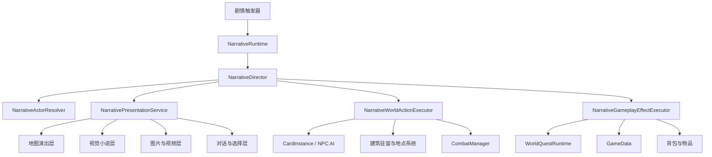

# 剧情表现系统技术方案 v0.1

## 1. 文档目的

本文档规划一套适用于《Card Colony》的通用剧情表现系统，用于统一承载以下内容：

- 地图上的卡牌式剧情演出；
- 玩家人物与 NPC 的对话；
- NPC 与 NPC 之间的交谈、移动、攻击、追逐、逃跑等互动；
- 全屏图片、章节插画和全屏视频；
- 保留对话框与选项的视觉小说式演出；
- 剧情结束后接入任务、战斗、物品、关系、建筑驻留和场景切换等正式游戏结果；
- 剧情跳过、存档恢复、失败兜底和调试日志。

本方案的核心不是制作传统电影式过场动画，而是为现有卡牌、地图、对话、任务和战斗系统增加一个可编排的“剧情导演层”。剧情导演负责控制表现顺序，现有游戏系统仍然负责真实规则和持久化结果。

---

## 2. 核心设计结论

### 2.1 一套剧情数据，三种表现模式

剧情定义不按“地图剧情”“视觉小说剧情”“视频剧情”拆成三套系统，而是使用同一套指令序列，在运行时切换表现模式：

1. **地图演出模式**
   - 保留当前地点地图；
   - 镜头聚焦相关卡牌；
   - NPC 可以靠近、交谈、攻击、受击、逃跑或进入建筑；
   - 适合大多数任务事件和地点事件。

2. **视觉小说模式**
   - 暂停地图交互；
   - 全屏显示场景图、CG 或人物立绘；
   - 底部保留姓名、头像、对话和选择；
   - 适合重要人物登场、回忆和章节剧情。

3. **全屏媒体模式**
   - 使用图片或视频作为全屏背景；
   - 对话框、字幕和选择仍由游戏 UI 独立显示；
   - 适合城镇介绍、商队出发、灾难、战争和章节开场。

同一段剧情可以连续切换模式，例如：

```text
地图上村长走向玩家
→ 地图对话
→ 淡出地图
→ 显示河湾村全屏插画
→ 播放商队出发视频，同时继续显示台词
→ 返回地图
→ 正式接取任务
```

### 2.2 剧情表现与游戏结果分离

剧情中的行为必须区分两类：

- **表现行为**：镜头移动、临时移动卡牌、播放攻击动作、显示图片、播放声音、切换表情；
- **游戏结果**：扣除生命、杀死人物、转移物品、接取任务、改变关系、进入建筑、开始战斗、切换地点。

表现可以被快进或跳过，游戏结果不能因为跳过演出而丢失。

例如“哥布林刺伤商人”不能只播放攻击动画，也不能只依赖正常战斗 AI。推荐拆成：

```text
PlayCinematicAttack(哥布林, 商人)
ApplyDamage(商人, 3, resultId: "merchant_wounded")
```

跳过剧情时可以不播放第一条，但必须幂等执行第二条。

### 2.3 剧情导演临时接管参与者

剧情开始时，系统只锁定参与演出的卡牌，不应默认冻结整个世界。被剧情接管的卡牌需要暂停：

- 日常闲逛；
- 主动追踪；
- 自主交谈；
- 玩家拖动；
- 普通 AI 决策。

剧情结束、取消或失败时，导演释放控制权并恢复正常状态。

### 2.4 世界地图规则保持不变

世界地图仍然遵守“整个小队一起行动”的既定规则。剧情系统不能把某个小队成员单独留在世界地图节点上。

世界地图剧情可以：

- 聚焦小队卡；
- 显示旁白、图片或视频；
- 触发地点发现、道路事件和正式战斗；
- 修改整个小队的当前地点或旅行状态。

如果剧情需要具体人物单独行动，应进入地点地图或建筑内部后再表现。

---

## 3. 当前项目基础与限制

### 3.1 可复用能力

当前项目已经具备以下基础：

- `DialoguePanelView`
  - 显示说话者头像、姓名和对话；
  - 支持独立的选择弹窗；
  - 可复用其视觉结构和选项列表。

- `DialogueManager`
  - 连接普通 NPC 对话和世界任务对话；
  - 能把对话选择汇报给任务系统。

- `NpcInteractionManager`
  - 已使用 `Initiator` 和 `Target` 表达互动双方；
  - 支持人物靠近、互动框、返回原位；
  - 已有 NPC 自主交谈的基础表现。

- `LocationNpcActivity`
  - 负责地点 NPC 的日常闲逛和自主社交；
  - 剧情开始时需要暂时暂停相关 NPC 的活动。

- `CombatManager.StartCombat(...)`
  - 可作为剧情进入正式战斗的入口。

- `WorldQuestRuntime` / `WorldQuestEngine`
  - 可承接剧情选择、任务接取、任务完成和事件汇报。

- `GameData.BuildingPersonSlots`
  - 是人物进入建筑的权威驻留数据；
  - 剧情不能只隐藏卡牌来伪造人物进入建筑。

### 3.2 当前不能直接满足的需求

现有 `DialogueManager.CanStartDialogue()` 仍然限制为“玩家人物 + 可对话 NPC”。因此：

- NPC 与 NPC 的剧情台词不能直接走现有普通对话入口；
- 没有卡牌实例的旁白、远程人物和回忆人物无法自然成为说话者；
- 普通对话管理器不应承担全屏图片、视频、镜头和多人物动作编排；
- `NpcInteractionManager` 当前是单一互动会话，不能直接表达多个并行动作组；
- 现有系统缺少剧情节点、断点恢复、跳过和持久化结果的统一协议。

因此推荐新增独立的 `NarrativeDirector`，并复用现有系统的能力，而不是继续扩大 `DialogueManager` 的职责。

---

## 4. 总体架构



### 4.1 主要职责

#### `NarrativeDefinition`

剧情资源定义，推荐使用 `ScriptableObject`：

- 唯一剧情 ID；
- 版本号；
- 触发条件；
- 参与者声明；
- 节点与指令；
- 分支；
- 完成标记；
- 失败和缺失参与者策略。

#### `NarrativeRuntime`

负责真实剧情状态：

- 当前剧情 ID；
- 当前节点 ID；
- 已选择分支；
- 已提交结果 ID；
- 是否可以跳过；
- 是否等待战斗、场景切换或玩家选择；
- 保存和恢复剧情检查点。

#### `NarrativeDirector`

负责执行剧情指令：

- 启动和结束剧情；
- 获取参与者控制权；
- 按顺序或并行执行指令；
- 处理暂停、快进、跳过和取消；
- 捕获异常并执行清理；
- 把表现指令和游戏结果分发给不同执行器。

#### `NarrativeActorResolver`

把剧情中的角色名绑定到真实对象：

```text
PlayerLeader → 当前小队选中人物
Mayor        → 当前地点的村长 CardInstance
Merchant     → 当前地点定义为杂货商的 NPC
Attacker     → 本剧情临时生成的哥布林首领
RemoteLord   → 仅有头像、没有地图卡牌的远程人物
```

#### `NarrativePresentationService`

统一管理：

- 地图遮罩；
- 视觉小说界面；
- 全屏图片；
- 全屏视频；
- 对话框；
- 选择弹窗；
- 淡入淡出；
- 字幕、历史记录和自动播放。

#### `NarrativeWorldActionExecutor`

负责地图中的人物动作：

- 移动、面向、追逐、逃跑；
- 临时站位；
- 剧情攻击和受击；
- 进入或离开建筑；
- 生成、隐藏和移除临时剧情卡；
- 调用正式战斗。

#### `NarrativeGameplayEffectExecutor`

只负责可持久化结果：

- 设置剧情标记；
- 修改关系；
- 给予或移除物品；
- 修改生命；
- 接取、推进、完成任务；
- 修改建筑驻留；
- 切换地点；
- 记录死亡和其他不可逆结果。

---

## 5. 剧情数据模型

### 5.1 推荐资源结构

```csharp
NarrativeDefinition
├─ Id
├─ Version
├─ DisplayName
├─ TriggerPolicy
├─ CanSkip
├─ ActorBindings[]
├─ Nodes[]
└─ EntryNodeId

NarrativeNodeDefinition
├─ Id
├─ Commands[]
├─ NextNodeId
├─ Choices[]
├─ CheckpointPolicy
└─ FailureNodeId

NarrativeCommandDefinition
├─ CommandId
├─ Type
├─ ActorRole
├─ TargetRole
├─ Text
├─ AssetReference
├─ NumberParameters
├─ StringParameters
├─ WaitPolicy
└─ ResultId
```

第一版不建议立即采用复杂的深层继承树。Unity 2022 下可以先使用“指令枚举 + 分类参数结构”，保持序列化、Inspector 和版本迁移简单。等指令数量稳定后，再考虑 `SerializeReference` 多态指令。

### 5.2 剧情参与者声明

```csharp
NarrativeActorBinding
├─ RoleId               // 剧情内角色名，如 Mayor
├─ ResolveMode          // 解析方式
├─ PersistentId         // 精确实例
├─ CardDefinitionId     // 卡牌定义
├─ PartyMemberId        // 小队成员
├─ LocationId
├─ BuildingId
├─ SpawnPolicy
├─ MissingActorPolicy
└─ PresentationOnlyData // 无地图实体时的头像、姓名、立绘
```

推荐的 `ResolveMode`：

| 模式 | 用途 |
|---|---|
| `PersistentId` | 精确查找某个已有角色实例 |
| `CardDefinitionId` | 查找当前地点某类 NPC |
| `SelectedPartyMember` | 当前小队选中人物 |
| `PartyLeader` | 主角或队长 |
| `BuildingOccupant` | 指定建筑人物槽内的成员 |
| `SpawnTemporary` | 生成临时剧情 NPC |
| `PresentationOnly` | 只有头像或立绘，不生成卡牌 |

推荐的 `MissingActorPolicy`：

- `FailNarrative`：缺少参与者时终止并记录错误；
- `SkipCommand`：跳过只影响表现的指令；
- `SpawnFallback`：生成临时替代角色；
- `UsePortraitOnly`：改用头像参与台词；
- `JumpToFailureNode`：进入预设失败分支。

### 5.3 不应依赖当前坐标查找人物

人物位置会因为拖动、建筑驻留、AI 和场景重建而变化。剧情必须优先依赖：

1. `PersistentId`；
2. 小队成员 ID；
3. 建筑人物槽数据；
4. 当前地点中的卡牌定义 ID；
5. 临时生成策略。

坐标只用于演出站位，不用于确认角色身份。

---

## 6. 指令分类

### 6.1 流程控制指令

| 指令 | 作用 |
|---|---|
| `Wait` | 等待固定时间，支持快进 |
| `WaitForInput` | 等待玩家点击继续 |
| `Jump` | 跳转到节点 |
| `BranchByFlag` | 按剧情或任务标记分支 |
| `BranchByCondition` | 按物品、关系、生命等条件分支 |
| `Parallel` | 同时执行一组动作 |
| `Sequence` | 顺序执行一组动作 |
| `Checkpoint` | 建立可保存和恢复的剧情检查点 |
| `EndNarrative` | 正常结束剧情 |

### 6.2 对话与文本指令

| 指令 | 作用 |
|---|---|
| `ShowDialogue` | 指定角色说话 |
| `ShowNarration` | 显示无角色旁白 |
| `ShowChoice` | 显示选择并跳转分支 |
| `SetSpeakerExpression` | 切换立绘或头像状态 |
| `ShowSpeechBubble` | 地图卡牌上方显示短气泡 |
| `AddDialogueHistory` | 写入剧情历史记录 |

剧情对话的说话者可以是：

- 玩家人物；
- 任意 NPC；
- 没有卡牌实例的远程人物；
- 旁白；
- 未知人物或系统提示。

### 6.3 地图人物指令

| 指令 | 作用 |
|---|---|
| `AcquireActorControl` | 暂停该角色 AI 和拖动 |
| `ReleaseActorControl` | 恢复角色控制权 |
| `MoveToActor` | 移动到目标附近 |
| `MoveToMarker` | 移动到剧情舞台点 |
| `FaceActor` | 面向目标 |
| `ReturnToOrigin` | 返回演出前位置 |
| `ChaseActor` | 持续追赶目标 |
| `FleeFromActor` | 远离指定目标 |
| `ShowEmote` | 显示惊讶、愤怒、疑问等提示 |
| `EnterBuilding` | 通过建筑人物槽进入建筑 |
| `LeaveBuilding` | 清理槽位并在地点地图生成角色 |
| `SpawnActor` | 生成临时或永久人物卡 |
| `DespawnActor` | 移除临时演出对象 |

### 6.4 冲突与战斗指令

必须明确区分剧情攻击和正式战斗。

#### `PlayCinematicAttack`

- 只播放攻击者靠近、挥击、目标受击和短暂停顿；
- 不启动战斗 AI；
- 不默认修改生命；
- 可以被快进；
- 适合偷袭、推搡、演示受伤和固定结果。

#### `ApplyDamage`

- 通过游戏结果执行器修改真实生命；
- 必须带唯一 `ResultId`；
- 重复恢复或跳过剧情时不能重复扣血；
- 生命归零时调用统一死亡流程，而不是只隐藏卡牌。

#### `StartCombat`

- 调用现有 `CombatManager.StartCombat(...)`；
- 剧情进入 `WaitingForCombat` 状态；
- 战斗胜负作为剧情后续分支条件；
- 战斗期间由战斗系统接管参与者；
- 战斗结束后剧情从检查点继续。

### 6.5 图片、视频与镜头指令

| 指令 | 作用 |
|---|---|
| `EnterVisualNovelMode` | 进入视觉小说模式 |
| `ExitVisualNovelMode` | 返回地图模式 |
| `ShowFullscreenImage` | 显示全屏图片或 CG |
| `HideFullscreenImage` | 隐藏图片 |
| `PlayFullscreenVideo` | 播放全屏视频 |
| `PauseVideo` | 暂停视频但保留画面 |
| `StopVideo` | 停止并释放视频资源 |
| `SetCharacterPortrait` | 设置人物立绘 |
| `ClearCharacterPortraits` | 清理立绘 |
| `FocusActor` | 镜头聚焦地图卡牌 |
| `PanCamera` | 镜头平移到舞台点 |
| `ShakeCamera` | 震动表现 |
| `FadeIn` / `FadeOut` | 淡入淡出 |

### 6.6 音频指令

- `PlayMusic`
- `StopMusic`
- `CrossFadeMusic`
- `PlaySoundEffect`
- `PlayVoice`
- `StopVoice`

语音、字幕和对话文本应独立。语音缺失不能阻断剧情。

### 6.7 游戏结果指令

- `SetNarrativeFlag`
- `ChangeRelationship`
- `GiveCardToBackpack`
- `RemoveCardFromBackpack`
- `GiveCoins`
- `StartQuest`
- `ReportQuestEvent`
- `CompleteQuest`
- `AssignBuildingPersonSlot`
- `ClearBuildingPersonSlot`
- `MovePartyToLocation`
- `SetActorHealth`
- `ApplyDamage`
- `KillActor`

所有不可逆结果必须具备唯一 `ResultId`，并记录到存档的已提交结果集合中。

---

## 7. NPC 之间的剧情互动

### 7.1 NPC 交谈

现有普通对话由玩家人物发起，不适合直接承担 NPC 与 NPC 的剧情对话。推荐流程：

1. 导演解析 `Mayor` 和 `Blacksmith`；
2. 暂停双方 `LocationNpcActivity`；
3. 让发起者移动到目标附近；
4. 可选复用 `NpcInteractionManager` 的双卡站位和互动框；
5. 由 `NarrativeDialoguePresenter` 显示双方台词；
6. 对话结束后让人物返回原位或保留新位置；
7. 释放双方 AI。

剧情对话不应调用 `DialogueManager.CanStartDialogue()`，因为它目前只允许玩家人物与 NPC 的组合。

### 7.2 NPC 攻击 NPC

剧情攻击分为三种强度：

| 类型 | 表现 | 真实结果 |
|---|---|---|
| 威吓 | 靠近、挥击、目标后退 | 不扣血 |
| 固定伤害 | 攻击与受击动画 | 剧情指定扣血 |
| 正式冲突 | 安排双方站位 | 启动真实战斗 |

不能通过模拟玩家拖卡或模拟点击来触发剧情攻击。剧情系统应调用明确的动作接口，避免 UI 改版后剧情失效。

### 7.3 追逐与逃跑

追逐属于持续动作，需要定义：

- 目标；
- 速度；
- 最大持续时间；
- 成功距离；
- 超时策略；
- 是否允许穿过卡牌；
- 到达边界后是离场、进入建筑还是停下。

示例：

```text
Parallel
├─ Merchant.FleeTo(VillageGate)
├─ Goblin.Chase(Merchant)
└─ Guard.MoveTo(MarketSquare)

WaitAll
Guard: “住手！”
```

### 7.4 进入和离开建筑

人物进入建筑必须使用已有建筑人物槽规则：

1. 调用 `AssignMemberToBuildingSlot(...)` 或对应正式服务；
2. 保存 `PersistentId + LocationId + BuildingId + SlotId`；
3. 当前地点地图移除人物卡实例；
4. 进入建筑内部时根据槽位数据生成同一人物；
5. 离开建筑时清理槽位，并在外部地图重新生成同一人物。

剧情不能只执行 `card.SetActive(false)` 来表示进入建筑，否则场景切换和存档后人物状态会分裂。

### 7.5 多人物并行演出

第一版并行组需要支持：

- `WaitAll`：全部动作完成后继续；
- `WaitAny`：任意动作完成后继续，并决定是否取消其他动作；
- `FireAndForget`：启动环境动作，不阻塞剧情；
- 超时：防止路径或对象异常导致剧情永久卡住。

同一参与者不能在同一个并行组里同时执行两个互斥位移动作。编辑器验证器必须报告这种冲突。

---

## 8. 视觉小说与全屏媒体界面

### 8.1 `NarrativePresentationRoot` 层级

建议在正式 `UIRoot.prefab` 中新增一个默认隐藏的剧情根节点：

```text
NarrativePresentationRoot
├─ InputBlocker
├─ MediaLayer
│  ├─ FullscreenImage
│  ├─ VideoSurface
│  └─ MediaTint
├─ CharacterLayer
│  ├─ LeftPortrait
│  ├─ CenterPortrait
│  └─ RightPortrait
├─ MapOverlayLayer
│  ├─ FocusMask
│  └─ LetterboxBars
├─ DialogueLayer
│  ├─ SpeakerName
│  ├─ Portrait
│  ├─ DialogueText
│  └─ ContinueIndicator
├─ ChoiceLayer
│  ├─ ChoiceTitle
│  └─ ScrollableChoiceList
├─ ControlLayer
│  ├─ AutoButton
│  ├─ SkipButton
│  └─ HistoryButton
└─ FadeLayer
```

### 8.2 对话 UI 复用策略

不建议直接把当前 `DialoguePanel.prefab` 整体移动到全屏剧情层，因为普通地图对话和视觉小说对话的尺寸、锚点和背景需求不同。

推荐拆出共享数据模型：

```csharp
DialoguePresentationModel
├─ SpeakerId
├─ SpeakerName
├─ Portrait
├─ BackgroundPortrait
├─ Text
├─ VoiceClip
├─ Choices[]
└─ ContinueMode
```

然后使用两个 View：

- `DialoguePanelView`：普通地图交谈；
- `NarrativeDialogueView`：全屏视觉小说对话。

两者共享文本推进、打字机、选择数据和历史记录，但拥有独立布局。

### 8.3 图片规范

第一版建议：

- 设计基准：1920×1080；
- 使用 `AspectRatioFitter` 或等效逻辑保持比例；
- 支持 `Fit`、`FillCrop` 和 `Stretch` 三种模式；
- 默认使用 `Fit`，必要时显示上下或左右黑边；
- 重要信息放在画面安全区，避免被底部对话框遮挡；
- 每张图片可配置备用纯色和加载失败提示。

### 8.4 视频规范

推荐使用：

```text
VideoPlayer
→ RenderTexture
→ RawImage(VideoSurface)
```

视频规则：

- 视频不烘焙对话字幕；
- 对话框、选择和字幕继续使用游戏 UI；
- 支持循环、等待播放完成和后台继续播放；
- 支持首帧或独立图片作为加载占位；
- 视频加载失败时切换备用图片并继续剧情；
- 退出剧情时停止播放并释放 `RenderTexture` 引用；
- 跳过视频不等于跳过后续游戏结果；
- 第一版优先使用本地资源，不在运行时依赖网络视频。

### 8.5 输入行为

视觉小说模式中：

- 点击空白区域：继续下一句；
- 点击选项：锁定输入直到分支跳转完成；
- `Esc`：打开剧情暂停菜单，不应直接退出剧情；
- `Space`：可作为继续快捷键；
- `Ctrl`：可作为按住快进，后续版本实现；
- 视频播放时仍可显示台词和选择；
- 出现选择时禁止点击空白区域越过选择。

---

## 9. 运行状态机

```text
Idle
→ Preparing
→ Playing
   ├─ WaitingForInput
   ├─ WaitingForChoice
   ├─ WaitingForActorAction
   ├─ WaitingForMedia
   ├─ WaitingForCombat
   └─ WaitingForSceneLoad
→ Completing
→ Idle

任意运行状态
→ Skipping
→ Completing

任意运行状态
→ Failed
→ Cleanup
→ Idle
```

### 9.1 `Preparing`

- 验证剧情资源；
- 解析参与者；
- 检查当前场景和地点；
- 检查是否处于战斗、市场、普通对话或场景切换；
- 记录参与者原始位置和 AI 状态；
- 获取输入和镜头控制权。

### 9.2 `Playing`

- 逐条执行指令；
- 每条指令必须支持完成、失败、取消和超时；
- 串行指令只能在前一条完成后继续；
- 并行组按等待策略汇合。

### 9.3 `Completing`

- 提交尚未提交的最终结果；
- 停止图片、视频、语音和 Tween；
- 清理临时人物；
- 恢复相机和 HUD；
- 恢复未永久改变的卡牌位置；
- 恢复 AI 和拖动；
- 写入剧情完成标记。

### 9.4 `Failed`

任何异常都必须进入统一清理流程，不能留下：

- 永久黑屏；
- 无法操作的卡牌；
- 被暂停但没有恢复的 AI；
- 悬空的互动框；
- 未释放的视频；
- 重复发放的任务奖励。

---

## 10. 输入、时间和系统互斥

### 10.1 输入锁

推荐增加统一 `GameplayInputLockService`，使用所有者令牌而不是简单布尔值：

```text
Acquire("Narrative:merchant_ambush")
Release("Narrative:merchant_ambush")
```

这样剧情、市场、战斗和场景切换不会互相错误解锁。

剧情期间通常禁止：

- 拖动卡牌；
- 打开市场；
- 切换地点；
- 开始另一段普通互动；
- 整理背包；
- 结束当前地点。

可以保留：

- 剧情继续；
- 选择；
- 跳过；
- 自动播放；
- 历史记录；
- 系统菜单。

### 10.2 时间策略

剧情使用 `unscaledDeltaTime` 播放 UI 和镜头效果，避免暂停游戏时间后演出停止。

地图剧情期间建议：

- 暂停一天推进和生存消耗；
- 暂停被接管 NPC 的 AI；
- 根据剧情配置决定是否暂停无关 NPC；
- 不依赖全局 `Time.timeScale = 0` 作为唯一方案。

### 10.3 与其他系统互斥

| 当前状态 | 默认处理 |
|---|---|
| 正式战斗中 | 不启动新剧情，除非是战斗结果剧情 |
| 市场全屏界面打开 | 关闭市场后再启动剧情 |
| 普通对话中 | 结束普通对话或排队等待 |
| 建筑切换中 | 等待场景稳定后启动 |
| 已有剧情运行 | 拒绝、排队或按优先级抢占 |
| 世界地图旅行中 | 只允许旅行事件类型剧情 |

---

## 11. 存档与恢复

### 11.1 不保存瞬时动画进度

不建议保存：

- Tween 已播放百分比；
- 视频播放到第几秒；
- 卡牌正在移动的中间坐标；
- 打字机显示到第几个字。

这些状态容易因资源和布局变化失效。

### 11.2 保存剧情检查点

推荐保存：

```csharp
NarrativeSaveData
├─ ActiveNarrativeId
├─ DefinitionVersion
├─ CheckpointNodeId
├─ SelectedChoiceIds[]
├─ CommittedResultIds[]
├─ LocalVariables[]
└─ ResumePolicy
```

恢复游戏时：

1. 先加载正式游戏结果；
2. 重新进入检查点节点；
3. 跳过检查点之前的纯表现；
4. 不重复执行已提交 `ResultId`；
5. 重新解析参与者；
6. 参与者缺失时进入失败分支或兜底流程。

### 11.3 保存时机

第一版建议只在安全检查点允许保存：

- 一段对话结束后；
- 选择完成并提交后；
- 正式战斗开始前或结束后；
- 场景切换完成后；
- 剧情结束后。

如果玩家在不可保存的演出中触发存档，系统应先快进到最近安全检查点，而不是把所有瞬时对象写进存档。

---

## 12. 跳过、快进与自动播放

### 12.1 跳过原则

跳过剧情时：

- 立即结束等待和 Tween；
- 停止图片淡入、视频和语音；
- 不自动代替玩家选择重要分支；
- 执行当前分支中必须提交的游戏结果；
- 将人物放到剧情规定的最终合法状态；
- 正确恢复相机、HUD、AI 和输入。

### 12.2 选择处理

遇到尚未选择的节点时，可选策略：

- 不允许继续跳过，必须选择；
- 使用剧情定义中的默认选项；
- 如果玩家已经看过该剧情，使用上次选择。

第一版建议：重要选择必须由玩家确认，普通无后果选择可以配置默认项。

### 12.3 已读快进

后续版本可以记录已读台词 ID：

- 未读台词保持正常速度；
- 已读台词允许快速推进；
- 选择、战斗和正式结果不能被无提示越过。

---

## 13. 编辑器与资源制作

### 13.1 剧情编辑器最低要求

P0 阶段不需要立即制作完整节点图编辑器，可以先使用：

- `NarrativeDefinition` 自定义 Inspector；
- 节点列表；
- 指令列表；
- 参与者表；
- 预览和验证按钮。

当剧情数量增加后，再升级为节点图编辑器。

### 13.2 静态验证

保存资源时检查：

- 剧情 ID 是否唯一；
- 节点 ID 是否唯一；
- 所有跳转目标是否存在；
- 是否有无法到达的节点；
- 是否存在无限跳转；
- 使用的角色名是否已声明；
- 不可逆指令是否拥有唯一 `ResultId`；
- 并行组是否对同一人物下达冲突动作；
- 图片、视频和音频资源是否存在；
- 正式战斗是否配置后续胜负分支；
- 建筑进入指令是否配置建筑和人物槽；
- 可跳过剧情是否定义最终状态。

### 13.3 运行时调试窗口

建议提供：

- 当前剧情 ID；
- 当前节点和指令；
- 已解析参与者；
- 当前状态机状态；
- 已提交结果；
- 当前输入锁所有者；
- 强制下一步；
- 跳转到节点；
- 模拟参与者缺失；
- 导出剧情日志。

---

## 14. 推荐代码和资源目录

```text
Assets/StackCraft/Scripts/Narrative/
├─ Definitions/
│  ├─ NarrativeDefinition.cs
│  ├─ NarrativeNodeDefinition.cs
│  ├─ NarrativeCommandDefinition.cs
│  └─ NarrativeActorBinding.cs
├─ Runtime/
│  ├─ NarrativeRuntime.cs
│  ├─ NarrativeDirector.cs
│  ├─ NarrativeExecutionContext.cs
│  ├─ NarrativeActorResolver.cs
│  └─ NarrativeSaveData.cs
├─ Commands/
│  ├─ NarrativePresentationExecutor.cs
│  ├─ NarrativeWorldActionExecutor.cs
│  └─ NarrativeGameplayEffectExecutor.cs
├─ UI/
│  ├─ NarrativePresentationView.cs
│  ├─ NarrativeDialogueView.cs
│  ├─ NarrativeChoiceView.cs
│  └─ NarrativeMediaView.cs
└─ Editor/
   ├─ NarrativeDefinitionEditor.cs
   ├─ NarrativeValidator.cs
   └─ NarrativeDebugWindow.cs

Assets/StackCraft/Prefabs/UI/
└─ NarrativePresentation.prefab

Assets/StackCraft/Resources/Narratives/
├─ Riverbend/
├─ WhisperingForest/
└─ WorldMap/
```

是否继续使用 `Resources` 可以在后续统一资源加载方案时调整。P0 阶段以实现稳定性优先，不强制同时引入 Addressables。

---

## 15. 完整剧情示例：杂货商遇袭

### 15.1 参与者

| RoleId | 解析方式 | 缺失策略 |
|---|---|---|
| `PlayerLeader` | 当前小队选中人物 | 使用队长 |
| `Merchant` | 当前地点杂货商 | 剧情失败 |
| `GoblinLeader` | 临时生成 | 生成备用 |
| `Guard` | 当前地点守卫 | 跳过守卫登场分支 |

### 15.2 指令流程

```text
Node: Begin
  AcquireInputLock
  AcquireActorControl(Merchant)
  SpawnActor(GoblinLeader, Marker: MarketEntrance)
  AcquireActorControl(GoblinLeader)
  FocusActor(Merchant)

  Parallel WaitAll
    GoblinLeader.MoveToActor(Merchant)
    Merchant.FaceActor(GoblinLeader)

  ShowDialogue(Merchant, “你们想干什么？”)
  ShowDialogue(GoblinLeader, “把货物留下！”)
  PlayCinematicAttack(GoblinLeader, Merchant)
  ApplyDamage(Merchant, 3, ResultId: merchant_ambush_damage)
  ShowEmote(Merchant, Shock)

  ShowChoice
    help     → Node: HelpMerchant
    observe  → Node: Observe

Node: HelpMerchant
  PlayerLeader.MoveToActor(GoblinLeader)
  ShowDialogue(PlayerLeader, “到此为止。”)
  Checkpoint
  StartCombat(
    Attackers: PlayerLeader,
    Defenders: GoblinLeader)
  BranchByCombatResult
    victory → Node: Victory
    defeat  → Node: Defeat

Node: Observe
  Merchant.FleeTo(MarketExit)
  RemoveCardsFromMarketStock(2, ResultId: merchant_goods_stolen)
  ChangeRelationship(Merchant, Player, -5,
    ResultId: merchant_abandoned_relation)
  ShowNarration(“哥布林抢走货物后消失在村外。”)
  Jump(End)

Node: Victory
  ShowFullscreenImage(MerchantRescuedCG)
  EnterVisualNovelMode
  ShowDialogue(Merchant, “谢谢你救了我的货物。”)
  GiveCoins(5, ResultId: merchant_rescue_reward)
  ReportQuestEvent(MerchantRescued)
  ExitVisualNovelMode
  Jump(End)

Node: Defeat
  ShowNarration(“你没能阻止袭击。”)
  SetNarrativeFlag(merchant_ambush_failed)
  Jump(End)

Node: End
  ReleaseActorControl(Merchant)
  ReleaseActorControl(GoblinLeader)
  ReleaseInputLock
  EndNarrative
```

### 15.3 跳过后的最终状态

如果玩家在第一次选择之后跳过：

- 已选择“帮助”则不能改成“旁观”；
- 已发生的固定伤害不会重复执行；
- 正式战斗不能被直接当作胜利跳过；
- 战斗结束后的奖励只发一次；
- 临时哥布林必须被正确移除或交给战斗结果处理；
- 商人 AI、玩家输入和镜头必须恢复。

---

## 16. 分阶段实施计划

### 16.1 P0：可制作一段完整剧情

目标是完成一段从地图演出进入视觉小说，再返回地图并触发正式结果的垂直切片。

范围：

1. `NarrativeDefinition`、节点和基础指令数据；
2. `NarrativeDirector` 顺序执行器；
3. 参与者解析和控制权管理；
4. 地图聚焦、移动、面向、气泡；
5. 普通剧情对话和选择；
6. 全屏图片；
7. 视觉小说模式；
8. 剧情攻击、受击和固定伤害；
9. 正式战斗入口与胜负回调；
10. 任务事件和剧情标记；
11. 基础跳过；
12. 节点级检查点；
13. 一段“杂货商遇袭”或“村长发布跑商任务”示例剧情。

P0 暂不实现：

- 完整节点图编辑器；
- 全语音；
- 已读快进；
- 对话历史搜索；
- 复杂时间轴；
- 网络视频；
- 多条剧情同时运行。

### 16.2 P1：全屏视频与多人物调度

- `VideoPlayer + RenderTexture + RawImage`；
- 视频备用图片和失败兜底；
- 并行指令组；
- 追逐和逃跑；
- 多人物立绘；
- 自动播放；
- 对话历史；
- 更多任务条件；
- 建筑进入和离开剧情指令；
- 剧情资源自定义 Inspector。

### 16.3 P2：制作工具与高级演出

- 节点图编辑器；
- 剧情时间轴预览；
- 语音和口型扩展；
- 已读快进；
- 章节回放；
- 镜头轨迹；
- 高级特效；
- 本地化表格接入；
- Addressables 或统一媒体资源管理。

---

## 17. 测试方案

### 17.1 编辑模式测试

- 剧情 ID 和节点 ID 唯一；
- 所有节点跳转有效；
- 角色引用有效；
- 不可逆结果拥有唯一 `ResultId`；
- 旧版本剧情资源可以迁移；
- 循环节点不会造成无上限同步死循环；
- 并行组能检测同一角色的冲突动作。

### 17.2 运行时测试

- NPC 能移动到另一 NPC 附近并交谈；
- NPC 与 NPC 对话不要求玩家人物参与；
- 剧情攻击不会错误启动战斗；
- 正式战斗可以暂停剧情并正确恢复；
- 跳过动画仍然提交一次且仅一次的游戏结果；
- 图片和视频失败时仍能继续剧情；
- 选择出现时不能点击空白直接越过；
- 剧情结束后卡牌重新可拖动；
- NPC AI 正确恢复；
- 输入锁不会被其他 UI 错误释放；
- 人物进入建筑后使用同一个 `PersistentId`；
- 保存并读取检查点不会重复扣血、发奖励或接任务。

### 17.3 故障注入测试

- 参与者在剧情中被销毁；
- 地点切换失败；
- 视频资源缺失；
- 正式战斗无法创建；
- 玩家在选择界面关闭游戏；
- 剧情定义升级后旧存档节点不存在；
- 临时人物生成失败；
- Tween 被外部系统取消。

所有故障都必须验证：不会黑屏、不会永久锁输入、不会重复发放结果。

---

## 18. P0 验收标准

P0 完成时至少满足：

1. 可以通过一个 `NarrativeDefinition` 资源配置完整剧情；
2. 可以在地点地图中解析玩家、NPC 和临时人物；
3. NPC 可以靠近、面向并与另一 NPC 对话；
4. 可以播放一次剧情攻击并单独提交固定伤害；
5. 可以切换到全屏图片的视觉小说模式并保留对话框；
6. 可以显示滚动选择列表并进入不同分支；
7. 可以从剧情进入正式战斗，并根据胜负继续；
8. 可以接取任务、给予物品和设置剧情标记；
9. 可以跳过纯表现，但不能跳过未选择的重要分支和正式战斗；
10. 剧情结束后地图、HUD、镜头、卡牌拖动和 NPC AI 正常恢复；
11. 保存恢复不会重复执行伤害、奖励和任务结果；
12. 至少交付一段可在正式场景运行的剧情样例。

---

## 19. 风险与约束

### 19.1 剧情系统侵入所有游戏系统

如果让剧情直接修改各系统私有字段，后续很难维护。所有正式结果必须通过公开服务接口执行，例如背包服务、任务运行时、战斗管理器和建筑人物槽服务。

### 19.2 表现和结果混在一起

这是最容易造成存档重复奖励和跳过剧情丢失结果的问题。必须从数据结构上区分 `PresentationCommand` 与 `GameplayEffectCommand`。

### 19.3 依赖拖拽或按钮模拟

剧情不能模拟玩家拖卡、点击按钮或打开 UI 来触发规则。应为移动、交谈、建筑驻留、战斗和交易提供明确的代码入口。

### 19.4 参与者状态不稳定

NPC 可能在建筑中、另一张地图中或已经死亡。每个剧情都必须声明缺失参与者策略，不能假设场景里一定存在某张卡。

### 19.5 媒体资源体积

视频和大量 CG 会明显增加包体。P0 先建立接口和本地播放能力，资源压缩、分包和 Addressables 留到内容规模明确后处理。

---

## 20. 最终建议

下一步不要先制作大量剧情内容，也不要先做复杂节点编辑器。推荐按以下顺序实施：

1. 建立 `NarrativeDirector`、剧情数据和基础状态机；
2. 建立全屏剧情根节点和视觉小说对话 View；
3. 接入地图人物控制、NPC 对话和剧情攻击；
4. 接入正式战斗、任务和幂等结果；
5. 完成检查点、跳过和异常清理；
6. 用一段短剧情验证完整闭环；
7. 再增加全屏视频和并行多人物演出；
8. 最后根据实际内容制作体验决定是否开发节点图编辑器。

第一段样例建议选择“村长发布首个跑商委托”或“杂货商遭到哥布林袭击”。前者适合验证视觉小说、选择和任务；后者可以同时验证 NPC 互动、剧情攻击、正式战斗和分支结果，技术覆盖更完整。
