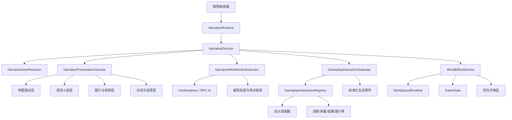

# 剧情表现系统技术方案 v0.2

## 1. 文档目的

本文档规划一套适用于《Card Colony》的通用剧情表现系统，用于统一承载以下内容：

- 地图上的卡牌式剧情演出；
- 玩家人物与 NPC 的对话；
- NPC 与 NPC 之间的交谈、移动、攻击、追逐、逃跑等互动；
- 全屏图片、章节插画和全屏视频；
- 保留对话框与选项的视觉小说式演出；
- 剧情结束后接入任务、战斗、物品、关系、建筑驻留和场景切换等正式游戏结果；
- 剧情跳过、存档恢复、失败兜底和调试日志。

本方案的核心不是制作传统电影式过场动画，而是为现有卡牌、地图、对话、任务和战斗系统增加一个可编排的“剧情导演层”。剧情导演负责控制表现顺序，现有游戏系统仍然负责真实规则和持久化结果。

v0.2 在 v0.1 的方向上增加以下硬性约束：

- 剧情系统和任务系统必须共同适配未来新增的玩法互动；
- 战斗只是“可等待的游戏互动”之一，不能成为剧情导演的特例；
- 新增调查、采集、偷窃、说服、潜行、护送、解谜、烹饪或其他动作时，不应修改剧情导演核心流程；
- 现有输入锁、任务幂等、建筑驻留和存档能力优先复用，不重复建设同类基础设施；
- P0 拆成可分别验收的阶段，禁止一次性实现全部蓝图。

---

## 2. 核心设计结论

### 2.1 一套剧情数据，三种表现模式

剧情定义不按“地图剧情”“视觉小说剧情”“视频剧情”拆成三套系统，而是使用同一套指令序列，在运行时切换表现模式：

1. **地图演出模式**
   - 保留当前地点地图；
   - 镜头聚焦相关卡牌；
   - NPC 可以靠近、交谈、攻击、受击、逃跑或进入建筑；
   - 适合大多数任务事件和地点事件。

2. **视觉小说模式**
   - 暂停地图交互；
   - 全屏显示场景图、CG 或人物立绘；
   - 底部保留姓名、头像、对话和选择；
   - 适合重要人物登场、回忆和章节剧情。

3. **全屏媒体模式**
   - 使用图片或视频作为全屏背景；
   - 对话框、字幕和选择仍由游戏 UI 独立显示；
   - 适合城镇介绍、商队出发、灾难、战争和章节开场。

同一段剧情可以连续切换模式，例如：

```text
地图上村长走向玩家
→ 地图对话
→ 淡出地图
→ 显示河湾村全屏插画
→ 播放商队出发视频，同时继续显示台词
→ 返回地图
→ 正式接取任务
```

### 2.2 剧情表现与游戏结果分离

剧情中的行为必须区分两类：

- **表现行为**：镜头移动、临时移动卡牌、播放攻击动作、显示图片、播放声音、切换表情；
- **游戏结果**：扣除生命、杀死人物、转移物品、接取任务、改变关系、进入建筑、开始战斗、切换地点。

表现可以被快进或跳过，游戏结果不能因为跳过演出而丢失。

例如“哥布林刺伤商人”不能只播放攻击动画，也不能只依赖正常战斗 AI。推荐拆成：

```text
PlayCinematicAttack(哥布林, 商人)
ApplyDamage(商人, 3, resultId: "merchant_wounded")
```

跳过剧情时可以不播放第一条，但必须幂等执行第二条。

### 2.3 剧情导演临时接管参与者

剧情开始时，系统只锁定参与演出的卡牌，不应默认冻结整个世界。被剧情接管的卡牌需要暂停：

- 日常闲逛；
- 主动追踪；
- 自主交谈；
- 玩家拖动；
- 普通 AI 决策。

剧情结束、取消或失败时，导演释放控制权并恢复正常状态。

### 2.4 世界地图规则保持不变

世界地图仍然遵守“整个小队一起行动”的既定规则。剧情系统不能把某个小队成员单独留在世界地图节点上。

世界地图剧情可以：

- 聚焦小队卡；
- 显示旁白、图片或视频；
- 触发地点发现、道路事件和正式战斗；
- 修改整个小队的当前地点或旅行状态。

如果剧情需要具体人物单独行动，应进入地点地图或建筑内部后再表现。

### 2.5 剧情、任务与未来玩法共享互动协议

剧情系统不得只认识“对话”和“战斗”。所有会产生正式游戏过程、需要等待结果或可能被任务记录的动作，统一视为**游戏互动**。

首批互动示例：

| `ActionId` | 互动 | 典型结果 `OutcomeId` |
|---|---|---|
| `core.dialogue` | 正式交谈 | `completed`、`refused`、`interrupted` |
| `core.combat` | 正式战斗 | `victory`、`defeat`、`retreated`、`aborted` |
| `core.trade` | 交易 | `purchased`、`sold`、`cancelled` |
| `world.enter_building` | 进入建筑 | `entered`、`capacity_full`、`locked` |
| `world.travel` | 地点旅行 | `arrived`、`interrupted`、`failed` |
| `gathering.collect` | 采集 | `success`、`depleted`、`tool_missing` |
| `social.persuade` | 说服 | `success`、`failure`、`hostile` |
| `stealth.steal` | 偷窃 | `success`、`caught`、`no_target` |
| `exploration.investigate` | 调查 | `clue_found`、`nothing_found`、`blocked` |

以后新增玩法时，通过注册新的互动处理器接入：

```text
玩法系统注册 ActionId 和参数规范
→ 剧情使用 ExecuteInteraction(ActionId) 发起
→ 玩法系统独立运行并返回 InteractionResult
→ 剧情按 OutcomeId 分支
→ 统一互动事件同时汇报给任务系统
```

因此：

- 剧情导演只负责发起、等待、取消和接收结果；
- 任务系统只消费标准化互动事件，不直接依赖具体玩法类；
- 玩法系统自己负责规则、概率、资源消耗、奖励和持久化；
- 表现层可以为特定互动提供专属 UI，但不能成为规则入口；
- 新动作不要求给 `NarrativeCommandType` 或 `WorldQuestEventType` 各增加一个枚举值。

---

## 3. 当前项目基础与限制

### 3.1 可复用能力

当前项目已经具备以下基础：

- `DialoguePanelView`
  - 显示说话者头像、姓名和对话；
  - 支持独立的选择弹窗；
  - 可复用其视觉结构和选项列表。

- `DialogueManager`
  - 连接普通 NPC 对话和世界任务对话；
  - 能把对话选择汇报给任务系统。

- `NpcInteractionManager`
  - 已使用 `Initiator` 和 `Target` 表达互动双方；
  - 支持人物靠近、互动框、返回原位；
  - 已有 NPC 自主交谈的基础表现。

- `LocationNpcActivity`
  - 负责地点 NPC 的日常闲逛和自主社交；
  - 剧情开始时需要暂时暂停相关 NPC 的活动。

- `CombatManager.StartCombat(...)`
  - 可作为剧情进入正式战斗的入口。
  - 现有 `CombatEventType.CombatEnded` 只表示结束，不携带胜负；接入剧情前必须补充正式的 `CombatOutcome`。

- `WorldQuestRuntime` / `WorldQuestEngine`
  - 可承接剧情选择、任务接取、任务完成和事件汇报。
  - 已使用 `QuestId + RunNumber + ScopeId + EffectId` 记录幂等操作，剧情结果不能另建一套互不兼容的幂等规则。

- `GameData.BuildingPersonSlots`
  - 是人物进入建筑的权威驻留数据；
  - 剧情不能只隐藏卡牌来伪造人物进入建筑。

- `InputManager`
  - 已使用所有者对象集合管理输入锁；
  - 剧情应直接调用 `AddLock(owner)` / `RemoveLock(owner)`，不再新增同类输入锁服务；
  - 所有者必须是稳定对象令牌，禁止使用临时字符串。

### 3.2 当前不能直接满足的需求

现有 `DialogueManager.CanStartDialogue()` 仍然限制为“玩家人物 + 可对话 NPC”。因此：

- NPC 与 NPC 的剧情台词不能直接走现有普通对话入口；
- 没有卡牌实例的旁白、远程人物和回忆人物无法自然成为说话者；
- 普通对话管理器不应承担全屏图片、视频、镜头和多人物动作编排；
- `NpcInteractionManager` 当前是单一互动会话，不能直接表达多个并行动作组；
- 现有系统缺少剧情节点、断点恢复、跳过和持久化结果的统一协议。

因此推荐新增独立的 `NarrativeDirector`，并复用现有系统的能力，而不是继续扩大 `DialogueManager` 的职责。

此外，当前项目在实施前必须补齐以下适配层：

- 战斗结束结果目前没有胜负和结束原因；
- `LocationNpcActivity.SetInteractionPaused(bool)` 不是多所有者安全的暂停协议；
- `BuildingPersonSlotData` 当前没有 `SlotId`，不能假设已经支持任意多槽位；
- 金币是卡牌/容器中的资源，不存在可直接修改的单一金币整数；
- 人物关系系统尚未正式建立，`ChangeRelationship` 在对应服务存在前不得成为可用指令；
- 剧情导演需要跨场景继续运行时，必须明确其生命周期和场景恢复入口。

---

## 4. 总体架构



### 4.1 主要职责

#### `NarrativeDefinition`

剧情资源定义，推荐使用 `ScriptableObject`：

- 唯一剧情 ID；
- 版本号；
- 触发条件；
- 参与者声明；
- 节点与指令；
- 分支；
- 完成标记；
- 失败和缺失参与者策略。

#### `NarrativeRuntime`

负责真实剧情状态：

- 当前剧情 ID；
- 当前节点 ID；
- 已选择分支；
- 已提交结果 ID；
- 是否可以跳过；
- 是否等待游戏互动、场景切换或玩家选择；
- 保存和恢复剧情检查点。

#### `NarrativeDirector`

负责执行剧情指令：

- 启动和结束剧情；
- 获取参与者控制权；
- 按顺序或并行执行指令；
- 处理暂停、快进、跳过和取消；
- 捕获异常并执行清理；
- 把表现指令和游戏结果分发给不同执行器。

#### `NarrativeActorResolver`

把剧情中的角色名绑定到真实对象：

```text
PlayerLeader → 当前小队选中人物
Mayor        → 当前地点的村长 CardInstance
Merchant     → 当前地点定义为杂货商的 NPC
Attacker     → 本剧情临时生成的哥布林首领
RemoteLord   → 仅有头像、没有地图卡牌的远程人物
```

#### `NarrativePresentationService`

统一管理：

- 地图遮罩；
- 视觉小说界面；
- 全屏图片；
- 全屏视频；
- 对话框；
- 选择弹窗；
- 淡入淡出；
- 字幕、历史记录和自动播放。

#### `NarrativeWorldActionExecutor`

负责地图中的人物动作：

- 移动、面向、追逐、逃跑；
- 临时站位；
- 剧情攻击和受击；
- 进入或离开建筑；
- 生成、隐藏和移除临时剧情卡；
- 只执行不产生独立玩法结果的地图表现动作；
- 正式战斗、交易、调查等可等待玩法必须通过 `GameplayInteractionGateway` 发起。

#### `GameplayInteractionGateway`

负责把剧情和任务与具体玩法解耦：

- 按 `ActionId` 查找已注册处理器；
- 校验参数、参与者和当前场景；
- 启动互动并返回唯一 `OperationId`；
- 等待完成、失败、取消或超时；
- 把 `InteractionResult` 返回剧情导演；
- 发布标准化互动事件供任务系统消费；
- 场景卸载或剧情取消时按处理器能力安全取消；
- 禁止通过模拟拖卡、按钮点击或 UI 状态启动规则。

#### `WorldEffectService`

负责剧情与任务共享的可持久化结果：

- 设置剧情标记；
- 修改关系；
- 给予或移除物品；
- 修改生命；
- 接取、推进、完成任务；
- 修改建筑驻留；
- 切换地点；
- 记录死亡和其他不可逆结果。

该服务必须调用背包、任务、货币、人物生命周期和地点等正式领域接口，禁止直接改写其他系统私有字段。现有 `WorldQuestEngine` 的效果执行和幂等能力应逐步抽取到此服务，不能让剧情再复制一份效果实现。

---

## 5. 剧情数据模型

### 5.1 推荐资源结构

```csharp
NarrativeDefinition
├─ Id
├─ Version
├─ DisplayName
├─ TriggerPolicy
├─ CanSkip
├─ ActorBindings[]
├─ Nodes[]
└─ EntryNodeId

NarrativeNodeDefinition
├─ Id
├─ Commands[]
├─ NextNodeId
├─ Choices[]
├─ CheckpointPolicy
└─ FailureNodeId

NarrativeCommandDefinition
├─ CommandId
├─ Type
├─ FlowParameters
├─ DialogueParameters
├─ ActorActionParameters
├─ MediaParameters
├─ InteractionParameters
├─ EffectParameters
├─ WaitPolicy
└─ FailurePolicy
```

第一版不建议立即采用复杂的深层继承树。Unity 2022 下可以先使用“指令枚举 + 分类参数结构”，保持序列化、Inspector 和版本迁移简单。每种指令只能读取与自己类别对应的参数结构，Inspector 必须隐藏其他类别字段。

禁止使用无语义的 `NumberParameters[]` 和 `StringParameters[]`。例如移动速度必须是 `ActorActionParameters.Speed`，伤害值必须是 `EffectParameters.Amount`。未来动作的扩展参数只允许存在于 `InteractionParameters.Arguments` 中，并由对应互动处理器公布的参数规范进行校验。

对话文本从 P0 起使用：

```text
TextKey + FallbackText
```

P0 可以只显示 `FallbackText`，但必须保留稳定 `TextKey`，避免内容规模扩大后再迁移所有剧情资源。

### 5.2 剧情参与者声明

```csharp
NarrativeActorBinding
├─ RoleId               // 剧情内角色名，如 Mayor
├─ ResolveMode          // 解析方式
├─ PersistentId         // 精确实例
├─ CardDefinitionId     // 卡牌定义
├─ PartyMemberId        // 小队成员
├─ LocationId
├─ BuildingId
├─ SpawnPolicy
├─ MissingActorPolicy
└─ PresentationOnlyData // 无地图实体时的头像、姓名、立绘
```

推荐的 `ResolveMode`：

| 模式 | 用途 |
|---|---|
| `PersistentId` | 精确查找某个已有角色实例 |
| `CardDefinitionId` | 查找当前地点某类 NPC |
| `SelectedPartyMember` | 当前小队选中人物 |
| `PartyLeader` | 主角或队长 |
| `BuildingOccupant` | 指定建筑人物槽内的成员 |
| `SpawnTemporary` | 生成临时剧情 NPC |
| `PresentationOnly` | 只有头像或立绘，不生成卡牌 |

推荐的 `MissingActorPolicy`：

- `FailNarrative`：缺少参与者时终止并记录错误；
- `SkipCommand`：跳过只影响表现的指令；
- `SpawnFallback`：生成临时替代角色；
- `UsePortraitOnly`：改用头像参与台词；
- `JumpToFailureNode`：进入预设失败分支。

### 5.3 不应依赖当前坐标查找人物

人物位置会因为拖动、建筑驻留、AI 和场景重建而变化。剧情必须优先依赖：

1. `PersistentId`；
2. 小队成员 ID；
3. 建筑人物槽数据；
4. 当前地点中的卡牌定义 ID；
5. 临时生成策略。

坐标只用于演出站位，不用于确认角色身份。

### 5.4 剧情触发请求与排队规则

所有剧情必须通过明确请求启动，不允许其他系统直接调用导演内部节点：

```csharp
NarrativeTriggerRequest
├─ TriggerInstanceId   // 本次请求唯一 ID，用于去重
├─ NarrativeId
├─ SourceSystemId      // quest、location、interaction 等
├─ SourceEventId       // 对应源事件，允许空
├─ Priority            // 0～100，数字越大优先级越高
├─ QueuePolicy         // Reject、Queue、ReplaceQueued
├─ RunPolicy           // OncePerSave、OncePerSourceRun、Repeatable
├─ SourceRunId         // 重复任务或重复事件的运行编号
├─ RequiredLocationId
└─ ContextValues[]
```

P0 规则固定如下：

- 同时只允许一段剧情处于运行状态；
- 运行中的剧情不可被另一段剧情抢占；
- 队列最多保存 16 个请求；
- 相同 `TriggerInstanceId` 只接受一次；
- 同优先级按请求时间先进先出；
- `Reject` 在忙碌时立即返回 `DirectorBusy`；
- `Queue` 在条件仍有效时排队，轮到执行前重新校验地点和参与者；
- `ReplaceQueued` 只替换同一 `NarrativeId + SourceRunId` 的未执行请求；
- 场景切换时只保留明确声明 `SurviveSceneLoad` 的请求；
- P0 不支持运行中剧情抢占，后续若增加抢占必须先定义回滚和恢复协议。

### 5.5 可扩展游戏互动协议

#### 互动请求

```csharp
GameplayInteractionRequest
├─ OperationId         // 本次运行唯一 ID
├─ ActionId            // 稳定、带命名空间，不使用枚举
├─ InitiatorActorIds[]
├─ TargetActorIds[]
├─ ContextId           // 地点、建筑、物体或任务上下文
├─ Arguments[]         // 带类型的扩展参数
├─ TimeoutSeconds
├─ CancellationPolicy
├─ CreditedToParty
└─ ProtagonistParticipated
```

`Arguments[]` 的每项必须包含 `Key + ValueType + Value`。支持的基础类型固定为 `String`、`Int`、`Float`、`Bool`、`ActorRole`、`CardDefinitionId` 和 `AssetReference`。处理器必须公开参数规范，编辑器验证器负责检查必填项、类型、范围和互斥关系。

#### 互动处理器

```csharp
public interface IGameplayInteractionHandler
{
    string ActionId { get; }
    InteractionParameterSchema Schema { get; }
    InteractionValidationResult Validate(
        GameplayInteractionRequest request,
        GameplayInteractionContext context);
    IGameplayInteractionOperation Begin(
        GameplayInteractionRequest request,
        GameplayInteractionContext context);
}
```

`IGameplayInteractionOperation` 必须公开：

- `OperationId`；
- `State`：`Running`、`Completed`、`Failed`、`Cancelled`；
- `CanCancel`；
- `Progressed` 事件；
- `Completed` 事件；
- `TryCancel(reason)`；
- 最终 `InteractionResult`。

#### 互动结果

```csharp
InteractionResult
├─ OperationId
├─ ActionId
├─ State
├─ OutcomeId           // 由玩法处理器定义的稳定结果 ID
├─ FailureCode
├─ ActorIds[]
├─ TargetIds[]
├─ ContextId
├─ Quantity
├─ ResultValues[]
└─ PersistedEventId
```

剧情只依据 `State`、`OutcomeId` 和明确的 `ResultValues` 分支，不读取玩法系统内部字段。

#### 任务系统接入

任务系统只新增一种通用事件和一种通用目标：

```text
WorldQuestEventType.GameplayInteraction
WorldQuestObjectiveType.Interaction
```

通用互动事件包含以下阶段：

| `Phase` | 用途 |
|---|---|
| `Started` | 互动正式开始，例如开始护送或开始调查 |
| `Progressed` | 发生可记录进度，例如护送到检查点、找到一条线索 |
| `Resolved` | 互动得到最终结果 |
| `Cancelled` | 互动被玩家或系统取消 |

每一个需要持久化的阶段事件都必须拥有独立 `PersistedEventId`。处理器把进度报告给 Operation，由 Gateway 统一转换成任务事件，处理器本身不直接调用任务运行时。

目标过滤条件为：

```text
ActionId（必填）
Phase（默认 Resolved）
OutcomeId（可选）
ContextId（可选）
TargetId（可选）
最低 Quantity（默认 1）
ActorRequirement（任意队员/主角必须参与）
```

互动开始、推进、完成或取消时，由 `GameplayInteractionGateway` 使用对应 `PersistedEventId` 向任务系统汇报。任务系统继续使用现有事件去重和任务运行编号，不因增加一种新玩法而修改任务引擎核心分支。

示例：

```text
护送商人任务
ActionId = escort.caravan
Phase = Progressed
ContextId = north_road_checkpoint
RequiredQuantity = 3

调查失踪案任务
ActionId = exploration.investigate
Phase = Progressed
OutcomeId = clue_found
RequiredQuantity = 4

说服守卫任务
ActionId = social.persuade
Phase = Resolved
OutcomeId = success
RequiredQuantity = 1
```

#### 新玩法接入的固定清单

新增任何玩法互动时必须完成：

1. 定义带命名空间的稳定 `ActionId`；
2. 定义参数规范和所有稳定 `OutcomeId`；
3. 实现并注册 `IGameplayInteractionHandler`；
4. 明确是否可取消、超时以及场景卸载行为；
5. 通过正式领域服务提交游戏结果；
6. 返回 `InteractionResult`；
7. 验证任务能够使用通用互动目标监听它；
8. 如果需要专属表现，再额外注册 Presenter；
9. 不修改 `NarrativeDirector` 的主执行循环；
10. 不为该玩法单独增加新的任务事件枚举。

---

## 6. 指令分类

### 6.1 流程控制指令

| 指令 | 作用 |
|---|---|
| `Wait` | 等待固定时间，支持快进 |
| `WaitForInput` | 等待玩家点击继续 |
| `Jump` | 跳转到节点 |
| `BranchByFlag` | 按剧情或任务标记分支 |
| `BranchByCondition` | 按物品、关系、生命等条件分支 |
| `Parallel` | 同时执行一组动作 |
| `Sequence` | 顺序执行一组动作 |
| `Checkpoint` | 建立可保存和恢复的剧情检查点 |
| `EndNarrative` | 正常结束剧情 |

### 6.2 对话与文本指令

| 指令 | 作用 |
|---|---|
| `ShowDialogue` | 指定角色说话 |
| `ShowNarration` | 显示无角色旁白 |
| `ShowChoice` | 显示选择并跳转分支 |
| `SetSpeakerExpression` | 切换立绘或头像状态 |
| `ShowSpeechBubble` | 地图卡牌上方显示短气泡 |
| `AddDialogueHistory` | 写入剧情历史记录 |

剧情对话的说话者可以是：

- 玩家人物；
- 任意 NPC；
- 没有卡牌实例的远程人物；
- 旁白；
- 未知人物或系统提示。

### 6.3 地图人物指令

| 指令 | 作用 |
|---|---|
| `AcquireActorControl` | 暂停该角色 AI 和拖动 |
| `ReleaseActorControl` | 恢复角色控制权 |
| `MoveToActor` | 移动到目标附近 |
| `MoveToMarker` | 移动到剧情舞台点 |
| `FaceActor` | 面向目标 |
| `ReturnToOrigin` | 返回演出前位置 |
| `ChaseActor` | 持续追赶目标 |
| `FleeFromActor` | 远离指定目标 |
| `ShowEmote` | 显示惊讶、愤怒、疑问等提示 |
| `EnterBuilding` | 通过建筑人物槽进入建筑 |
| `LeaveBuilding` | 清理槽位并在地点地图生成角色 |
| `SpawnActor` | 生成临时或永久人物卡 |
| `DespawnActor` | 移除临时演出对象 |

`AcquireActorControl` 和 `ReleaseActorControl` 不直接设置布尔值。导演为每个参与者持有独立控制租约，并在 `finally` 清理栈中释放。普通互动、剧情和其他系统同时暂停同一 NPC 时，只有最后一个所有者释放后才能恢复 AI。

### 6.4 剧情攻击与正式游戏互动

必须明确区分只负责演出的剧情动作和会运行正式规则的游戏互动。

#### `PlayCinematicAttack`

- 只播放攻击者靠近、挥击、目标受击和短暂停顿；
- 不启动战斗 AI；
- 不默认修改生命；
- 可以被快进；
- 适合偷袭、推搡、演示受伤和固定结果。

#### `ApplyDamage`

- 通过游戏结果执行器修改真实生命；
- 必须带唯一 `ResultId`；
- 重复恢复或跳过剧情时不能重复扣血；
- 生命归零时调用统一死亡流程，而不是只隐藏卡牌。

#### `ExecuteInteraction`

所有正式战斗以及未来新增的调查、采集、偷窃、说服、护送、解谜等动作统一使用：

```text
ExecuteInteraction(ActionId, Participants, Arguments)
→ GameplayInteractionGateway
→ 对应 IGameplayInteractionHandler
→ InteractionResult
→ BranchByInteractionOutcome
```

战斗使用 `ActionId: core.combat`，不再为战斗保留一条只能由剧情导演理解的特殊执行路径。战斗处理器内部调用现有 `CombatManager.StartCombat(...)`。

接入战斗前必须增加正式 `CombatOutcome`：

```csharp
CombatOutcome
├─ OriginalSessionId
├─ FinalSessionId
├─ Result              // Victory、Defeat、Retreated、Aborted
├─ EndReason
├─ SurvivingActorIds[]
└─ DefeatedActorIds[]
```

战斗发生合并时，处理器必须维护 `OriginalSessionId → FinalSessionId` 映射。仅监听当前的 `CombatEnded` 文本事件不足以支持剧情分支。

其他互动遵守同样协议。比如说服处理器可以打开说服 UI、执行检定并返回 `success` 或 `failure`；剧情导演和任务引擎不需要知道具体概率算法。

### 6.5 图片、视频与镜头指令

| 指令 | 作用 |
|---|---|
| `EnterVisualNovelMode` | 进入视觉小说模式 |
| `ExitVisualNovelMode` | 返回地图模式 |
| `ShowFullscreenImage` | 显示全屏图片或 CG |
| `HideFullscreenImage` | 隐藏图片 |
| `PlayFullscreenVideo` | 播放全屏视频 |
| `PauseVideo` | 暂停视频但保留画面 |
| `StopVideo` | 停止并释放视频资源 |
| `SetCharacterPortrait` | 设置人物立绘 |
| `ClearCharacterPortraits` | 清理立绘 |
| `FocusActor` | 镜头聚焦地图卡牌 |
| `PanCamera` | 镜头平移到舞台点 |
| `ShakeCamera` | 震动表现 |
| `FadeIn` / `FadeOut` | 淡入淡出 |

### 6.6 音频指令

- `PlayMusic`
- `StopMusic`
- `CrossFadeMusic`
- `PlaySoundEffect`
- `PlayVoice`
- `StopVoice`

语音、字幕和对话文本应独立。语音缺失不能阻断剧情。

### 6.7 游戏结果指令

- `SetNarrativeFlag`
- `ChangeRelationship`
- `GiveCardToBackpack`
- `RemoveCardFromBackpack`
- `GiveCoins`
- `StartQuest`
- `ReportQuestEvent`
- `CompleteQuest`
- `AssignBuildingPersonSlot`
- `ClearBuildingPersonSlot`
- `MovePartyToLocation`
- `SetActorHealth`
- `ApplyDamage`
- `KillActor`

所有不可逆结果必须具备唯一 `ResultId`，并通过 `WorldEffectService` 执行。没有正式领域接口的指令在验证阶段必须报错，不允许暂时直接修改数据：

- `GiveCoins` 必须通过货币发放服务生成可存入背包的金币资源，并处理背包容量不足；
- `ChangeRelationship` 在人物关系服务完成前标记为 `Unsupported`；
- `KillActor` 必须调用统一人物生命周期流程；
- `MovePartyToLocation` 必须调用正式地点切换服务。

幂等键固定为：

```text
NarrativeId : DefinitionVersion : RunId : NodeId : ResultId
```

同一 `ResultId` 只要求在同一剧情运行中唯一。可重复剧情进入新的 `RunId` 后可以合法再次发放结果。

---

## 7. NPC 之间的剧情互动

### 7.1 NPC 交谈

现有普通对话由玩家人物发起，不适合直接承担 NPC 与 NPC 的剧情对话。推荐流程：

1. 导演解析 `Mayor` 和 `Blacksmith`；
2. 暂停双方 `LocationNpcActivity`；
3. 让发起者移动到目标附近；
4. 可选复用 `NpcInteractionManager` 的双卡站位和互动框；
5. 由 `NarrativeDialoguePresenter` 显示双方台词；
6. 对话结束后让人物返回原位或保留新位置；
7. 释放双方 AI。

剧情对话不应调用 `DialogueManager.CanStartDialogue()`，因为它目前只允许玩家人物与 NPC 的组合。

### 7.2 NPC 攻击 NPC

剧情攻击分为三种强度：

| 类型 | 表现 | 真实结果 |
|---|---|---|
| 威吓 | 靠近、挥击、目标后退 | 不扣血 |
| 固定伤害 | 攻击与受击动画 | 剧情指定扣血 |
| 正式冲突 | 安排双方站位 | 启动真实战斗 |

不能通过模拟玩家拖卡或模拟点击来触发剧情攻击。剧情系统应调用明确的动作接口，避免 UI 改版后剧情失效。

### 7.3 追逐与逃跑

追逐属于持续动作，需要定义：

- 目标；
- 速度；
- 最大持续时间；
- 成功距离；
- 超时策略；
- 是否允许穿过卡牌；
- 到达边界后是离场、进入建筑还是停下。

示例：

```text
Parallel
├─ Merchant.FleeTo(VillageGate)
├─ Goblin.Chase(Merchant)
└─ Guard.MoveTo(MarketSquare)

WaitAll
Guard: “住手！”
```

### 7.4 进入和离开建筑

人物进入建筑必须通过 `world.enter_building` 互动处理器调用统一 `IBuildingOccupancyService`，剧情不能直接假设底层已经支持多个 `SlotId`。

当前项目需要区分两种状态：

1. **持久驻留人物**
   - 使用现有 `BuildingPersonSlots`；
   - 当前结构每个 `EntranceInstanceId` 实际只保留一个驻留人物；
   - P0 不承诺通过该结构同时驻留多名 NPC。

2. **本次进入建筑的队伍参与者**
   - 使用 `BuildingEntryContext.ParticipantPersistentIds`；
   - 用于多人进入建筑内部并保持同一人物状态；
   - 不等价于把所有人永久写进单人物驻留槽。

如果以后正式增加多人物槽位，应由 `IBuildingOccupancyService` 内部迁移为：

```text
PersistentId + SettlementLocationId + EntranceInstanceId + SlotId
```

剧情资源和任务目标只引用建筑及可选逻辑槽标签，不直接依赖当前存档结构。

通用进入流程：

1. 处理器校验建筑、容量、锁定条件和参与者；
2. 占用服务提交权威驻留或进入上下文；
3. 地点系统移除当前地图卡牌实例；
4. 建筑场景根据同一 `PersistentId` 重建人物；
5. 返回 `entered`、`capacity_full` 或 `locked` 等结果；
6. 离开时通过同一服务逆向清理并在合法位置恢复人物。

剧情不能只执行 `card.SetActive(false)` 来表示进入建筑，否则场景切换和存档后人物状态会分裂。

### 7.5 多人物并行演出

第一版并行组需要支持：

- `WaitAll`：全部动作完成后继续；
- `WaitAny`：任意动作完成后继续，并决定是否取消其他动作；
- `FireAndForget`：启动环境动作，不阻塞剧情；
- 超时：防止路径或对象异常导致剧情永久卡住。

同一参与者不能在同一个并行组里同时执行两个互斥位移动作。编辑器验证器必须报告这种冲突。

---

## 8. 视觉小说与全屏媒体界面

### 8.1 `NarrativePresentationRoot` 层级

建议把以下结构制作成独立 `NarrativePresentation.prefab`，由 UI 启动流程实例化到正式 `UIRoot` 下并默认隐藏：

```text
NarrativePresentationRoot
├─ InputBlocker
├─ MediaLayer
│  ├─ FullscreenImage
│  ├─ VideoSurface
│  └─ MediaTint
├─ CharacterLayer
│  ├─ LeftPortrait
│  ├─ CenterPortrait
│  └─ RightPortrait
├─ MapOverlayLayer
│  ├─ FocusMask
│  └─ LetterboxBars
├─ DialogueLayer
│  ├─ SpeakerName
│  ├─ Portrait
│  ├─ DialogueText
│  └─ ContinueIndicator
├─ ChoiceLayer
│  ├─ ChoiceTitle
│  └─ ScrollableChoiceList
├─ ControlLayer
│  ├─ AutoButton
│  ├─ SkipButton
│  └─ HistoryButton
└─ FadeLayer
```

### 8.2 对话 UI 复用策略

不建议直接把当前 `DialoguePanel.prefab` 整体移动到全屏剧情层，因为普通地图对话和视觉小说对话的尺寸、锚点和背景需求不同。

推荐拆出共享数据模型：

```csharp
DialoguePresentationModel
├─ SpeakerId
├─ SpeakerName
├─ Portrait
├─ BackgroundPortrait
├─ Text
├─ VoiceClip
├─ Choices[]
└─ ContinueMode
```

然后使用两个 View：

- `DialoguePanelView`：普通地图交谈；
- `NarrativeDialogueView`：全屏视觉小说对话。

两者共享文本推进、打字机、选择数据和历史记录，但拥有独立布局。

### 8.3 图片规范

第一版建议：

- 设计基准：1920×1080；
- 使用 `AspectRatioFitter` 或等效逻辑保持比例；
- 支持 `Fit`、`FillCrop` 和 `Stretch` 三种模式；
- 默认使用 `Fit`，必要时显示上下或左右黑边；
- 重要信息放在画面安全区，避免被底部对话框遮挡；
- 每张图片可配置备用纯色和加载失败提示。

### 8.4 视频规范

推荐使用：

```text
VideoPlayer
→ RenderTexture
→ RawImage(VideoSurface)
```

视频规则：

- 视频不烘焙对话字幕；
- 对话框、选择和字幕继续使用游戏 UI；
- 支持循环、等待播放完成和后台继续播放；
- 支持首帧或独立图片作为加载占位；
- 视频加载失败时切换备用图片并继续剧情；
- 退出剧情时停止播放并释放 `RenderTexture` 引用；
- 跳过视频不等于跳过后续游戏结果；
- 第一版优先使用本地资源，不在运行时依赖网络视频。

### 8.5 输入行为

视觉小说模式中：

- 点击空白区域：继续下一句；
- 点击选项：锁定输入直到分支跳转完成；
- `Esc`：打开剧情暂停菜单，不应直接退出剧情；
- `Space`：可作为继续快捷键；
- `Ctrl`：可作为按住快进，后续版本实现；
- 视频播放时仍可显示台词和选择；
- 出现选择时禁止点击空白区域越过选择。

---

## 9. 运行状态机

```text
Idle
→ Preparing
→ Playing
   ├─ WaitingForInput
   ├─ WaitingForChoice
   ├─ WaitingForActorAction
   ├─ WaitingForMedia
   ├─ WaitingForInteraction
   └─ WaitingForSceneLoad
→ Completing
→ Idle

任意可跳过的表现状态
→ Skipping
→ Playing（停在下一个剧情屏障）
或 → Completing（已经到达 EndNarrative）

任意运行状态
→ Failed
→ Cleanup
→ Idle
```

### 9.1 `Preparing`

- 验证剧情资源；
- 解析参与者；
- 检查当前场景和地点；
- 检查是否处于战斗、市场、普通对话或场景切换；
- 记录参与者原始位置和 AI 状态；
- 获取输入和镜头控制权。

### 9.2 `Playing`

- 逐条执行指令；
- 每条指令必须支持完成、失败、取消和超时；
- 串行指令只能在前一条完成后继续；
- 并行组按等待策略汇合。

### 9.3 `Completing`

- 完成当前已经开始但尚未落在原子边界上的效果提交；
- 不执行尚未到达的分支、互动或奖励；
- 停止图片、视频、语音和 Tween；
- 清理临时人物；
- 恢复相机和 HUD；
- 恢复未永久改变的卡牌位置；
- 恢复 AI 和拖动；
- 写入剧情完成标记。

### 9.4 `WaitingForInteraction`

- 保存当前 `OperationId`、`ActionId` 和允许的结果分支；
- 只接受该操作返回的 `InteractionResult`；
- 根据 `OutcomeId` 跳转到显式配置的节点；
- 超时进入该指令的 `FailureNodeId`，不能默认为成功；
- 战斗、调查、采集和以后新增的玩法动作全部使用此状态；
- 如果处理器声明不可取消，剧情跳过必须停在该互动屏障前。

### 9.5 `Failed`

任何异常都必须进入统一清理流程，不能留下：

- 永久黑屏；
- 无法操作的卡牌；
- 被暂停但没有恢复的 AI；
- 悬空的互动框；
- 未释放的视频；
- 重复发放的任务奖励。

---

## 10. 输入、时间和系统互斥

### 10.1 输入锁

直接复用现有 `InputManager`，剧情导演持有稳定对象令牌：

```csharp
private readonly object narrativeInputLock = new();

InputManager.Instance.AddLock(
    narrativeInputLock,
    allowCameraInput: definition.AllowCameraInput);

InputManager.Instance.RemoveLock(narrativeInputLock);
```

禁止使用剧情 ID 字符串作为所有者。现有 `InputManager` 以所有者对象集合管理锁，只有所有锁都释放后才恢复输入。导演必须把解除操作登记到统一清理栈，正常完成、失败、取消和对象销毁都执行同一释放路径。

剧情期间通常禁止：

- 拖动卡牌；
- 打开市场；
- 切换地点；
- 开始另一段普通互动；
- 整理背包；
- 结束当前地点。

可以保留：

- 剧情继续；
- 选择；
- 跳过；
- 自动播放；
- 历史记录；
- 系统菜单。

### 10.2 时间策略

剧情使用 `unscaledDeltaTime` 播放 UI 和镜头效果，避免暂停游戏时间后演出停止。

地图剧情期间建议：

- 暂停一天推进和生存消耗；
- 暂停被接管 NPC 的 AI；
- 根据剧情配置决定是否暂停无关 NPC；
- 不依赖全局 `Time.timeScale = 0` 作为唯一方案。

### 10.3 与其他系统互斥

| 当前状态 | 默认处理 |
|---|---|
| 正式战斗中 | 不启动新剧情，除非是战斗结果剧情 |
| 市场全屏界面打开 | 关闭市场后再启动剧情 |
| 普通对话中 | 结束普通对话或排队等待 |
| 建筑切换中 | 等待场景稳定后启动 |
| 已有剧情运行 | 按 `QueuePolicy` 拒绝或排队；P0 禁止抢占 |
| 世界地图旅行中 | 只允许旅行事件类型剧情 |
| 任意正式互动运行中 | 只有该互动的结果剧情可以立即启动，其他请求排队 |

---

## 11. 存档与恢复

### 11.1 不保存瞬时动画进度

不建议保存：

- Tween 已播放百分比；
- 视频播放到第几秒；
- 卡牌正在移动的中间坐标；
- 打字机显示到第几个字。

这些状态容易因资源和布局变化失效。

### 11.2 保存剧情检查点

推荐保存：

```csharp
NarrativeSaveData
├─ ActiveNarrativeId
├─ DefinitionVersion
├─ RunId
├─ CheckpointNodeId
├─ SelectedChoiceIds[]
├─ CommittedResultIds[]
├─ LocalVariables[]      // 每项必须包含 Key、ValueType、Value
├─ WaitingInteractionData
└─ ResumePolicy
```

同时保存长期历史：

```csharp
NarrativeHistoryData
├─ CompletedOnceNarrativeIds[]
├─ LastCompletedSourceRunByNarrativeAndSource[]
├─ LastRunNumberByNarrativeId[]
└─ PendingTriggerInstanceIds[] // 只保存当前运行和队列中的请求
```

`CommittedResultIds` 中保存完整幂等键：

```text
NarrativeId : DefinitionVersion : RunId : NodeId : ResultId
```

不可仅保存裸 `ResultId`，否则可重复剧情后续轮次无法再次产生合法结果。

`CommittedResultIds` 只保留当前未结束剧情运行的数据。剧情完成后，正式结果已经存在于各领域系统中，应清除该运行的逐条结果列表，并压缩为 `CompletedOnceNarrativeIds` 或最后完成的 `SourceRunId`。禁止永久累积每次播放的全部指令 ID。

恢复游戏时：

1. 先加载正式游戏结果；
2. 重新进入检查点节点；
3. 跳过检查点之前的纯表现；
4. 不重复执行已提交 `ResultId`；
5. 重新解析参与者；
6. 如果检查点等待正式互动，则向对应处理器查询或恢复操作；
7. 参与者缺失时进入失败分支或兜底流程。

### 11.3 保存时机

P0-C 开始只在安全检查点写入新的剧情检查点：

- 一段对话结束后；
- 选择完成并提交后；
- 正式互动开始前或结束后；
- 场景切换完成后；
- 剧情结束后。

如果玩家在不可保存的演出中触发存档，不能为了保存而自动快进、替玩家选择或提交未来结果。存档记录最近一个安全检查点；读取后从该检查点重新播放纯表现，并跳过已经提交的幂等结果。

---

## 12. 跳过、快进与自动播放

### 12.1 跳过原则

“跳过”定义为跳到下一个剧情屏障，不是无条件结束整段剧情。执行时：

- 立即结束等待和 Tween；
- 停止图片淡入、视频和语音；
- 不自动代替玩家选择重要分支；
- 只提交在当前已确定路径上、屏障之前必须发生的游戏结果；
- 将人物放到该屏障规定的合法状态；
- 到达重要选择、正式互动、场景切换或不可逆确认时停止跳过；
- 只有到达 `EndNarrative` 才恢复全部相机、HUD、AI 和输入。

剧情屏障类型固定为：

| 屏障 | 跳过行为 |
|---|---|
| `ImportantChoice` | 停止并等待玩家选择 |
| `GameplayInteraction` | 停止并进入正式互动 |
| `SceneTransition` | 完成切换并等待场景稳定 |
| `IrreversibleConfirmation` | 停止并要求确认 |
| `Checkpoint` | 可配置是否继续 |
| `NarrativeEnd` | 进入 `Completing` |

### 12.2 选择处理

遇到尚未选择的节点时，可选策略：

- 不允许继续跳过，必须选择；
- 使用剧情定义中的默认选项；
- 如果玩家已经看过该剧情，使用上次选择。

第一版建议：重要选择必须由玩家确认，普通无后果选择可以配置默认项。

### 12.3 已读快进

后续版本可以记录已读台词 ID：

- 未读台词保持正常速度；
- 已读台词允许快速推进；
- 选择、战斗和正式结果不能被无提示越过。

---

## 13. 编辑器与资源制作

### 13.1 剧情编辑器最低要求

P0 阶段不需要立即制作完整节点图编辑器，可以先使用：

- `NarrativeDefinition` 自定义 Inspector；
- 节点列表；
- 指令列表；
- 参与者表；
- 预览和验证按钮。

当剧情数量增加后，再升级为节点图编辑器。

### 13.2 静态验证

保存资源时检查：

- 剧情 ID 是否唯一；
- 节点 ID 是否唯一；
- 所有跳转目标是否存在；
- 是否有无法到达的节点；
- 是否存在无限跳转；
- 使用的角色名是否已声明；
- 不可逆指令是否拥有唯一 `ResultId`；
- 同一剧情运行范围内的幂等键是否唯一；
- 并行组是否对同一人物下达冲突动作；
- 图片、视频和音频资源是否存在；
- `ExecuteInteraction` 的 `ActionId` 是否已注册；
- 互动参数是否符合处理器公布的 Schema；
- 所有可能的 `OutcomeId` 是否有分支或默认失败节点；
- 建筑进入互动是否配置建筑、参与者和容量失败分支；
- 可跳过剧情是否正确设置剧情屏障；
- `TextKey` 是否唯一且非空；
- 未实现领域服务的效果指令是否被错误使用。

### 13.3 运行时调试窗口

建议提供：

- 当前剧情 ID；
- 当前节点和指令；
- 已解析参与者；
- 当前状态机状态；
- 已提交结果；
- 当前输入锁所有者；
- 当前互动 `OperationId`、`ActionId` 和状态；
- 当前队列、优先级和触发来源；
- 强制下一步；
- 跳转到节点；
- 模拟参与者缺失；
- 导出剧情日志。

---

## 14. 推荐代码和资源目录

```text
Assets/StackCraft/Scripts/Narrative/
├─ Definitions/
│  ├─ NarrativeDefinition.cs
│  ├─ NarrativeNodeDefinition.cs
│  ├─ NarrativeCommandDefinition.cs
│  └─ NarrativeActorBinding.cs
├─ Runtime/
│  ├─ NarrativeRuntime.cs
│  ├─ NarrativeDirector.cs
│  ├─ NarrativeExecutionContext.cs
│  ├─ NarrativeActorResolver.cs
│  └─ NarrativeSaveData.cs
├─ Commands/
│  ├─ NarrativePresentationExecutor.cs
│  ├─ NarrativeWorldActionExecutor.cs
│  └─ NarrativeEffectCommandExecutor.cs
├─ Interactions/
│  ├─ GameplayInteractionGateway.cs
│  ├─ GameplayInteractionRegistry.cs
│  ├─ IGameplayInteractionHandler.cs
│  ├─ GameplayInteractionRequest.cs
│  ├─ InteractionResult.cs
│  └─ Adapters/
│     ├─ CombatInteractionHandler.cs
│     ├─ DialogueInteractionHandler.cs
│     ├─ BuildingEntryInteractionHandler.cs
│     └─ TravelInteractionHandler.cs
├─ Effects/
│  ├─ WorldEffectService.cs
│  ├─ WorldEffectRequest.cs
│  └─ WorldEffectResult.cs
├─ UI/
│  ├─ NarrativePresentationView.cs
│  ├─ NarrativeDialogueView.cs
│  ├─ NarrativeChoiceView.cs
│  └─ NarrativeMediaView.cs
└─ Editor/
   ├─ NarrativeDefinitionEditor.cs
   ├─ NarrativeValidator.cs
   └─ NarrativeDebugWindow.cs

Assets/StackCraft/Prefabs/UI/
└─ NarrativePresentation.prefab

Assets/StackCraft/Resources/Narratives/
├─ Riverbend/
├─ WhisperingForest/
└─ WorldMap/
```

`NarrativePresentation.prefab` 作为独立预制体由 UI 启动流程挂到正式 `UIRoot` 下，不直接把大段结构硬写进 `UIRoot.prefab`。这样普通 UI 改版和剧情 UI 可以独立维护。

是否继续使用 `Resources` 可以在后续统一资源加载方案时调整。P0 阶段以实现稳定性优先，不强制同时引入 Addressables。

---

## 15. 完整剧情示例：杂货商遇袭

### 15.1 参与者

| RoleId | 解析方式 | 缺失策略 |
|---|---|---|
| `PlayerLeader` | 当前小队选中人物 | 使用队长 |
| `Merchant` | 当前地点杂货商 | 剧情失败 |
| `GoblinLeader` | 临时生成 | 生成备用 |
| `Guard` | 当前地点守卫 | 跳过守卫登场分支 |

### 15.2 指令流程

```text
Node: Begin
  AcquireInputLock
  AcquireActorControl(Merchant)
  SpawnActor(GoblinLeader, Marker: MarketEntrance)
  AcquireActorControl(GoblinLeader)
  FocusActor(Merchant)

  Parallel WaitAll
    GoblinLeader.MoveToActor(Merchant)
    Merchant.FaceActor(GoblinLeader)

  ShowDialogue(Merchant, “你们想干什么？”)
  ShowDialogue(GoblinLeader, “把货物留下！”)
  PlayCinematicAttack(GoblinLeader, Merchant)
  ApplyDamage(Merchant, 3, ResultId: merchant_ambush_damage)
  ShowEmote(Merchant, Shock)

  ShowChoice
    help     → Node: HelpMerchant
    observe  → Node: Observe

Node: HelpMerchant
  PlayerLeader.MoveToActor(GoblinLeader)
  ShowDialogue(PlayerLeader, “到此为止。”)
  Checkpoint
  ExecuteInteraction(
    ActionId: core.combat,
    Initiators: PlayerLeader,
    Targets: GoblinLeader)
  BranchByInteractionOutcome
    victory → Node: Victory
    defeat  → Node: Defeat
    retreated → Node: Defeat
    aborted → Node: CombatUnavailable

Node: Observe
  Merchant.FleeTo(MarketExit)
  RemoveCardsFromMarketStock(2, ResultId: merchant_goods_stolen)
  IncrementWorldFactInt(merchant_abandoned_count, 1,
    ResultId: merchant_abandoned_fact)
  ShowNarration(“哥布林抢走货物后消失在村外。”)
  Jump(End)

Node: Victory
  ShowFullscreenImage(MerchantRescuedCG)
  EnterVisualNovelMode
  ShowDialogue(Merchant, “谢谢你救了我的货物。”)
  GiveCoins(5, ResultId: merchant_rescue_reward)
  ReportQuestEvent(MerchantRescued)
  ExitVisualNovelMode
  Jump(End)

Node: Defeat
  ShowNarration(“你没能阻止袭击。”)
  SetNarrativeFlag(merchant_ambush_failed)
  Jump(End)

Node: CombatUnavailable
  ShowNarration(“冲突没有正常开始，事件暂时中断。”)
  SetNarrativeFlag(merchant_ambush_interrupted)
  Jump(End)

Node: End
  ReleaseActorControl(Merchant)
  ReleaseActorControl(GoblinLeader)
  ReleaseInputLock
  EndNarrative
```

### 15.3 跳过后的最终状态

如果玩家在第一次选择之后跳过：

- 已选择“帮助”则不能改成“旁观”；
- 已发生的固定伤害不会重复执行；
- 正式战斗不能被直接当作胜利跳过；
- 战斗结束后的奖励只发一次；
- 临时哥布林必须被正确移除或交给战斗结果处理；
- 商人 AI、玩家输入和镜头必须恢复。

---

## 16. 分阶段实施计划

### 16.1 P0-A：剧情骨架与开放互动入口

目标：不依赖战斗和复杂镜头，完成一段可以运行、选择、产生任务结果并可靠清理的短剧情，同时证明未来玩法能够注册到统一互动入口。

范围固定为：

1. 强类型分类参数的 `NarrativeDefinition`、节点和顺序指令；
2. `NarrativeDirector` 的 `Idle / Preparing / Playing / Completing / Failed`；
3. 触发请求、去重、16 条队列和 P0 禁止抢占规则；
4. `PersistentId`、`PartyLeader`、`CardDefinitionId`、`PresentationOnly` 四种参与者解析；
5. 复用 `InputManager` 的稳定对象锁；
6. 基础旁白、对话、重要选择、跳转和结束；
7. `TextKey + FallbackText`；
8. 最小 `WorldEffectService`：设置世界事实、汇报任务事件、接取任务；
9. `GameplayInteractionRegistry`、Gateway、参数 Schema 和一个不依赖真实玩法的验证处理器；
10. 任务系统增加通用 `GameplayInteraction` 事件和 `Interaction` 目标；
11. 自定义 Inspector 的静态校验按钮；
12. 一段“村长发布首个委托”正式场景样例。

P0-A 明确不做：人物移动、视觉小说界面、全屏图片、剧情攻击、正式战斗接入、并行指令、剧情中途存档、视频和节点图编辑器。

P0-A 保存规则：剧情运行中只保存最近一个剧情外安全状态；剧情正常结束并提交结果后调用现有保存流程。异常退出后允许重新触发该段短剧情，已提交结果依靠完整幂等键去重。

### 16.2 P0-B：地图与视觉表现、屏障式跳过

目标：让剧情真正具有本项目的卡牌演出特色，但仍不把正式战斗和跨场景恢复混进本阶段。

范围固定为：

1. 将 `LocationNpcActivity` 改为多所有者暂停租约；
2. 参与者控制租约和统一 `finally` 清理栈；
3. 聚焦、移动、面向、气泡、表情和返回合法位置；
4. 临时人物生成与清理；
5. 独立 `NarrativePresentation.prefab`；
6. 全屏图片和基础视觉小说模式；
7. 剧情攻击与 `ApplyDamage` 分离；
8. `ImportantChoice`、`GameplayInteraction`、`SceneTransition`、`IrreversibleConfirmation`、`Checkpoint` 和 `NarrativeEnd` 屏障；
9. 跳过到下一屏障；
10. 在正式地点运行一段“商人被威吓但尚未进入正式战斗”的样例。

P0-B 明确不做：正式战斗结果、视频、并行组、中途存档恢复和跨场景继续运行。

### 16.3 P0-C：正式互动、战斗与检查点恢复

目标：让剧情可以等待一个真正的玩法系统，按结果分支并在存档恢复后保持幂等。

范围固定为：

1. `core.combat` 互动处理器；
2. 带胜负、撤退、异常结束和会话合并映射的 `CombatOutcome`；
3. `WaitingForInteraction` 和 `BranchByInteractionOutcome`；
4. `RunId`、完整幂等键和 `NarrativeHistoryData`；
5. 节点级安全检查点；
6. 等待互动时的保存、查询和恢复协议；
7. `WorldEffectService` 与现有任务效果幂等能力共享；
8. “杂货商遇袭”完整垂直切片；
9. 使用一个简单的非战斗处理器，例如 `exploration.investigate`，验证无需修改导演核心即可按结果分支并推进任务。

只有 P0-A、P0-B、P0-C 分别通过各自验收后，才认为整体 P0 完成。

### 16.4 P1：更多互动与多人物调度

- `world.enter_building`、`world.travel`、`core.trade` 等互动适配器；
- 并行指令组、追逐和逃跑；
- `VideoPlayer + RenderTexture + RawImage`；
- 视频备用图片和失败兜底；
- 多人物立绘；
- 自动播放和对话历史；
- 建筑多人物槽位正式升级；
- 剧情资源自定义 Inspector 完善；
- 再接入至少一种后续新增玩法，并验证不修改导演和任务引擎核心。

### 16.5 P2：制作工具与高级演出

- 节点图编辑器；
- 剧情时间轴预览；
- 语音和口型扩展；
- 已读快进；
- 章节回放；
- 镜头轨迹；
- 高级特效；
- `TextKey` 对接正式本地化表格；
- Addressables 或统一媒体资源管理。

### 16.6 整体暂不实现

- 网络视频；
- 多条剧情同时运行；
- 运行中剧情抢占；
- 保存 Tween、视频秒数和移动中间坐标；
- 用剧情系统接管玩法系统内部规则。

---

## 17. 测试方案

### 17.1 编辑模式测试

- 剧情 ID 和节点 ID 唯一；
- 所有节点跳转有效；
- 角色引用有效；
- 不可逆结果拥有唯一 `ResultId`；
- 旧版本剧情资源可以迁移；
- 循环节点不会造成无上限同步死循环；
- 并行组能检测同一角色的冲突动作；
- 未注册 `ActionId` 无法保存为有效剧情资源；
- 互动参数缺失、类型错误或超出范围会被 Schema 检测；
- 通用任务互动目标可以按 `ActionId + Phase + OutcomeId + ContextId` 过滤；
- 同一剧情不同 `RunId` 的合法结果不会互相误判为重复。

### 17.2 运行时测试

- NPC 能移动到另一 NPC 附近并交谈；
- NPC 与 NPC 对话不要求玩家人物参与；
- 剧情攻击不会错误启动战斗；
- 任意已注册互动都可以暂停剧情并按结果恢复；
- 正式战斗可以通过 `core.combat` 处理器返回胜负、撤退和异常结果；
- 战斗合并后剧情仍能等待最终 Session；
- 一个新建的非战斗处理器无需修改导演即可运行并推进任务；
- 跳过动画仍然提交一次且仅一次的游戏结果；
- 图片和视频失败时仍能继续剧情；
- 选择出现时不能点击空白直接越过；
- 剧情结束后卡牌重新可拖动；
- NPC AI 正确恢复；
- 输入锁不会被其他 UI 错误释放；
- 人物进入建筑后使用同一个 `PersistentId`；
- 保存并读取检查点不会重复扣血、发奖励或接任务。

### 17.3 故障注入测试

- 参与者在剧情中被销毁；
- 地点切换失败；
- 视频资源缺失；
- 正式战斗无法创建；
- 互动处理器不存在、拒绝执行或超时；
- 互动运行中场景被卸载；
- 玩家在选择界面关闭游戏；
- 剧情定义升级后旧存档节点不存在；
- 临时人物生成失败；
- Tween 被外部系统取消。

所有故障都必须验证：不会黑屏、不会永久锁输入、不会重复发放结果。

---

## 18. P0 分阶段验收标准

### 18.1 P0-A 验收

1. 可以配置并运行一段顺序对话、旁白和重要选择；
2. 触发请求能去重、排队并在执行前重新校验；
3. 输入锁不会释放其他系统持有的锁；
4. 世界事实和任务接取只提交一次；
5. 通用互动验证处理器能返回结果并让剧情分支；
6. 任务能使用通用互动目标记录该结果；
7. 处理器异常后剧情进入统一清理，不残留输入锁；
8. “村长发布首个委托”在正式场景可运行。

### 18.2 P0-B 验收

1. NPC 可以靠近、面向并与另一 NPC 对话；
2. 多个系统同时暂停 NPC 时，提前释放一个租约不会恢复 AI；
3. 可以播放剧情攻击并单独提交固定伤害；
4. 可以切换全屏图片和视觉小说模式；
5. 跳过只到下一屏障，不越过重要选择和正式互动；
6. 正常结束、失败、取消和对象销毁都恢复镜头、HUD、拖动和 AI；
7. 临时人物不会在读档或重新进场后残留。

### 18.3 P0-C 验收

1. `core.combat` 返回胜利、失败、撤退和异常结束；
2. 战斗合并后仍能把结果返回原剧情操作；
3. 剧情能从正式互动结果进入不同节点；
4. 检查点恢复不会重复扣血、发奖励或接任务；
5. 可重复剧情的新 `RunId` 可以再次合法产生结果；
6. 一个新建的 `exploration.investigate` 处理器无需修改导演核心即可运行；
7. 任务系统无需新增专用事件枚举即可监听调查成功；
8. “杂货商遇袭”完整样例在正式场景可运行。

---

## 19. 风险与约束

### 19.1 剧情系统侵入所有游戏系统

如果让剧情直接修改各系统私有字段，后续很难维护。所有正式结果必须通过公开服务接口执行，例如背包服务、任务运行时、战斗管理器和建筑人物槽服务。

### 19.2 表现和结果混在一起

这是最容易造成存档重复奖励和跳过剧情丢失结果的问题。必须从数据结构上区分 `PresentationCommand` 与 `GameplayEffectCommand`。

### 19.3 依赖拖拽或按钮模拟

剧情不能模拟玩家拖卡、点击按钮或打开 UI 来触发规则。应为移动、交谈、建筑驻留、战斗和交易提供明确的代码入口。

### 19.4 参与者状态不稳定

NPC 可能在建筑中、另一张地图中或已经死亡。每个剧情都必须声明缺失参与者策略，不能假设场景里一定存在某张卡。

### 19.5 媒体资源体积

视频和大量 CG 会明显增加包体。P0 先建立接口和本地播放能力，资源压缩、分包和 Addressables 留到内容规模明确后处理。

### 19.6 把每种新玩法写进导演和任务枚举

如果每新增偷窃、调查或采集都增加一条剧情指令和一种任务事件，两个核心系统会不断膨胀。正式玩法动作必须使用稳定 `ActionId + Handler + InteractionResult`，任务使用通用互动目标过滤结果。

### 19.7 扩展参数再次退化为无类型字典

开放互动协议允许扩展参数，但每个处理器必须公开 Schema。没有 Schema 的任意字符串字典会把错误推迟到运行时，资源保存验证必须拒绝这种处理器。

### 19.8 互动阶段事件重复推进任务

互动处理器、剧情和玩法系统不能分别汇报同一条 `GameplayInteraction` 阶段事件。只有 `GameplayInteractionGateway` 使用唯一 `PersistedEventId` 发布通用互动事件。玩法仍可发布语义不同的领域事件，例如战斗中的 `CardDefeated`、采集获得的 `CardObtained`；这些事件必须使用各自唯一事件 ID，任务定义也应明确监听“互动阶段”还是“互动中的具体成果”。

---

## 20. 最终建议

下一步不要先制作大量剧情内容，也不要先做复杂节点编辑器。必须按以下顺序实施：

1. 先完成 P0-A 的强类型数据、导演顺序执行、触发队列和清理；
2. 同时建立 `GameplayInteractionGateway` 与任务通用互动目标；
3. 用一个最简单的验证处理器证明未来动作可以注册，而不是写死在导演中；
4. 完成“村长发布首个委托”，验收剧情、选择、世界事实和任务闭环；
5. 再进入 P0-B，增加卡牌移动、剧情攻击、全屏图片和屏障式跳过；
6. 在 P0-C 之前先补齐 `CombatOutcome`，不要直接依赖现有 `CombatEnded`；
7. 通过 `core.combat` 处理器完成“杂货商遭袭”；
8. 再实现一个非战斗的 `exploration.investigate` 处理器，作为开放扩展性的强制验收；
9. 最后根据实际内容制作体验决定是否开发节点图编辑器、视频和高级时间轴。

第一段样例固定选择“村长发布首个委托”，因为它能以较小风险验证剧情骨架。完整“杂货商遭到哥布林袭击”留到 P0-C，用于验证 NPC 演出、正式战斗、互动结果、任务推进和存档幂等。调查互动必须与它一起交付，防止系统表面上宣称可扩展，实际仍只为战斗定制。
