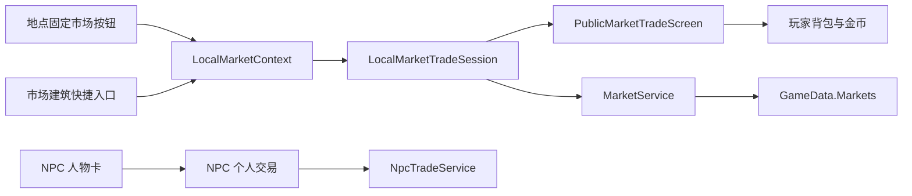
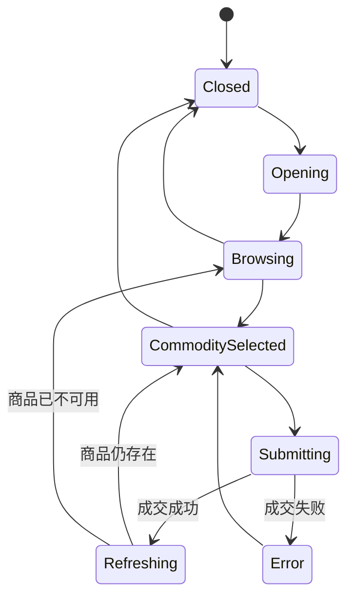

# 地点公共市场总览与交易 UI 技术方案 v0.2

> 文档状态：待评审  
> 编制日期：2026-07-29  
> 适用项目：《异界旅人》/ Card Colony  
> 关联文档：《市场与跑商交易系统重构方案 v0.3》  
> 关联文档：《市场经济核心 P0 技术实现方案 v0.1》  
> 关联文档：《白石城市场接入与首条跑商闭环技术实现方案 v0.1》  
> 前置版本：《统一市场入口与交易 UI 重构技术方案 v0.1》  
> 目标版本：玩家亲自跑商 P1.0  

---

## 0. 执行结论

当前交易系统不需要推翻市场经济内核。`MarketService` 已经负责地区市场的报价、库存、资金、刷新和原子交易，真正需要重构的是：

- 交易入口目前主要绑定 `NpcTrader`。
- 完整买卖列表被塞进右侧人物状态栏。
- 交易请求和交易权限仍以 `MerchantId`、`MerchantTradePolicy` 为中心。
- 地点本身没有直接打开公共市场总览的能力。
- 公共市场和 NPC 个人交易在入口、数据和界面概念上仍然混在一起。

本方案采用以下结构：

> **市场属于地点。玩家到达地点后可以直接打开市场总览，不需要选择、接近或经过任何 NPC。**

首版交互规则：

1. 玩家进入拥有公共市场的地点后，地点界面固定显示“市场”按钮。
2. 点击“市场”按钮，直接打开该地点完整的市场总览和交易界面。
3. 打开公共市场不要求先选中 NPC，也不要求玩家人物卡先与 NPC 形成交互框。
4. 市场建筑卡可以保留“进入市场”作为沉浸式快捷入口，但不是必经入口。
5. 公共市场商品来自 `MarketProfile`，不再由某个 NPC 的经营范围决定。
6. NPC 交易只保留个人物品、特殊商品、关系交易和回购，不代表整个地区市场。
7. 世界地图可以查看玩家已经获得的异地行情，但不允许远程买卖。
8. 本期只支持玩家本人或当前唯一队伍亲自跑商，不加入商队管理、自动贸易路线、其他商队模拟或派遣系统。

不建议现在制作独立的“市场街区地图”。地点内固定按钮直接打开总览，操作路径最短，适合需要反复买卖的核心跑商玩法。未来即使增加市场街区，它也只能作为场景表现层，仍然复用本方案的公共市场界面和 `MarketService`。

---

## 1. 目标与非目标

### 1.1 本期目标

本期需要实现：

- 将公共市场交易 UI 从 NPC 右侧状态栏中彻底提取出来。
- 地点直接持有或解析自己的 `MarketProfile`。
- 玩家在当地可以一键打开完整公共市场总览。
- 公共市场打开、浏览和成交的整个调用链不依赖 `NpcTrader`。
- 一个地区的公共市场只有一份库存、资金、刷新时间和价格状态。
- 在交易界面中完成商品查看、数量选择、报价确认、购买和出售。
- 交易界面能清楚展示本地价格、市场库存、玩家持有量和市场收购能力。
- 保留过期报价校验和原子交易。
- 交易完成后，市场状态、玩家金币和玩家背包立即刷新。
- 为后续异地行情记录和首条跑商路线保留扩展位置。
- NPC 个人交易继续存在，但不参与公共市场入口。

### 1.2 本期明确不做

本期不实现：

- 管理其他商队。
- 创建、雇佣或派遣商队。
- 自动往返贸易路线。
- NPC 商队在世界地图上的实时移动。
- NPC 商队参与市场库存的完整模拟。
- 多支玩家队伍和队伍切换。
- 远程购买、远程出售和跨城瞬间运输。
- 拍卖行、订单簿和玩家挂单。
- 商会仓库和跨地区共享仓库。
- 联机玩家交易。
- 新的独立市场街区地图。
- 合同、护送、劫匪、天气和道路风险。

其中“其他商队管理”不是延后到本方案后半段，而是完全排除在本版本范围外。本版所有界面文案、数据结构和按钮都不应提前暴露“商队”“派遣”“自动路线”等不可用入口。

---

## 2. 当前实现基线

### 2.1 已经具备的底层能力

当前项目已经具备：

- `MarketProfile`：地区市场静态配置。
- `MarketStateData`：地区市场动态状态。
- `MarketService`：市场状态创建、补算、报价和交易。
- `MarketQuote`：库存、买卖价、市场可收购数量和状态修订号。
- `MarketTradeRequest`：带预期单价、预期修订号和数量的交易请求。
- `MarketRefreshEngine`：按世界经济时间刷新和补算市场。
- `GameData.Markets`：市场状态存档。
- `NpcTradeProfile`：NPC 商品范围、价格修正和市场绑定。
- `NpcTrader`：NPC 选择和交易入口。
- `NpcTradeService`：NPC 到市场交易内核的适配。
- `WorldMapLocationView`：地点内人物、建筑和交易状态栏。

因此本方案不重新编写价格公式、库存算法或资金结算。

### 2.2 当前耦合点

| 耦合位置 | 当前问题 | 本方案处理 |
| --- | --- | --- |
| `WorldMapLocationView` | 人物选择、建筑选择、交易列表、出售确认都集中在一个类 | 将完整交易界面提取为独立控制器 |
| `LocationDefinition` | 地点不能显式指向自己的公共市场 | 增加 `publicMarketProfile` 或稳定的市场解析入口 |
| `NpcTrader` | 同时承担选择对象、解析配置和地区市场交易门面 | 只保留 NPC 个人交易和人物选择职责 |
| `NpcTradeService` | 地区市场访问要求传入 `NpcTrader` | 公共市场改走独立 `LocalMarketTradeService` |
| `MarketTradeRequest.MerchantId` | 公共市场成交仍要求伪造一个商人身份 | 改为公共市场交易渠道或直接按市场规则校验 |
| `RegisterMerchantPolicy` | 公共市场权限被表达成商人权限 | 增加公共市场策略，NPC 策略不再是公共市场前置条件 |
| `NpcTradeProfile` | NPC 同时持有个人交易和地区市场配置 | 移除其公共市场所有权，只保留个人交易配置 |
| 右侧人物栏 | 地区商品列表占用人物面板 | 人物栏只显示人物行动和个人交易 |

### 2.3 必须保持的现有行为

重构过程中必须保持：

- 玩家点击 NPC，右侧人物状态栏仍然出现。
- 玩家与 NPC 的交谈、行动和个人交易不受公共市场重构影响。
- 选中建筑后，右侧栏切换为建筑内容，但不会导致整个侧栏消失。
- 市场报价发生变化后，旧报价不能继续成交。
- 购买和出售失败时，玩家、市场和背包都不能留下半笔交易。
- 已有普通 NPC 的个人买卖和回购库存不能无故丢失。
- 读取旧存档后，已经存在的市场状态继续有效。

---

## 3. 目标架构

### 3.1 总体关系



职责划分：

- `LocationDefinition`：声明地点是否拥有公共市场以及对应的 `MarketProfile`。
- `LocalMarketContext`：描述当前地点和当前公共市场，不包含 NPC。
- `LocalMarketTradeSession`：维持本次打开界面期间的选中商品、当前报价和交易状态。
- `PublicMarketTradeScreen`：显示整个地区公共市场的商品总览、玩家货物和交易确认。
- `MarketService`：继续作为地区市场唯一报价和结算权威。
- `NpcTradeService`：只处理 NPC 个人交易，不作为公共市场前置入口。
- 地点按钮、建筑和世界地图都不直接修改市场库存或玩家货币。

### 3.2 地区市场与入口的关系

一个地点只保存一份公共市场状态，并由地点直接引用：

```text
河湾村
└── riverbend-market
    ├── 地点固定“市场”按钮
    ├── 市场建筑快捷入口
    └── PublicMarketTradeScreen
```

两个公共市场入口看到完全相同的商品总览，并读写同一个 `riverbend-market`：

- 地点固定按钮：显示整个公共市场。
- 市场建筑：显示整个公共市场。

公共市场不再按杂货商、铁匠、药师过滤商品。商品是否出现在总览中，只由 `MarketProfile.commodityRules` 决定。

NPC 个人交易使用自己的个人库存和资金，但不能读写公共市场库存，也不能被用作访问整个地区市场的代理对象。

### 3.3 公共市场与个人交易

系统保留两种交易提供者：

#### 公共市场

- 使用 `MarketProfile` 和 `MarketStateData`。
- 价格由地区供需决定。
- 地点固定按钮和市场建筑共享库存和资金。
- 完整显示当前地区允许公开交易的商品。
- 用于跑商核心商品。
- 不需要 NPC 在场、存活、被选中或处于交互状态。

#### NPC 个人交易

- 使用 NPC 个人资金和个人回购库存。
- 商品数量少，经营范围窄。
- 可受人物关系、任务和身份影响。
- 用于角色特色物品、战利品回购和少量生活物资。
- 不显示完整公共市场总览。
- 不使用公共市场资金和公共市场库存。

公共市场界面只显示地点和市场：

```text
河湾村公共市场
今日行情 · 距离下次刷新 8 小时
```

NPC 个人交易继续显示人物身份：

```text
村长的个人交易
```

玩家不能把两者误认为同一套库存。

---

## 4. 公共市场入口设计

### 4.1 地点固定入口

地点固定“市场”按钮是公共市场的主要入口。

当 `LocationDefinition.publicMarketProfile != null` 时，地点界面固定显示：

```text
[背包]    [市场]    [返回世界地图]
```

“市场”按钮不属于人物状态栏，也不要求当前选中任何卡牌。

直接交互：

```text
玩家进入地点
→ 系统检测地点存在 publicMarketProfile
→ 固定显示“市场”按钮
→ 玩家点击“市场”
→ 创建 LocalMarketContext
→ 打开 PublicMarketTradeScreen
```

如果地点没有公共市场：

```text
LocationDefinition.publicMarketProfile == null
→ 不显示市场按钮
```

### 4.2 市场建筑快捷入口

市场建筑卡可以保留，但它只是第二入口，不是交易所必需的 NPC 替代品。

玩家选中市场建筑后，右侧建筑栏显示：

- 市场名称。
- 盛产商品摘要。
- 紧缺商品摘要。
- 下次刷新时间。
- “打开市场总览”按钮。

点击后创建与地点固定入口完全相同的 `LocalMarketContext`，打开同一个 `PublicMarketTradeScreen`。

市场建筑：

- 不保存独立库存。
- 不配置独立价格。
- 不要求人物卡拖到建筑上。
- 不要求任何 NPC 存在。
- 不影响固定“市场”按钮是否出现。

### 4.3 NPC 个人交易入口

理论上任何 NPC 都可以提供个人交易，但 NPC 不再提供公共市场总览。

NPC 的默认规则：

- 可以出售少量个人物品。
- 可以收购有限类别物品。
- 使用个人资金上限。
- 可以根据关系提供折扣、特殊商品或任务物品。
- 没有可买卖物品时，显示“此人目前没有可交易物品”。

NPC 人物栏中不再出现代表地区公共市场的“购买”“出售”列表。若保留“交易”按钮，它只能打开该人物自己的交易。

### 4.4 世界地图行情入口

玩家访问过某个市场后，可以在世界地图地点详情中查看：

- 上次记录的主要商品价格。
- 行情记录时间。
- 盛产和紧缺标签。

首版规则：

- 未访问市场：显示“行情未知”。
- 已访问市场：显示最后一次亲自访问时记录的行情。
- 当前队伍在当地：可以点击“进入市场”，直接打开公共市场总览。
- 人不在当地：只能查看记录，购买和出售按钮禁用。

禁止：

- 从世界地图直接在异地买货。
- 从世界地图直接卖出背包货物。
- 自动将货物传送到其他城市。

---

## 5. 统一交易界面

### 5.1 界面定位

交易界面采用大型覆盖层或接近全屏的独立面板，不继续放在右侧状态栏内部。

推荐尺寸：

- 覆盖地点可游玩区域的 70%～85%。
- 保留背景暗化，玩家仍能感知自己身处当前地点。
- 不切换 Unity Scene。
- 关闭后恢复进入前选中的人物或建筑。

### 5.2 推荐布局

```text
┌──────────────────────────────────────────────────────────────┐
│ 河湾村公共市场                    金币 128   背包 9/24   [关闭] │
├───────────────────────────────────────────────┬──────────────┤
│ [全部] [食物] [原料] [加工品] [药品]          │ 玩家货物      │
│                                               │              │
│ 商品   库存  市场售价  收购价  持有  行情      │ 浆果 × 12     │
│ 浆果    32      4        3      12   低价      │ 石料 × 8      │
│ 木材    10     11        8       0   正常      │ 金币 × 128    │
│ 石料     3     19       15       8   紧缺      │              │
│                                               │              │
├───────────────────────────────────────────────┴──────────────┤
│ 石料  当地紧缺  上次进货均价 9                               │
│ [购买] [出售]       [-]  4  [+] [最大]                        │
│ 单价 15   数量 4   总收入 60   交易后持有 4                   │
│                                      [确认出售]               │
└──────────────────────────────────────────────────────────────┘
```

### 5.3 顶部摘要区

必须显示：

- 地点名称。
- 公共市场名称。
- 玩家金币。
- 背包已用槽位和总槽位。
- 关闭按钮。

可选显示：

- 市场可用资金。
- 下次刷新时间。
- 税费或人物价格修正。

### 5.4 商品列表

每行至少显示：

| 字段 | 文案要求 |
| --- | --- |
| 商品图标与名称 | 保留卡牌美术辨识度 |
| 市场库存 | 无库存时明确显示 0 |
| 市场售价 | 标注“你购买时支付” |
| 市场收购价 | 标注“你出售时获得” |
| 玩家持有 | 来自当前背包真实状态 |
| 行情 | 盛产、低价、正常、偏高、紧缺 |

避免只显示“买价”“卖价”，因为该说法容易混淆交易方向。正式文案统一使用：

- **市场售价**：玩家购买商品时支付的单价。
- **市场收购价**：玩家出售商品时获得的单价。

商品列表支持：

- 按分类筛选。
- 按名称、市场售价、收购价、库存、持有量排序。
- 无商品时显示明确空状态。
- 列表刷新后尽量保持原商品选中；商品消失时才清空选择。

商品是否允许公开购买或出售，只读取 `MarketProfile` 中对应商品规则。公共市场总览不再叠加 NPC 职业过滤。

首版可以不做搜索框。

### 5.5 玩家货物区

玩家货物区显示：

- 可交易商品。
- 数量。
- 当地公共市场是否收购。
- 当地不收购时的禁用样式和原因。

不要为了刷新交易 UI 重建或销毁真实背包卡牌。该区域只能读取背包数据并生成 UI 项，真实卡牌变更仍由交易提交适配器处理。

这是防止“交易后打开背包为空”“重新添加卡牌后又显示”的重要边界：

- UI 列表刷新不能修改背包容器。
- 交易成功前不能预先移除真实卡牌。
- 交易失败或过期报价不能触发背包重排提交。

### 5.6 数量与确认区

数量控制：

- `-1`
- 当前数量
- `+1`
- `最大`
- 可选快捷数量：`+10`

数量下限为 1。

最大购买数量：

```text
Min(
    市场可售库存,
    玩家金币 / 市场售价,
    当前背包可容纳数量
)
```

最大出售数量：

```text
Min(
    玩家持有数量,
    市场可收购数量,
    当地公共市场规则允许数量
)
```

确认区必须显示：

- 交易方向。
- 单价。
- 数量。
- 总价。
- 交易后金币。
- 交易后玩家持有量。
- 交易后市场库存。
- 无法成交时的明确原因。

点击确认后：

1. 立即禁用确认按钮。
2. 提交带预期单价和预期状态修订号的交易请求。
3. 成功后刷新市场列表、玩家货物、金币和数量上限。
4. 失败后保留界面，显示原因。
5. 完成刷新后再启用按钮。

### 5.7 行情记录

行情记录是跑商决策的一部分，但首版不必做完整曲线。

建议记录：

```text
MarketObservation
- marketId
- commodityId
- observedBuyFromMarketPrice
- observedSellToMarketPrice
- observedStockBand
- observedWorldHour
```

界面只显示玩家已经亲自观察到的数据：

```text
白石城：上次市场售价 18，收购价 14，24 小时前
```

不能直接显示当前远方市场的实时内部状态，否则旅行和情报失去意义。

首版如果开发量需要收缩，可以先保留行情区域占位，不接入异地记录；但不能伪造实时行情。

---

## 6. 交易会话与状态机

### 6.1 会话状态

建议状态：

```text
Closed
Opening
Browsing
CommoditySelected
Submitting
Refreshing
Error
```

状态转换：



### 6.2 报价生命周期

```text
选择商品
→ 请求 MarketQuote
→ 保存 Quote 与 StateRevision
→ 玩家调整数量
→ 单价不变，只重新计算总价
→ 提交 ExpectedUnitPrice、ExpectedStateRevision、Quantity
→ MarketService 重新校验
→ 成交或返回 StaleQuote
```

数量变化时不能偷偷重新请求单价。否则玩家看到的单价、总价和最终成交价可能不一致。

当收到 `StaleQuote`：

- 不成交。
- 不修改背包和金币。
- 刷新该商品报价。
- 显示“市场行情刚刚发生变化，请重新确认”。
- 数量压缩到新的最大可交易数量。

### 6.3 关闭规则

关闭界面时必须清理：

- 当前商品选择。
- 当前报价。
- 当前数量。
- 提交锁。
- 临时错误提示。
- 访问上下文。

关闭界面时不得：

- 清空当前 NPC 或建筑选择。
- 修改背包。
- 修改市场库存。
- 自动确认尚未提交的交易。

---

## 7. 数据结构方案

### 7.1 `LocationDefinition` 公共市场引用

建议在地点定义上增加显式引用：

```csharp
public sealed class LocationDefinition : ScriptableObject
{
    [SerializeField] private MarketProfile publicMarketProfile;

    public MarketProfile PublicMarketProfile =>
        publicMarketProfile;
}
```

规则：

- `publicMarketProfile == null`：地点没有公共市场，不显示固定市场按钮。
- `publicMarketProfile != null`：玩家在当地可以直接打开完整市场总览。
- `publicMarketProfile.LocationId` 必须与 `LocationDefinition.Id` 一致。
- 地点不复制市场库存，仍使用 `GameData.Markets[MarketProfile.Id]`。

不建议仅凭场景中是否存在某张商人卡来推断市场。NPC 缺失、被隐藏或尚未生成，都不能导致当地公共市场不可访问。

### 7.2 `LocalMarketContext`

运行时上下文不保存到资产，并且不包含 NPC：

```csharp
public sealed class LocalMarketContext
{
    public string LocationId { get; }
    public string LocationDisplayName { get; }
    public MarketProfile MarketProfile { get; }
    public LocalMarketOpenSource OpenSource { get; }
    public MarketTradeOpenMode InitialMode { get; }
}
```

`LocalMarketOpenSource` 只用于埋点、关闭后焦点恢复和界面动画，不改变商品范围或价格：

```csharp
public enum LocalMarketOpenSource
{
    LocationButton,
    MarketBuilding,
    LocalWorldMapDetails
}
```

首版不加入：

```text
Npc
RemoteMarket
Caravan
ManagedRoute
```

### 7.3 公共市场交易规则

公共市场允许交易哪些商品，直接读取：

```text
MarketProfile
└── commodityRules
    ├── commodityId
    ├── allowPlayerPurchase
    ├── allowPlayerSale
    ├── stock bounds
    └── production / consumption
```

公共市场请求不应该要求真实或虚构的 `MerchantId`。推荐将交易渠道泛化为：

```csharp
public enum MarketTradeChannel
{
    PublicMarket
}
```

目标请求：

```csharp
public sealed class MarketTradeRequest
{
    public string MarketId { get; }
    public MarketTradeChannel Channel { get; }
    public string CommodityId { get; }
    public MarketTradeDirection Direction { get; }
    public int Quantity { get; }
    public int ExpectedUnitPrice { get; }
    public long ExpectedStateRevision { get; }
}
```

`MarketService` 收到公共市场请求后，必须校验：

- `MarketProfile` 存在。
- 商品属于该市场。
- 当前方向被该商品规则允许。
- 市场库存和资金足够。
- 玩家金币和持有量足够。
- 预期报价和修订号仍然有效。

过渡规则：

- 旧 NPC 公共市场路径暂时保留兼容接口。
- 新的地点总览路径不得传入默认商人或伪造 `MerchantId`。
- 公共市场界面稳定后，删除 NPC 到地区市场的绑定。
- NPC 个人交易继续走自己的个人交易请求，不复用 `MarketTradeChannel.PublicMarket`。

### 7.4 `NpcTradeProfile` 迁移

目标结构：

```text
NpcTradeProfile
- npcDefinition
- personal sell offers
- personal buy tags
- personal funds
- personal price modifiers
- relation requirements
- dialogue and identity fields
```

迁移期间：

- 旧 `NpcTradeProfile.marketProfile` 只用于兼容现有内容。
- 河湾杂货商等已绑定地区市场的 NPC，逐步改成个人交易配置。
- 地区市场商品全部迁移到 `MarketProfile.commodityRules`。
- 地点通过 `LocationDefinition.publicMarketProfile` 访问地区市场。
- 完成资产迁移后删除 `NpcTradeProfile.marketProfile` 及对应公共市场 Resolver 分支。

---

## 8. 代码改造方案

### 8.1 新增文件

建议新增：

```text
Assets/StackCraft/Scripts/Trading/LocalMarket/
├── LocalMarketContext.cs
├── LocalMarketResolver.cs
├── LocalMarketTradeService.cs
├── LocalMarketTradeSession.cs
├── MarketTradeSelection.cs
└── MarketTradeSessionResult.cs

Assets/StackCraft/Scripts/UI/Trading/
├── PublicMarketTradeScreen.cs
├── PublicMarketTradeScreenViewModel.cs
├── MarketCommodityListItem.cs
├── MarketInventoryListItem.cs
├── MarketTradeQuantityPanel.cs
└── LocalMarketButtonController.cs
```

Prefab：

```text
Assets/StackCraft/Prefabs/UI/Trading/PublicMarketTradeScreen.prefab
```

### 8.2 `WorldMapLocationView`

修改目标：

- 保留人物、建筑、任务等右侧状态栏的选择和摘要显示。
- 删除或停止使用右侧栏内完整商品列表的构建逻辑。
- 根据当前 `LocationDefinition.PublicMarketProfile` 显示固定“市场”按钮。
- 固定按钮不读取当前 `SelectedNpcTrader`。
- 市场建筑“打开市场总览”按钮调用同一接口。
- NPC 的“交易”按钮只保留个人交易。
- 交易界面关闭时恢复当前人物或建筑状态栏。

建议门面：

```csharp
public void OpenLocalPublicMarket(
    LocalMarketOpenSource source);
```

`WorldMapLocationView` 不再负责：

- 构造每一行商品按钮。
- 保存当前市场报价。
- 计算最大交易数量。
- 直接提交购买和出售。

### 8.3 `PublicMarketTradeScreen`

职责：

- 绑定与解绑 `LocalMarketTradeSession`。
- 渲染市场摘要和商品列表。
- 渲染玩家货物列表。
- 保存纯 UI 输入状态。
- 将确认操作交给会话。
- 显示成功、失败和过期报价提示。

禁止：

- 直接写入 `GameData.Markets`。
- 直接销毁或生成真实背包卡牌。
- 自己计算地区价格。
- 自己判断公共市场是否允许某商品。
- 读取当前选中的 NPC 来决定市场内容。

### 8.4 `LocalMarketTradeSession`

职责：

- 接受 `LocalMarketContext`。
- 解析当前地点的 `MarketProfile`。
- 请求商品列表和报价。
- 保存当前选择和报价快照。
- 计算最大可交易数量。
- 调用交易服务提交请求。
- 在成功后返回统一刷新结果。

该类不依赖具体按钮和 TextMeshPro 文本，方便 EditMode 测试。

### 8.5 `NpcTradeService`

重构后：

- 普通 NPC 个人交易仍可通过该服务。
- 专业 NPC 也只通过该服务提供自己的个人交易。
- 地区公共市场改为调用 `LocalMarketTradeService`。
- 旧 NPC 地区市场接口只在迁移阶段保留。
- 最终不再由它承担任何公共市场入口。

### 8.6 `MarketService`

价格与交易算法保持不变，新增公共市场交易渠道：

- 公共市场渠道直接读取 `MarketProfile.commodityRules`。
- NPC 商人策略只服务兼容路径，不能成为公共市场总览的依赖。
- 新请求通过 `MarketTradeChannel.PublicMarket` 表明交易渠道。
- 公共市场不应用 NPC 个人价格修正。

安全边界保持：

- UI 不能提交自定义价格修正。
- UI 不能交易市场规则未包含的商品。
- UI 不能绕过市场资金和库存。
- UI 不能用伪造 NPC 身份扩大商品范围。

### 8.7 市场建筑组件

可复用现有 `LocationEntrance` 作为选择入口，并新增：

```csharp
public sealed class LocalMarketShortcut : MonoBehaviour
{
    [SerializeField] private MarketProfile marketProfile;
}
```

职责：

- 提供市场建筑快捷入口。
- 提供建筑显示名称。
- 不保存市场库存。
- 不计算价格。
- 不依赖 NPC。
- 不在 `OnPointerClick` 中直接成交，只打开总览。

若地点资产已经显式绑定 `publicMarketProfile`，建筑组件可以不重复保存引用，而是从当前 `LocationDefinition` 解析并校验两者一致。

---

## 9. UI Prefab 与布局要求

### 9.1 Canvas 与锚点

交易界面必须使用全屏拉伸锚点：

```text
Anchor Min = (0, 0)
Anchor Max = (1, 1)
Offset 由统一边距控制
```

主内容采用布局组件，不使用运行时硬编码绝对坐标修复：

- 顶部固定高度。
- 中间区域拉伸。
- 底部确认区固定或按内容高度。
- 商品列表与背包列表使用 `ScrollRect`。
- 文本启用截断或自动缩放的范围限制。

### 9.2 分辨率

最低验收：

- 16:9，1920×1080。
- 16:9，1280×720。
- Unity Game 视图缩放变化。
- 右侧状态栏展开和折叠。

重点检查：

- 商品名称不会压缩价格列。
- 数量按钮不越界。
- 总价和错误提示不互相覆盖。
- 长地点或市场名称不会把关闭按钮推走。
- 滚动列表不会盖住底部确认区。

### 9.3 输入锁

交易界面打开时：

- 禁止拖动地点中的卡牌。
- 禁止点击被遮罩的 NPC 和建筑。
- 世界地图移动和地点切换按钮禁用。
- `Esc` 或关闭按钮先关闭交易界面。

交易界面关闭后恢复原输入状态。

---

## 10. 存档与兼容

### 10.1 不新增第二份市场状态

地点固定入口和市场建筑快捷入口必须使用现有：

```text
GameData.Markets[marketId]
```

不能新增：

```text
BuildingMarketState
NpcMarketState
TradeScreenCachedMarketState
```

### 10.2 会话不存档

以下内容不写入存档：

- 当前打开的交易界面。
- 当前选中商品。
- 当前交易数量。
- 当前报价快照。
- 当前错误提示。

存档或读档后交易界面默认关闭。

### 10.3 行情记录

如果本期接入行情记录，需要加入 `GameData`，并带版本号。

旧存档：

- 没有行情记录时初始化为空。
- 不根据当前市场状态倒填历史价格。
- 玩家下一次亲自访问市场时开始记录。

---

## 11. 测试方案

### 11.1 纯逻辑测试

覆盖：

- `LocationDefinition` 没有市场引用时不生成公共市场上下文。
- `LocationDefinition` 有市场引用时可以直接创建公共市场会话。
- 创建公共市场会话不需要 `NpcTrader`。
- 地点固定入口和市场建筑读取同一 `MarketId` 和同一市场状态。
- 公共市场商品范围完全来自 `MarketProfile.commodityRules`。
- 市场规则未授权的商品不能成交。
- 数量变化不改变报价单价和修订号。
- 过期报价整笔拒绝。
- 最大购买数量受库存、金币和背包限制。
- 最大出售数量受持有量、市场资金和权限限制。
- 成交后市场库存、市场资金和玩家金币正确变化。
- 失败时全部状态保持原样。

### 11.2 UI 测试

覆盖：

- 进入拥有市场的地点后固定显示“市场”按钮。
- 未选中任何 NPC 时点击“市场”可以打开完整公共市场总览。
- 当前不存在 `NpcTrader` 对象时仍可打开并完成交易。
- 选中任意 NPC 后点击地点固定“市场”按钮，公共市场内容不受 NPC 影响。
- 点击市场建筑快捷入口打开同一公共市场 Prefab。
- 公共市场标题不显示“经由某某商人”。
- NPC 交易只显示该人物的个人交易，不显示地区市场总览。
- 切换购买/出售不会保留错误的旧数量和旧报价。
- 交易成功后商品列表、背包列表、金币和持有量立即更新。
- 交易失败后背包卡牌仍然显示。
- 关闭界面后原 NPC 或建筑仍保持选中。
- UI 打开期间不能操作背景卡牌。

### 11.3 背包回归测试

重点覆盖此前出现过的背包显示问题：

- 出售一件物品后打开背包，其他卡牌继续显示。
- 批量出售后打开背包，未出售卡牌继续显示。
- 出售失败后，所有卡牌继续显示。
- 过期报价后，所有卡牌继续显示。
- 多次快速点击确认只成交一次。
- 交易 UI 刷新不触发背包清空、重新归属或隐藏。
- 添加新卡牌不是恢复旧卡牌显示的必要条件。

### 11.4 手工验收

1. 进入河湾村。
2. 不选中任何 NPC。
3. 确认地点界面固定显示“市场”按钮。
4. 点击“市场”，直接打开完整公共市场总览。
5. 确认标题只显示河湾村和公共市场，不显示杂货商。
6. 记录某商品库存、市场售价和收购价。
7. 购买指定数量。
8. 确认金币下降、持有量上升、市场库存下降。
9. 关闭界面。
10. 选中杂货商，再次点击地点固定“市场”按钮。
11. 确认公共市场商品、价格和库存不因选中杂货商发生变化。
12. 出售部分商品。
13. 确认市场库存上升、市场资金下降、玩家金币上升。
14. 单独打开杂货商个人交易，确认它不是公共市场总览。
15. 打开背包，确认其他物品仍然显示。
16. 返回世界地图，确认只能查看行情，不能远程成交。
17. 保存并读档，确认市场状态保持且交易界面默认关闭。

---

## 12. 分阶段实施计划

### M1：建立地点直达的公共市场界面

内容：

- 创建 `PublicMarketTradeScreen` Prefab。
- 创建 `LocalMarketTradeSession` 和 ViewModel。
- 为 `LocationDefinition` 增加 `publicMarketProfile`。
- 在地点界面增加固定“市场”按钮。
- 按钮直接读取当前地点市场，不读取 `SelectedNpcTrader`。

完成标准：

- 没有选择任何 NPC 时可以打开并使用公共市场。
- 场景里没有商人 NPC 时公共市场仍可使用。
- 公共市场显示整个 `MarketProfile` 商品范围。
- 交易后背包和市场显示稳定。

### M2：公共市场交易请求脱离商人

内容：

- 新增 `LocalMarketContext`。
- 新增 `MarketTradeChannel.PublicMarket`。
- 公共市场请求不再携带或伪造 `MerchantId`。
- `MarketService` 按 `MarketProfile.commodityRules` 校验公共交易。

完成标准：

- 公共市场完整调用链不依赖 `NpcTrader` 和 `NpcTradeProfile`。
- 删除 NPC 时不会影响当地市场。
- NPC 个人价格修正不会影响公共市场。
- 市场核心测试继续通过。

### M3：建筑快捷入口与 NPC 个人交易分离

内容：

- 为河湾村和白石城绑定 `publicMarketProfile`。
- 为市场建筑增加 `LocalMarketShortcut`。
- 建筑右侧栏增加市场摘要和进入按钮。
- 建筑打开与地点固定按钮相同的公共市场总览。
- 迁移专业 NPC，使其只保留个人交易。

完成标准：

- 地点固定入口和建筑快捷入口共享库存、资金、刷新和价格。
- NPC 不再被用作公共市场入口或商品过滤器。
- 普通 NPC 个人交易不受影响。

### M4：批量交易与行情信息

内容：

- 数量选择和最大数量。
- 明确显示总价和交易后结果。
- 接入已访问市场的最后观察价格。
- 世界地图显示历史行情但禁止远程成交。

完成标准：

- 玩家可以一次装载和出售多件商品。
- 河湾村与白石城之间可以进行完整的亲自跑商。
- 玩家能依据自己获得的历史行情做路线判断。

本方案到 M4 结束。之后也不自动进入商队管理开发。

---

## 13. 风险与控制

| 风险 | 控制措施 |
| --- | --- |
| 新界面与旧右侧列表并存，产生两套刷新逻辑 | M1 完成后停止旧商品列表入口，只保留临时兼容代码 |
| 为直达市场伪造默认商人 | 新公共市场请求使用 `MarketTradeChannel.PublicMarket`，不传 NPC |
| 地点和建筑创建独立市场 | 两者都从 `LocationDefinition.PublicMarketProfile` 解析同一市场 |
| 选中 NPC 后污染公共市场列表 | 公共市场控制器禁止读取 `SelectedNpcTrader` |
| 交易刷新误改背包显示 | UI 只读背包快照，真实变更只走原子交易适配器 |
| 连续点击导致重复成交 | 提交状态锁 + `StateRevision` 双重保护 |
| 关闭界面后右侧状态栏消失 | 保留进入前选择对象，关闭时重新渲染摘要 |
| 全屏 UI 遮挡但背景仍可点击 | Modal 遮罩和统一输入锁 |
| 远方实时行情削弱跑商 | 只保存最后观察值和观察时间 |
| 新地图开发拖慢核心验证 | 本期明确不制作市场街区 Scene |
| 功能再次扩展到自动商队 | 验收项与数据结构中不出现商队管理入口 |

---

## 14. 最终验收清单

- [ ] 地点固定“市场”按钮成为公共市场主入口。
- [ ] 未选择任何 NPC 时可以打开并完成公共市场交易。
- [ ] 场景中不存在商人 NPC 时公共市场仍然可用。
- [ ] 市场建筑只是打开同一总览的快捷入口。
- [ ] 公共市场界面与 `NpcTrader`、`NpcTradeProfile` 没有运行时依赖。
- [ ] 完整交易列表不再塞入右侧状态栏。
- [ ] 一个地区只有一份公共市场状态。
- [ ] 公共市场商品范围只由 `MarketProfile` 决定。
- [ ] NPC 只保留个人交易，不代表地区市场。
- [ ] 市场售价和市场收购价文案方向明确。
- [ ] 支持精确数量和最大数量。
- [ ] 成交前显示单价、数量、总价和交易后结果。
- [ ] 过期报价不能成交。
- [ ] 快速重复点击不能重复成交。
- [ ] 交易成功后市场、金币和背包立即刷新。
- [ ] 交易失败后背包卡牌不会消失。
- [ ] 关闭交易界面后原选择对象仍然存在。
- [ ] 世界地图只查看已知行情，不允许远程交易。
- [ ] 本期没有商队管理、自动路线和派遣入口。
- [ ] 本期没有新增独立市场地图。

---

## 15. 本方案完成后的玩家体验

完成后，玩家的核心流程为：

```text
进入河湾村
→ 不需要寻找或选择杂货商
→ 点击地点固定“市场”按钮
→ 打开公共市场交易界面
→ 比较商品售价、收购价、库存和自身持有量
→ 批量购买
→ 玩家亲自前往白石城
→ 点击白石城固定“市场”按钮
→ 打开白石城完整公共市场总览
→ 批量出售
→ 当地库存、资金和价格发生变化
→ 玩家依据已记录行情决定下一次亲自跑商
```

该流程不经过 NPC，把高频跑商操作集中到清晰、稳定、可扩展的地点公共市场 UI 中。NPC 继续负责人物互动和个人交易，不再成为玩家使用地区市场的障碍。

本版本的商业成长来自：

- 更好地识别地区价差。
- 更合理地选择商品和数量。
- 更有效地使用当前背包容量和金币。
- 对行情刷新和旅途时间作出判断。

不依赖管理其他商队，也不依赖自动贸易。
