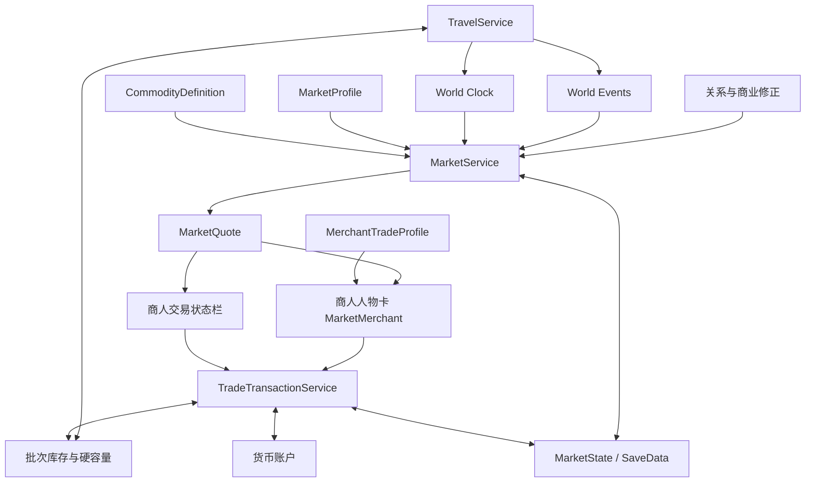

# 市场与跑商交易系统重构方案 v0.3

> 文档状态：提案  
> 编制日期：2026-07-27  
> 适用项目：《异界旅人》/ Card Colony  
> 目标版本：商业闭环 P3 前置重构  
> 核心结论：保留现有河湾市场的场景、卡牌交互和交易确认体验，重构价格、库存、资金、运输、容量、行情与合同系统，使“跑商”成为可以反复游玩的核心路线。

## 0. 执行摘要

当前河湾市场已经完成了单地点买卖原型：

- 玩家可以进入市场地点。
- 七个摊位提供固定商品、固定买价和每日库存。
- 玩家可以点击摊位购买，也可以把物品拖到收购台确认出售。
- 金币可以从背包和桌面扣除。
- 当日库存会写入地点存档。

这些内容证明了市场场景和卡牌交易交互可行，但当前系统本质上仍是“固定价杂货店 + 无限资金回收站”。它不能形成跑商，因为玩家缺少以下决策：

- 不同地区之间的买卖价差。
- 商品数量、重量和资金占用的取舍。
- 路线耗时、费用和危险。
- 行情是否可靠、何时刷新。
- 自由贸易与限时合同之间的选择。
- 大量买入或卖出对当地市场的影响。

因此市场需要进行结构级重构，但不需要推倒现有表现层。重构原则是：

1. **保留卡牌感**：市场仍然是可以进入的地点，交易入口改为有身份、有关系的商人人物卡，摊位只留在背景美术中。
2. **统一经济逻辑**：所有购买、出售、合同和店铺进货都调用同一套报价与结算服务。
3. **先做可读经济，不做复杂模拟**：玩家看到“盛产、正常、短缺、紧急”等趋势，底层只使用有限库存、地区系数和事件修正。
4. **先验证三地跑商，再扩展内容**：三个市场、六至八种商品足以验证核心玩法。
5. **时间和载重必须产生机会成本**：利润不能只由两个价格相减决定。
6. **人物承载服务**：点击商人卡打开交易状态栏；将玩家角色拖到商人卡仍然进入对话，避免交易挤占人物互动。

## 1. 目标与非目标

### 1.1 系统目标

市场与跑商系统需要支持以下完整循环：


玩家应当能够回答：

- 为什么在这里买？
- 为什么运去那里？
- 为什么选择这种货，而不是另一种？
- 为什么现在出发，而不是等待刷新？
- 这趟利润是否覆盖了时间、费用和风险？

### 1.2 首版非目标

首版不做：

- 每个 NPC 都独立生产和消费商品。
- 完整模拟商队在地图上的实时流动。
- 股票式分钟级价格曲线。
- 拍卖行、订单簿、竞价撮合。
- 数十个城镇和上百种商品。
- 隐藏公式驱动的剧烈随机波动。
- 联机经济和玩家间交易。
- 因每日固定食物不足而直接死亡。

## 2. 当前实现评估

### 2.1 应当保留

| 当前内容 | 保留理由 | 后续处理 |
| --- | --- | --- |
| 河湾市场地点和背景 | 已经形成明确的市场空间和卡牌辨识度 | 作为首个市场模板，摊位改为背景陈设 |
| 选中交易对象后使用右侧面板 | 操作清楚，不需要把金币逐张拖入 | 交易对象由摊位卡改为商人人物卡 |
| 出售前显示预览并确认 | 能防止误卖 | 合并到商人交易面板的“出售”页签 |
| `MarketCurrencyService` | 已解决背包和桌面货币统一统计 | 后续迁移到数量化货币账户 |
| `MarketStockLedger` | 已具备地点库存持久化骨架 | 扩展为完整市场状态 |
| `LocationDefinition` 的市场配置入口 | 已经支持地点差异的数据驱动 | 改为引用 `MarketProfile` |
| 市场专项测试 | 已覆盖入口、库存、货币和确认出售 | 扩展动态价格及跨市场测试 |

### 2.2 必须重构

| 当前机制 | 问题 | 重构方向 |
| --- | --- | --- |
| 每种商品对应一张摊位卡 | 桌面拥挤，商品越多需要的卡越多 | 删除摊位卡，由商人人物卡打开商品列表 |
| 摊位直接配置固定 `BuyPrice` | 价格无法被地区、库存、事件影响 | 商人面板运行时向 `MarketService` 请求报价 |
| 收购价直接使用 `CardDefinition.SellPrice` | 所有市场的收购价相同 | `SellPrice` 降级为商品基础价 |
| 独立收购台拥有无限金币 | 交易服务与人物割裂，市场可以无限吞货 | 取消独立收购入口，商人或市场保存可用资金 |
| 卖出不会增加当地库存 | 玩家行为不影响供给 | 成交后增加市场库存并压低价格 |
| 库存每天完全刷新 | 不符合策划的 2～4 天周期，也容易机械等待 | 使用生产、消费和补货增量更新 |
| 每次购买一件商品 | 无法支持批量跑商 | 增加数量选择和批量结算 |
| 每枚金币、每件货物都是独立记录 | 数量扩大后存档和界面成本过高 | 容器内使用带数量的批次卡 |
| 背包满后自动扩容 | 容量不构成选择 | 改为硬槽位和硬重量上限 |
| 世界地图旅行约 1 秒 | 运输没有机会成本 | 旅行推进世界时间并结算风险 |

### 2.3 应当停止继续扩展的旧方式

在重构完成前，不建议继续：

- 给河湾市场增加更多固定价格摊位。
- 为每一种新商品制作一张交易设施卡。
- 为每个城镇复制一套独立交易代码。
- 在 `CardDefinition` 中增加更多最终交易价格字段。
- 用增加随机库存代替地区经济差异。
- 通过单纯降低卖价解决套利问题。

## 3. 核心玩法结构

### 3.1 三种交易行为

#### 自由贸易

玩家依据已知行情自行买卖，收益较高但不保证。它是跑商路线的主要重复玩法。

#### 运输合同

合同指定商品、数量、目的地、期限和报酬。收益相对稳定，用于：

- 新手教学。
- 为玩家提供最低收入保障。
- 引导玩家探索新路线。
- 在市场暂时无明显价差时提供替代目标。

#### 本地出售

玩家出售采集物、战利品和制作物。它继续服务冒险与制作路线，但报价仍由当地市场需求决定，不再使用全局固定收购价。

### 3.2 首批市场

至少需要三个市场，两个市场只能形成近似固定的往返答案。

| 市场 | 主要盛产 | 主要需求 | 路线角色 |
| --- | --- | --- | --- |
| 河湾村 | 粮食、浆果、木材、绳索 | 工具、布料、盐、药品 | 低价基础物资产地 |
| 白石城 | 工具、布料、盐、加工品 | 粮食、木材、矿石 | 商业中心和合同中心 |
| 旧矿营地 | 矿石、石料 | 食物、绳索、药品、工具 | 高风险高利润目的地 |

三个市场应复用同一个市场场景模板和同一套交易界面，通过 `MarketProfile` 产生差异。河湾市场现有场景作为模板起点，不为每个市场复制逻辑。

每个市场只保留少量有身份的商人人物卡。首版建议：

| 市场 | 商人人物 | 主要服务 |
| --- | --- | --- |
| 河湾村 | 杂货商 | 食物、木材、绳索、本地收购 |
| 白石城 | 商会柜员或行商 | 工具、布料、盐、合同、行情 |
| 旧矿营地 | 补给商 | 食物、药品、工具、矿石收购 |

商品差异来自人物配置和市场状态，不需要在场景里为每件商品摆一张卡。

### 3.3 首批商品

建议首版使用八种商品：

| 商品 | 类别 | 特性 | 主要用途 |
| --- | --- | --- | --- |
| 粮食 | 食物 | 低价、较重 | 河湾村向城镇和矿区输出 |
| 木材 | 原料 | 低价、占重 | 建设与制作需求 |
| 盐 | 日用品 | 轻量、中价 | 白石城向外输出 |
| 布料 | 加工品 | 轻量、中价 | 高价值轻货 |
| 工具 | 加工品 | 中重、高价 | 矿区和村庄需求 |
| 矿石 | 原料 | 很重、中高价 | 矿区向白石城输出 |
| 药品 | 补给 | 轻量、高价 | 危险地区紧急需求 |
| 绳索 | 旅行用品 | 轻量、中价 | 矿区和冒险合同需求 |

苹果、浆果、土豆、生肉可以继续作为本地生活物资，但不必全部成为跑商主商品。核心贸易商品需要具有明确的地区来源、需求和运输差异。

## 4. 数据结构

### 4.1 `CommodityDefinition`

商品定义建议独立于最终交易价格。

| 字段 | 含义 |
| --- | --- |
| `id` | 稳定商品 ID |
| `cardDefinition` | 对应卡牌定义 |
| `basePrice` | 全世界统一的基准价格 |
| `unitWeight` | 单位重量 |
| `stackLimit` | 单张批次卡最大数量 |
| `category` | 食物、原料、加工品、药品等 |
| `volatility` | 对库存和事件的价格敏感度 |
| `perishableHours` | 可选；零代表不会腐坏 |
| `tradeTags` | 粮食、矿物、医疗、军需等 |
| `isTradeCommodity` | 是否进入常规市场报价 |

`CardDefinition.SellPrice` 在迁移期可以作为 `basePrice` 的默认来源，但不能继续直接作为最终收购价。

### 4.2 `MarketProfile`

每个市场一份静态配置。

| 字段 | 含义 |
| --- | --- |
| `id` | 市场 ID |
| `locationId` | 所属地点 |
| `currency` | 使用的货币 |
| `baseSpread` | 基础买卖价差 |
| `startingFunds` | 初始可用资金 |
| `fundRecovery` | 每次刷新恢复的资金 |
| `refreshHoursMin/Max` | 价格与供需刷新间隔 |
| `transactionFee` | 税费或市场手续费 |
| `commodityRules` | 各商品的地区系数、目标库存、生产和消费 |
| `contractPool` | 可生成的合同池 |
| `eventTags` | 可以影响该市场的事件标签 |

单个 `MarketCommodityRule` 包含：

- 商品定义。
- 地区价格系数。
- 初始库存范围。
- 目标库存。
- 每次刷新生产量。
- 每次刷新消费量。
- 最低和最高库存。
- 是否允许买入。
- 是否允许卖出。

#### `MerchantTradeProfile`

商人人物卡引用一份交易服务配置：

| 字段 | 含义 |
| --- | --- |
| `id` | 商人服务 ID |
| `npcDefinition` | 对应人物卡 |
| `marketProfile` | 所属市场 |
| `sellCommodityTags` | 商人向玩家出售的商品范围 |
| `buyCommodityTags` | 商人愿意收购的商品范围 |
| `usesMarketFunds` | 是否使用市场公共资金 |
| `personalFundLimit` | 可选；商人独立资金上限 |
| `contractAccess` | 是否提供合同 |
| `rumorAccess` | 是否提供异地行情 |
| `requiredRelation` | 特殊商品或大额合同关系门槛 |
| `defaultTab` | 默认打开购买、出售或合同 |

一个市场可以有多个商人，但他们共享同一套地区价格基础。人物差异体现在经营品类、可用资金、合同、关系和服务范围，不应复制价格公式。

### 4.3 `MarketState`

每个存档、每个市场保存一份动态状态。

| 字段 | 含义 |
| --- | --- |
| `marketId` | 市场 ID |
| `availableFunds` | 当前可用于收购的金币 |
| `lastRefreshTime` | 上次刷新世界时间 |
| `nextRefreshTime` | 下次刷新世界时间 |
| `commodities` | 各商品动态状态 |
| `activeEventIds` | 当前生效事件 |
| `activeContracts` | 当前合同 |
| `stateVersion` | 存档迁移版本 |

每个 `MarketCommodityState` 保存：

- 当前库存。
- 当前库存压力。
- 最近买入量。
- 最近卖出量。
- 当前价格趋势。
- 最近一次成交时间。

### 4.4 `MarketQuote`

界面和成交只能读取统一报价结果：

| 字段 | 含义 |
| --- | --- |
| `commodityId` | 商品 |
| `buyPrice` | 玩家从市场购买的单价 |
| `sellPrice` | 玩家卖给市场的单价 |
| `availableStock` | 玩家最多可以买多少 |
| `marketAffordableQuantity` | 市场最多能收购多少 |
| `trend` | 盛产、正常、短缺、紧急 |
| `nextRefreshTime` | 下次刷新 |
| `priceFactors` | 用于调试的价格组成 |

新的 `MarketMerchant` 只负责人物卡选中、打开交易面板和展示状态，不自行决定价格。旧 `MarketProductVendor` 与 `MarketCardBuyer` 在迁移期作为兼容组件，完成商人化后移除。

### 4.5 其他数据

#### `TradeContractDefinition/State`

- 委托市场。
- 目的市场。
- 商品标签或指定商品。
- 数量范围。
- 接受时间。
- 截止时间。
- 基础报酬。
- 押金。
- 逾期惩罚。
- 货损容忍度。
- 声望奖励。

#### `RouteDefinition`

- 起点、终点。
- 基础耗时。
- 路费。
- 危险等级。
- 允许或限制的载具。
- 事件表。
- 天气修正。

#### `VehicleDefinition/State`

- 槽位。
- 最大重量。
- 速度修正。
- 货损保护。
- 维护费用。
- 路线适应性。

#### `MarketKnowledgeData`

- 市场 ID。
- 商品 ID。
- 最后已知买价和卖价。
- 情报获取时间。
- 情报来源。
- 是否为精确价格。

## 5. 价格与供需模型

### 5.1 设计原则

- 玩家不需要计算公式。
- 价格必须可解释。
- 同一市场不能原地套利。
- 地区差异应比随机波动更重要。
- 事件可以改变最优路线，但不能毫无预告地清空利润。
- 玩家交易会影响价格，但不会一笔交易摧毁整个经济。

### 5.2 推荐公式

```text
库存率 = 当前库存 / 目标库存

库存系数 = Clamp(
    1 + 价格弹性 × (1 - 库存率),
    最低库存系数,
    最高库存系数
)

市场中间价 = 基础价
    × 地区系数
    × 库存系数
    × 事件系数

玩家买价 = Ceil(
    市场中间价
    × (1 + 买卖价差 / 2)
    × 购买修正
)

玩家卖价 = Floor(
    市场中间价
    × (1 - 买卖价差 / 2)
    × 出售修正
)
```

推荐限制：

- 库存系数：0.75～1.45。
- 普通事件系数：0.85～1.35。
- 紧急事件系数：最高 1.60。
- 基础买卖价差：14%～20%。
- 关系与商业能力总修正：不超过 10%。
- 强制保证 `玩家买价 > 玩家卖价`。

### 5.3 价格趋势

玩家界面不直接展示库存公式，只展示：

| 趋势 | 建议价格区间 | 含义 |
| --- | ---: | --- |
| 盛产 | 基准价的 70%～85% | 适合买入 |
| 正常 | 基准价的 90%～110% | 普通交易 |
| 短缺 | 基准价的 125%～150% | 适合卖出 |
| 紧急 | 基准价的 160%～200% | 高利润、有时效或风险 |

### 5.4 成交对市场的影响

玩家从市场买入：

- 市场库存减少。
- 市场资金增加。
- 商品库存系数上升。
- 下一次报价可能变高。

玩家向市场卖出：

- 市场库存增加。
- 市场资金减少。
- 商品库存系数下降。
- 下一次报价可能变低。

首版可以按成交完成后立即重新报价，不需要模拟订单簿。

### 5.5 市场刷新

不再每天随机补满，而是在 48～96 个游戏小时之间进行一次增量刷新：

```text
新库存 = 当前库存
    + 本地生产
    + 外部补货
    - 本地消费

新资金 = Min(
    资金上限,
    当前资金 + 资金恢复
)
```

刷新周期在本轮生成后就写入存档，读档、重复进出地点都不能改变刷新结果。

## 6. 市场交易流程

### 6.1 购买

1. 玩家点击商人人物卡。
2. 右侧状态栏显示商人头像、关系和“购买 / 出售 / 合同 / 交谈”页签。
3. “购买”页签列出该商人当前出售的所有商品。
4. 玩家查看本地买价、卖价、库存、持有数量、单位重量和趋势。
5. 玩家选择商品和购买数量。
6. 界面显示总价、购买后重量和剩余容量。
7. 玩家确认购买。
8. `MarketService` 再次校验报价、资金、库存和容量。
9. 一次性扣除货币、减少市场库存并加入商品批次。
10. 市场重新报价，右侧状态栏保持打开并刷新列表。

### 6.2 出售

主要入口改为商人交易面板：

1. 玩家点击商人人物卡并切换到“出售”页签。
2. 列表只显示该商人愿意收购、且玩家当前持有的商品。
3. 系统读取商品批次数量和当地报价。
4. 玩家选择商品和出售数量。
5. 玩家也可以把商品卡拖到商人卡上，系统只打开该商品的出售预览，不直接成交。
6. 将玩家角色卡拖到商人卡上仍然进入对话，不进入出售流程。
7. 显示单价、总价、商人或市场资金和成交后剩余数量。
8. 市场资金不足时允许部分成交。
9. 确认后一次性扣除商品、增加市场库存、扣除市场资金并增加玩家金币。
10. 重新计算当地价格并刷新右侧列表。

### 6.3 原子结算

一次交易必须全部成功或全部失败：

- 不允许已扣金币但没有得到商品。
- 不允许商品已删除但市场资金不足。
- 不允许容量不足时部分生成卡牌。
- 不允许切换地点或关闭界面后重复结算。

推荐由 `TradeTransactionService` 统一执行：

```text
Validate → Reserve → Apply → Persist → Notify
```

任何阶段失败都回滚到交易前状态。

## 7. 物品、货币与容量

### 7.1 商品批次

跑商不能继续把每个单位都保存为独立卡牌。容器内应使用：

```text
商品卡 = 商品定义 + 数量 + 品质 + 批次信息
```

同商品、同品质、同状态可以合并。拖出时允许选择数量。

### 7.2 货币

建议把货币权威数据改为数值账户：

```text
CurrencyWallet.Gold
```

金币卡只作为可视化代理，卡面显示数量。这样可以避免一次大型交易生成几十或上百个金币存档条目。

如果首阶段不改货币模型，也必须至少支持金币批次数量，不能继续一枚金币对应一条背包记录。

### 7.3 硬容量

背包、手推车和马车都必须同时限制：

- 槽位数量。
- 总重量。

达到上限后交易失败，不得自动扩容。

不同货物由价值重量比形成差异：

- 粮食和矿石利润稳定，但重量高。
- 布料、药品利润高且轻，但价格和风险更高。
- 工具价值高，但需要较多本金。

## 8. 旅行成本与风险

### 8.1 时间

世界地图路线必须使用游戏世界时间，而不是只播放约一秒的现实时间进度。

旅行确认面板显示：

- 预计到达时间。
- 路线费用。
- 危险等级。
- 当前载重与速度修正。
- 合同剩余时间。
- 已知目的地行情及其更新时间。

旅行完成后推进全局时钟，从而可能触发：

- 市场刷新。
- 合同到期。
- 地区事件变化。
- 旅店和任务时间条件。

### 8.2 不恢复每日饥饿死亡

运输成本不依赖“每天固定吃两份食物，否则死亡”。建议改为：

- 旅行补给影响精力恢复。
- 缺少补给会降低速度或提高负面事件概率。
- 旅费、车辆维护和路线风险承担主要经济成本。
- 角色不会因为一次被动跨日立即死亡。

### 8.3 路线风险

首版每段旅行最多触发一次主要事件：

- 安全通过。
- 支付额外通行费。
- 绕路并增加时间。
- 丢失少量货物。
- 遭遇强盗，可战斗、交钱、弃货或撤退。
- 遇到流动商人，进行一次临时交易。

风险应在出发前显示范围，例如“可能损失 0～20% 货物”，不能隐藏致命结果。

### 8.4 载具

| 载具 | 容量 | 速度 | 保护 | 定位 |
| --- | --- | --- | --- | --- |
| 背包 | 低 | 正常 | 无 | 教学和短途 |
| 手推车 | 中 | 略慢 | 低 | 初期商旅 |
| 马车 | 高 | 路上较快 | 中 | 正式跑商 |
| 加固马车 | 高 | 正常 | 高 | 危险路线 |

载具升级提供新的贸易选择，不只增加一个线性数值。

## 9. 行情与信息玩法

### 9.1 行情不是全知

玩家默认只知道当前市场的精确报价。其他市场显示最后一次获得的行情：

```text
白石城 · 工具
最后情报：第 4 天 09:00
买价：约 16～19
趋势：盛产
```

行情会过期。玩家需要权衡：

- 使用旧行情冒险出发。
- 在旅店购买传闻。
- 完成商会任务获得精确行情。
- 提高商业熟练度，延长行情有效期。

### 9.2 信息来源

- 亲自访问市场。
- 旅店传闻。
- 商会公告。
- NPC 对话。
- 运输合同。
- 商业熟练能力。
- 世界事件预告。

### 9.3 世界地图表现

世界地图地点面板增加：

- 已知需求标签。
- 已知盛产标签。
- 最近行情时间。
- 当前地区事件。
- 路线耗时与危险。

不在地图上展示所有精确价格，避免把跑商变成无脑选择最大数字。

## 10. 合同系统

### 10.1 合同类型

#### 标准运输

在指定时间内运送固定数量商品，收益稳定。

#### 紧急补给

期限短、利润高，通常前往危险地区。

#### 采购合同

玩家自行寻找商品来源，合同只规定交付目标。

#### 护送商货

不占用玩家本金或只收押金，但路线风险更高。

#### 长期供应

连续多次交付，奖励地区声望和最终战资源。

### 10.2 合同生成规则

合同应从真实市场状态生成：

- 库存低于目标时更容易生成采购合同。
- 地区事件可以生成紧急需求。
- 盛产市场可以生成对外运输合同。
- 同一商品不能同时生成互相矛盾的无限合同。

### 10.3 防止合同成为纯奖励

- 接受合同时可以收取押金。
- 逾期降低声望。
- 部分交付只获得部分报酬。
- 合同收益计入路线时间、风险和载重成本。
- 合同不能与自由贸易报价叠加出无风险双倍收益。

## 11. 市场事件

首版建议六类事件：

| 事件 | 主要影响 | 玩家决策 |
| --- | --- | --- |
| 丰收 | 粮食库存增加、价格下降 | 提前买入并外运 |
| 矿难 | 矿石减产，药品和工具需求上升 | 抢运补给或等待风险降低 |
| 节庆 | 食物、布料需求上升 | 限时高价出售 |
| 商队抵达 | 多种库存增加、价格暂降 | 集中采购 |
| 道路封锁 | 路线耗时和费用上升 | 绕路、等待或改换商品 |
| 魔物潮 | 危险地区补给涨价，路线风险上升 | 高利润与货损风险取舍 |

事件必须显示：

- 开始时间。
- 预计结束时间。
- 受影响地区。
- 受影响商品或路线标签。

首版不需要模拟事件传播，只需要可配置、可保存、可预告。

## 12. UI 与交互改造

### 12.1 保留市场场景

不建议把河湾市场改成纯表格商店。保留：

- 市场背景。
- 商人人物卡。
- 背景中的摊位、货箱和市场陈设。
- 可选的取货区，用于表现大宗货物交付。

删除七张商品摊位卡和独立收购台卡。点击商人人物卡后，右侧状态栏承担购买、出售、合同和关系信息；摊位只作为背景美术建立空间感，不再承担逻辑。

### 12.2 商人状态栏

点击商人人物卡后，右侧状态栏显示：

- 商人姓名、头像和职业。
- 所属市场。
- 关系或商业声望。
- 市场资金状态。
- 下次行情刷新时间。
- “购买 / 出售 / 合同 / 交谈”页签。

交互优先级：

- 点击商人卡：选中人物并打开交易状态栏。
- 将玩家角色卡拖到商人卡：进入对话。
- 将商品卡拖到商人卡：打开该商品的出售预览。
- 所有出售都必须再次确认，不允许拖入后直接销毁。

这套分工与当前交互兼容：点击用于选择服务，角色拖放用于人物对话。

### 12.3 商品列表

商品列表每行显示：

- 商品名称和图标。
- 本地趋势。
- 市场库存。
- 玩家持有数量。
- 买价。
- 卖价。
- 单位重量。

选中商品后显示：

- 数量选择。
- 总价格。
- 成交后资金。
- 成交后载重。
- 下次刷新时间。
- 已知其他市场行情。

“购买”页签显示商人出售的商品；“出售”页签只显示商人收购范围内且玩家持有的商品。没有库存或不收购的商品可以隐藏，也可以灰显并解释原因。

### 12.4 合同面板

市场商人或商会卡打开合同列表，显示：

- 起点与终点。
- 商品和数量。
- 截止时间。
- 固定报酬。
- 押金与失败代价。
- 路线危险。

### 12.5 关键错误提示

所有失败都必须给出明确原因：

- 金币不足。
- 市场库存不足。
- 市场资金不足。
- 背包槽位不足。
- 总重量超限。
- 商品不在本市场收购范围。
- 报价已经变化，请重新确认。
- 合同已过期。

## 13. 与其他系统的连接

### 13.1 冒险

- 冒险获得的矿物、药材和战利品可以按地区需求出售。
- 危险地区高价需求补给。
- 护送、强盗和路线安全连接战斗系统。

### 13.2 制作

- 原料可以加工为更轻或更高价值的商品。
- 制作消耗时间，因此需要比较直接运输与加工利润。
- 合同可以指定品质或加工品。

### 13.3 店铺

- 店铺从统一市场系统进货。
- 店铺库存与城市市场报价相关，但顾客零售价不等于市场批发价。
- 店铺不能自行复制一套独立经济公式。

### 13.4 NPC、关系与声望

关系和声望可以：

- 降低交易手续费。
- 解锁特殊商品。
- 提高市场资金上限。
- 提供更准确的异地行情。
- 解锁大额合同。

关系修正不应大到消除买卖价差。

### 13.5 魔王终局

商业路线可以通过：

- 完成军需合同。
- 资助城镇防御。
- 切断敌方补给。
- 向危险地区持续运送药品和工具。

改变魔王城守军、盟军和补给状态，使跑商路线能够推进主线，而不只是赚钱。

## 14. 平衡目标

### 14.1 初始参数建议

| 参数 | 建议值 |
| --- | ---: |
| 首批市场 | 3 |
| 首批核心商品 | 6～8 |
| 市场刷新周期 | 48～96 游戏小时 |
| 基础买卖价差 | 14%～20% |
| 普通自由贸易净毛利 | 15%～35% |
| 安全路线预期货损 | 0%～5% |
| 中危路线预期货损 | 5%～12% |
| 高危路线预期货损 | 12%～25% |
| 普通合同溢价 | 同路线自由贸易预期利润的 10%～20% |
| 价格情报有效期 | 24～72 游戏小时 |

净毛利需要扣除：

- 买入成本。
- 路费。
- 维护费。
- 预期货损。
- 占用时间的机会成本。

### 14.2 防止唯一最优路线

- 每条主要路线至少有两种可运商品。
- 最高利润商品通常受库存、资金、重量或事件限制。
- 市场刷新和玩家交易会削弱连续重复同一路线的收益。
- 合同引导路线变化。
- 三角市场结构允许玩家改变回程货物。

### 14.3 失败应当可解释

亏损原因必须能被玩家识别：

- 行情过期。
- 路线费用过高。
- 货物太重。
- 抵达前事件结束。
- 市场资金不足。
- 同一商品卖得太多导致价格下降。
- 遭遇风险造成货损。

不能让玩家因为完全隐藏的随机数突然失去全部资本。

## 15. 防刷与边界规则

必须测试并防止：

- 同一市场买入后立即卖出获利。
- 退出再进入市场刷新库存或报价。
- 读档改变本次刷新和合同结果。
- 拆分、合并商品批次复制数量。
- 交易确认时快速切换地点重复成交。
- 市场资金不足时仍删除全部商品。
- 背包已满时购买生成桌面免费商品。
- 暂停或时间倍率导致市场多次刷新。
- 合同交付后重复领取奖励。
- 玩家卖出影响库存，却不影响价格。

市场随机内容应使用存档种子和确定的刷新序号，避免读档刷价。

## 16. 技术架构建议



### 16.1 职责划分

#### `MarketService`

- 读取市场配置和动态状态。
- 刷新生产、消费、资金和事件。
- 生成买卖报价。
- 计算可成交数量。
- 不直接操作场景卡牌。

#### `TradeTransactionService`

- 校验交易。
- 原子扣除和发放。
- 更新库存与资金。
- 写入交易记录。
- 通知 UI 和存档。

#### `MarketMerchant`

- 处理商人人物卡选中。
- 读取 `MerchantTradeProfile`。
- 请求允许经营商品的买卖报价。
- 打开购买、出售、合同和交谈页签。
- 接受商品拖入时只打开出售预览。
- 不保存最终价格，不直接销毁或生成商品。

#### `MarketRefreshService`

可以由 `MarketService` 内部承担，负责根据世界时间补算离线期间应发生的有限次刷新。不得每帧模拟经济。

## 17. 存档迁移

### 17.1 旧数据处理

- 现有 `MarketStockData` 增加版本号。
- 旧存档第一次进入市场时，根据当前剩余库存初始化新 `MarketCommodityState`。
- 现有 `LocationMarketOffer.BuyPrice` 作为初始地区报价参考，不直接长期保留为最终价格。
- 从河湾市场初始生成列表移除七张摊位卡和独立收购台卡。
- 为现有杂货商绑定 `MerchantTradeProfile` 和 `MarketMerchant`。
- `CardDefinition.SellPrice` 迁移为商品基础价默认值。
- 旧背包中的同类金币和商品在加载时合并为批次。
- 自动扩展出来的背包容量需要保留到旧存档迁移完成，再转换为明确的容器等级。

### 17.2 兼容要求

- 旧存档可以进入河湾市场。
- 旧存档物品和金币数量不丢失。
- 第一次迁移结果确定，重复读档不会再次赠送或扣除物品。
- 市场状态初始化后立即写入新版本。

## 18. 测试计划

### 18.1 纯逻辑测试

- 任意合法状态下买价始终高于卖价。
- 价格系数始终在配置上下限内。
- 库存越低，其他条件相同时价格不会下降。
- 玩家卖出后库存增加、市场资金减少。
- 玩家买入后库存减少、市场资金增加。
- 市场资金不足时正确计算部分成交量。
- 容量和重量不足时交易不改变任何状态。
- 刷新时间由存档决定，读档不能重抽。

### 18.2 集成测试

- 河湾市场现有购买和确认出售流程继续可用。
- 点击杂货商打开购买、出售、合同和交谈页签。
- 角色卡拖到杂货商仍然触发对话，商品卡拖入只打开出售预览。
- 三个市场对同一商品生成不同报价。
- 市场交易后重新进入地点，价格和库存保持。
- 世界时间跨过刷新点后只刷新一次。
- 批量购买、部分出售、商品拆分和合并正确。
- 路线旅行推进世界时间并可能使行情过期。
- 合同交付和市场出售不能重复结算同一批商品。

### 18.3 利用漏洞测试

- 同地循环套利。
- 进出地点刷库存。
- 暂停刷市场。
- 读档刷事件。
- 批次复制。
- 市场资金负数。
- 商品库存负数。
- 整数溢出和超大数量交易。

### 18.4 试玩验证

30～45 分钟商业垂直切片应验证：

- 新玩家可以完成一次合同和一次自由贸易。
- 玩家至少比较过两个目的地。
- 玩家因为容量限制放弃过一种商品。
- 玩家能解释一次盈利或亏损的主要原因。
- 事件至少改变过一次原计划。
- 玩家愿意用利润升级运输能力，再跑一趟。

## 19. 分阶段实施顺序

### P0：经济核心

交付：

- `CommodityDefinition`
- `MarketProfile`
- `MerchantTradeProfile`
- `MarketState`
- `MarketQuote`
- `MarketService`
- 价格与库存纯逻辑测试

完成判定：

- 不进入 Unity 场景也能模拟三个市场连续十次刷新和交易。
- 同地套利、负库存和负资金测试全部通过。

### P1：重构河湾市场

交付：

- 移除七张摊位卡和独立收购台卡。
- 河湾杂货商接入 `MarketMerchant` 和商人交易状态栏。
- 数量选择。
- 市场资金。
- 商品批次。
- 存档迁移。

完成判定：

- 玩家只通过杂货商人物卡即可完成购买、出售和对话。
- 买卖会改变库存、资金和后续报价。

### P2：跑商闭环

交付：

- 白石城市场。
- 旧矿营地市场。
- 硬容量和重量。
- 世界时间旅行。
- 路线费用与基础风险。
- 异地行情。

完成判定：

- 玩家能在三个市场之间完成至少两条不同的盈利路线。
- 扣除路线成本后，正确路线净毛利约为 15%～35%。

### P3：合同与事件

交付：

- 合同板。
- 六类市场事件。
- 行情时效。
- 商业声望。

完成判定：

- 合同和自由贸易都能形成正向收入。
- 事件能够改变最优路线，但不会造成无法预判的清零式亏损。

### P4：内容与平衡

交付：

- 车辆升级。
- 更多商品与合同。
- 与制作、店铺、NPC任务和终局连接。
- UI、音效、引导和数值调优。

完成判定：

- 不存在长期唯一最优路线。
- 商旅路线能独立推进主线和终局准备。

## 20. 最终验收清单

- [ ] 至少三个可交易市场。
- [ ] 每个市场通过商人人物卡进入交易，不使用一商品一摊位卡。
- [ ] 点击商人显示购买、出售、合同和交谈页签。
- [ ] 角色卡拖到商人进入对话，商品卡拖到商人只打开出售预览。
- [ ] 同一商品在不同地区具有不同买卖报价。
- [ ] 同一市场无法原地套利。
- [ ] 市场具有有限库存和有限资金。
- [ ] 玩家买卖会影响库存、资金和价格。
- [ ] 价格和库存按世界时间每 2～4 天刷新。
- [ ] 读档和重复进出不能刷行情。
- [ ] 商品和金币支持数量化批次。
- [ ] 背包和车辆具有硬槽位与硬重量。
- [ ] 旅行推进世界时间并产生费用或风险。
- [ ] 不恢复每日固定食物不足直接死亡。
- [ ] 玩家可以查看本地精确行情和异地过期行情。
- [ ] 自由贸易与运输合同都可重复游玩。
- [ ] 交易、制作、冒险和店铺使用统一商品与价格基础。
- [ ] 商旅路线可以影响主线或魔王终局。
- [ ] 30～45 分钟试玩中，玩家至少完成一次“判断行情—装货—旅行—异地出售”的完整循环。

## 21. 开发决策

市场确实需要大改，但改造重点不是重做场景，而是替换经济内核。

明确保留：

- 河湾市场场景与美术。
- 杂货商等商人人物卡。
- 右侧状态栏和交易确认。
- 背景中的摊位视觉与可选取货区。
- 地点配置和存档骨架。

明确重做：

- 删除七张商品摊位卡和独立收购台卡。
- 交易入口统一到商人人物卡。
- 右侧状态栏统一显示购买、出售、合同和交谈列表。
- 固定买价和全局固定卖价。
- 无限市场资金。
- 每日完全随机补满库存。
- 单件点击购买。
- 单枚金币、单件商品存档。
- 自动扩容背包。
- 不推进世界时间的一秒旅行。

第一开发目标不应是“让河湾市场商品更多”，而应是：

> 用三个市场、六至八种商品和一套统一报价服务，做出可以连续跑三趟仍然需要重新判断路线的商业闭环。

这个目标完成后，市场交易才具备成为《异界旅人》核心玩法的条件。
