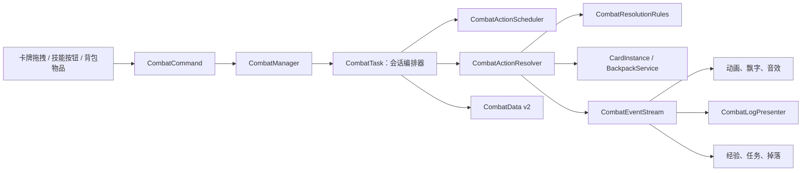

# 《异界旅人》战斗系统重构与战斗日志技术实现规格 v1.0

## 1. 文档状态

- 文档类型：实现前技术规格。
- 编写日期：2026-08-02。
- 代码基线：`main` 分支，提交 `fe931b18`。
- 适用场景：村庄外部、森林、洞穴、城镇事件等使用卡牌战斗框的局部地点。
- 目标读者：程序、UI、美术、数值和后续内容制作者。

本文是后续战斗重构的唯一实现依据。实现中如果需要改变本文确定的交互、数值公式、存档字段或验收条件，必须先修改本文，不允许在代码中临时决定另一套规则。

## 2. 最终玩家体验

战斗继续采用现在容易理解的实时自动战斗：

1. 玩家把主角或伙伴卡拖到敌人附近。
2. 双方进入战斗框并自动积累行动进度。
3. 行动进度满的角色自动普通攻击。
4. 玩家可以为一名己方角色预先安排一个主动技能。
5. 玩家可以从右侧背包把可战斗使用的物品拖到己方角色卡上。
6. 玩家可以把己方人物卡拖出战斗框尝试撤退。
7. 左下角战斗日志持续说明攻击、伤害、治疗、技能、撤退和死亡结果。
8. 战斗结束后结算经验、任务进度和战利品，角色状态继续通过现有主角持久化系统保存。

第一版不要求玩家频繁操作。玩家不使用技能、道具或撤退时，战斗仍能依靠普通攻击自动完成。

## 3. 当前系统评估

### 3.1 已有能力

当前代码已经具备以下基础：

- `CombatManager` 创建、更新、合并、保存和恢复多个 `CombatTask`。
- `CombatRect` 把参战卡牌排列在一个独立战斗区域中。
- `CardCombatant` 保存是否参战、是否攻击和行动进度。
- `CombatTask` 每秒选择行动进度最高的角色执行一次攻击。
- 普通攻击支持命中、闪避、暴击、攻击/防御和近战/远程/魔法克制。
- 近战跳跃、远程投射物、命中特效、音效和镜头震动已经存在。
- `CardAI` 可以主动攻击、加入附近战斗。
- `CardController` 已经允许部分玩家卡从战斗框中拖出。
- `CombatTask` 已经在敌人死亡时发放主角经验并报告任务击杀。
- `CombatData` 已经可以保存双方卡牌和战斗框位置。
- 主角等级、经验、当前生命、精力、濒死和跨场景状态已经接入存档。

### 3.2 当前真实行为

当前实现并不是严格的行动条系统：

- 所有角色每帧积累 `AttackSpeed × deltaTime` 的行动进度。
- `CombatTask` 每隔固定 1 秒选择行动进度最高的角色。
- 选择角色时没有要求行动进度达到固定阈值。
- 角色攻击动画执行期间，其他角色仍会积累进度。
- 攻击完成后，行动者进度归零。
- 目标从敌方存活列表中随机选择。

当前撤退行为也不是最终需求：

- 仅当 `PlayerIsAttacker == true` 时允许拖出攻击方玩家卡。
- `CombatTask.Flee` 没有成功率计算。
- 合法卡牌拖出后直接撤退成功。
- 没有撤退失败后的立即反击。

### 3.3 当前结构问题

`CombatTask` 同时负责：

- 行动进度调度。
- 目标选择。
- 随机数。
- 命中和伤害计算。
- 动画、投射物、音效和镜头震动。
- 角色死亡。
- 经验发放。
- 任务事件。
- 参战者加入和移除。
- 撤退。
- 战斗结束和卡牌回到桌面。

这会导致新增技能、道具、状态效果或日志时都必须继续修改同一个类，也无法在不启动 Unity 场景的情况下可靠测试战斗规则。

### 3.4 当前缺失能力

- 没有统一的战斗行动或命令模型。
- 没有主动技能定义、消耗、冷却和目标规则。
- 背包物品不能直接作为战斗行动使用。
- 没有撤退成功率和失败惩罚。
- 没有结构化战斗事件，UI 只能从最终画面推测发生了什么。
- 没有滚动战斗日志。
- 战斗存档没有保存行动进度、冷却、排队行动和随机数状态。
- 使用 `UnityEngine.Random`，规则测试不能稳定复现同一次战斗。

## 4. 重构目标与非目标

### 4.1 必须达到的目标

1. 保留卡牌、战斗框和实时自动攻击的现有表现。
2. 把规则计算与动画表现分离。
3. 所有攻击、技能、物品和撤退都经过统一命令入口。
4. 所有可见战斗结果都产生结构化 `CombatEvent`。
5. 战斗日志只消费事件，不直接读取或修改战斗状态。
6. 技能和战斗物品通过数据资源配置，不在角色 ID 上写分支。
7. 撤退支持成功和失败；失败后角色回位并立即遭受一次敌方攻击。
8. 主角经验、任务击杀和濒死流程保持现有语义。
9. 战斗中途保存和读取后，不复制卡牌、不重复奖励、不重复消耗物品。
10. 核心公式可以在 EditMode 中确定性测试。

### 4.2 本轮明确不做

- 不改成完整回合制。
- 不增加棋盘格、站位格或前后排系统。
- 不制作技能树。
- 不制作复杂伙伴战术编辑器。
- 不制作敌人的主动技能 AI；第一版敌人继续普通攻击。
- 不制作范围技能；第一版主动技能只支持单体目标。
- 不制作持续伤害、控制、护盾等正式状态内容；只预留接口。
- 不制作战斗回放。
- 不把战斗日志写入永久存档。
- 不允许战斗中把物品直接丢到地面。

## 5. 固定设计结论

### 5.1 战斗节奏

- 战斗仍然实时进行。
- 行动进度阈值固定为 `100`。
- 每帧增加：`ActionProgress += AttackSpeed × deltaTime`。
- 行动进度上限固定为 `150`，允许动画执行期间保留少量溢出。
- 当没有行动正在播放时，从进度达到 `100` 的角色中选择行动者。
- 选择顺序：进度高者优先；进度相同按加入战斗顺序优先。
- 行动完成后行动者进度减去 `100`，不直接清零。
- 如果没有排队命令，角色执行普通攻击。
- 一场战斗同一时间只播放一个行动，避免卡牌动画重叠。

这会替换当前“每隔一秒强制选一个人”的逻辑，但保留攻击速度越高、行动越频繁的直觉。

### 5.2 玩家操作量

- 普通攻击始终自动执行。
- 每名玩家角色最多排队一个主动命令。
- 玩家可以提前选择技能，不需要在行动条满的瞬间点击。
- 不进行操作不会让角色停下。

### 5.3 阵营

- 战斗逻辑按 `CardFaction.Player` 和 `CardFaction.Mob` 分组。
- 是否允许玩家控制不再依赖 `PlayerIsAttacker`。
- `PlayerIsAttacker` 暂时保留，只用于旧存档迁移和表现方向。
- 中立 NPC 第一版不能加入正式战斗。

## 6. 目标架构



### 6.1 保留 `CombatTask` 名称

第一轮不重命名 `CombatTask`，避免同时修改 `CombatManager`、`CardCombatant`、`CardController`、`CombatData` 和现有测试中的全部类型引用。

重构后 `CombatTask` 只负责：

- 保存会话状态。
- 保存双方和所有曾参与者。
- 接收和排队命令。
- 调用调度器选择行动者。
- 调用解析器执行行动。
- 管理加入、撤退、合并和结束。
- 发布会话级事件。

它不再直接计算命中、伤害或拼接 UI 文本。

### 6.2 新增核心类型

```text
Assets/StackCraft/Scripts/Combat/
├── CombatCommand.cs
├── CombatEvent.cs
├── CombatActionResult.cs
├── CombatActionScheduler.cs
├── CombatActionResolver.cs
├── CombatResolutionRules.cs
├── CombatRandom.cs
├── CombatRewardService.cs
├── CombatItemReservationService.cs
├── CombatFocusService.cs
├── Definitions/
│  ├── CombatSkillDefinition.cs
│  └── CombatItemDefinition.cs
└── UI/
   ├── CombatHudPresenter.cs
   ├── CombatLogPresenter.cs
   ├── CombatLogView.cs
   └── CombatTargetingController.cs
```

第一轮继续使用 `CryingSnow.StackCraft` 命名空间，不新建程序集，不引入跨程序集迁移风险。

## 7. 战斗会话数据模型

### 7.1 会话状态

```csharp
public enum CombatPhase
{
    Starting = 0,
    Running = 1,
    ResolvingAction = 2,
    Ending = 3,
    Finished = 4
}
```

合法转换固定为：

```text
Starting → Running
Running → ResolvingAction
ResolvingAction → Running
Running → Ending
ResolvingAction → Ending
Ending → Finished
```

禁止从 `Finished` 返回其他状态。

### 7.2 会话字段

`CombatTask` 增加：

```csharp
public string SessionId { get; }
public CombatPhase Phase { get; }
public uint RandomState { get; }
public int CreatedSequence { get; }
public IReadOnlyCollection<string> ResolvedDefeatIds { get; }
```

内部保存：

- 玩家方存活角色。
- 敌方存活角色。
- 所有曾经参与过的角色。
- 每名角色的加入顺序。
- 每名角色的行动进度。
- 每名角色的排队命令。
- 每名角色的技能剩余冷却。
- 已结算死亡实例 ID。
- 确定性随机数状态。

### 7.3 战斗角色标识

- `CardInstance.PersistentId` 作为 `CombatantId`。
- 所有 `CardInstance` 在 `Awake` 时已经拥有 GUID，因此敌人也可以稳定标识。
- 不允许使用显示名称、卡牌定义 ID 或列表索引标识一个战斗实例。
- 同一种史莱姆的多张卡必须拥有不同 `CombatantId`。

## 8. 统一战斗命令

### 8.1 命令类型

```csharp
public enum CombatCommandType
{
    BasicAttack = 0,
    UseSkill = 1,
    UseItem = 2,
    Retreat = 3,
    ForcedAttack = 4
}
```

`ForcedAttack` 只用于撤退失败惩罚，不对 UI 暴露。

### 8.2 命令结构

```csharp
public sealed class CombatCommand
{
    public string CommandId;
    public string SessionId;
    public string ActorId;
    public CombatCommandType Type;
    public string DefinitionId;
    public string TargetId;
    public string BackpackEntryId;
    public long RequestedSequence;
}
```

字段规则：

- `CommandId`：每次操作生成唯一 GUID。
- `DefinitionId`：技能 ID 或战斗物品定义 ID；普通攻击和撤退为空。
- `TargetId`：单体目标的 `PersistentId`。
- `BackpackEntryId`：物品命令使用的真实背包条目 ID。
- `RequestedSequence`：由 `CombatManager` 单调递增分配，不能使用系统时间排序。

### 8.3 统一入口

所有玩家行动必须调用：

```csharp
public CombatCommandResult TrySubmitCommand(CombatCommand command);
```

禁止 UI 直接调用以下方法：

- `TakeDamage`。
- `GainExperience`。
- `BackpackData.TryRemove`。
- `CombatTask.Flee`。
- 技能效果方法。

返回结果使用固定错误码：

```csharp
public enum CombatCommandResultCode
{
    Accepted,
    SessionNotFound,
    SessionNotRunning,
    ActorNotFound,
    ActorNotControllable,
    ActorUnavailable,
    TargetNotFound,
    InvalidTarget,
    SkillNotKnown,
    InsufficientEnergy,
    SkillOnCooldown,
    BackpackEntryNotFound,
    ItemNotCombatUsable,
    ItemAlreadyReserved,
    RetreatNotAllowed
}
```

`CombatCommandResult` 必须包含 `Code` 和中文 `PlayerMessage`。UI 只根据 `Code` 决定交互状态，不能解析提示字符串。

### 8.4 每名角色只有一个排队命令

- 新技能命令替换旧技能命令。
- 新物品命令替换旧命令前，必须先释放旧物品预留。
- 撤退命令不进入普通队列，在拖拽结束时立即解析。
- 敌人第一版不接受外部命令，行动条满后自动生成普通攻击命令。

## 9. 行动调度与目标选择

### 9.1 调度规则

`CombatActionScheduler` 是无 Unity 依赖的规则类，输入所有存活角色状态，返回下一个行动者 ID。

角色满足以下全部条件才可行动：

- 当前生命大于 0。
- 未处于濒死状态。
- 不在拖拽中。
- 不在执行动画。
- 行动进度大于或等于 100。

### 9.2 普通攻击目标

- 从敌对阵营的存活角色中选择。
- 使用会话自己的 `CombatRandom`，不使用 `UnityEngine.Random`。
- 同一个随机状态和同一组输入必须得到同一目标。
- 如果行动开始前目标死亡，重新选择一次。
- 如果敌对阵营已经为空，立即进入战斗结束流程。

### 9.3 玩家技能目标失效

- `RetargetIfInvalid == true`：从合法目标中重新选择。
- `RetargetIfInvalid == false`：取消该命令，不扣精力、不进入冷却。
- 命令取消后，如果仍有敌人，角色本次改为普通攻击。

第一版“奋力一击”设置为允许重新选择目标。

## 10. 命中和伤害规则

### 10.1 普通攻击

保留当前数值语义：

```text
命中率 = Clamp((攻击者命中 - 防守者闪避) / 100, 0.05, 0.95)
基础伤害 = Max(1, 攻击 - 防御)
```

克制关系继续为：

- 近战克远程。
- 远程克魔法。
- 魔法克近战。
- 相同类型或任一方为 `None` 时无克制。

伤害应用顺序固定为：

1. 计算命中。
2. 计算技能基础伤害；普通攻击使用攻击减防御。
3. 应用类型克制倍率。
4. 应用暴击倍率。
5. 四舍五入到整数。
6. 非未命中的伤害最低为 1。
7. 扣除目标生命。

### 10.2 技能伤害

```text
技能基础伤害 = Max(
    1,
    Round(攻击 × PowerMultiplier) + FlatPower - 防御
)
```

之后继续应用类型克制和可选暴击。

### 10.3 治疗

```text
实际治疗 = Min(配置治疗量, 最大生命 - 当前生命)
```

- 满生命目标不能接受治疗物品命令。
- 治疗不会复活已经确认死亡的角色。
- 濒死主角仍使用现有“救援”流程，第一版不能直接通过普通治疗物品解除濒死。

## 11. 主动技能系统

### 11.1 技能定义

```csharp
[CreateAssetMenu(menuName = "StackCraft/Combat Skill")]
public sealed class CombatSkillDefinition : ScriptableObject
{
    public string Id;
    public string DisplayName;
    public string Description;
    public Texture2D Icon;
    public CombatTargetRule TargetRule;
    public int EnergyCost;
    public float CooldownSeconds;
    public float PowerMultiplier;
    public int FlatPower;
    public bool CanCritical;
    public bool RetargetIfInvalid;
}
```

### 11.2 技能来源

`CardDefinition` 新增：

```csharp
[SerializeField]
private List<CombatSkillDefinition> innateCombatSkills;
```

装备定义同样可以配置 `grantedCombatSkills`。运行时技能列表按以下顺序构建：

1. 人物固有技能。
2. 武器提供技能。
3. 其他装备提供技能。
4. 按技能 ID 去重，保留第一次出现的技能。
5. UI 最多显示前三个主动技能。

### 11.3 第一版正式技能

只制作一个技能：

| 字段 | 数值 |
| --- | --- |
| ID | `skill_protagonist_power_strike` |
| 名称 | 奋力一击 |
| 目标 | 单个存活敌人 |
| 精力消耗 | 2 |
| 冷却 | 4秒 |
| 伤害倍率 | 1.5 |
| 固定伤害 | 0 |
| 可暴击 | 是 |
| 目标死亡后重新选择 | 是 |

该技能加入主角基础人物定义。伙伴和敌人第一版不增加主动技能内容。

### 11.4 技能执行时机

- 玩家点击技能后进入目标选择状态。
- 点击合法敌人卡后保存排队命令。
- 精力和冷却在技能真正开始执行时扣除，不在点击时扣除。
- 执行前再次验证精力、冷却、行动者和目标。
- 技能执行完成后行动进度减去100。
- 技能冷却使用战斗的 `deltaTime`，暂停游戏时不减少。

## 12. 战斗中使用背包物品

### 12.1 交互流程

```text
打开右侧“背包”页签
→ 拖动可战斗使用的物品图标
→ 合法己方人物卡出现绿色外框
→ 松开到人物卡
→ 物品进入“已准备”状态
→ 该人物下一次行动时使用物品
→ 成功后消耗一个真实背包条目
```

### 12.2 拖拽规则

- 战斗期间，可战斗物品从背包拖出后进入 `CombatTargeting` 模式。
- 只允许放到当前战斗的存活己方人物卡上。
- 放到敌人、空白场地、战斗框外或其他战斗时，物品返回背包。
- 第一版战斗中不允许通过该拖拽把物品丢到桌面。
- 非战斗状态继续使用现有“拖出背包生成世界卡”的行为。

### 12.3 战斗物品定义

```csharp
[CreateAssetMenu(menuName = "StackCraft/Combat Item")]
public sealed class CombatItemDefinition : ScriptableObject
{
    public string Id;
    public CombatTargetRule TargetRule;
    public CombatItemEffectType EffectType;
    public int Magnitude;
    public bool ConsumesAction;
}
```

`CardDefinition` 新增可空引用：

```csharp
[SerializeField]
private CombatItemDefinition combatItemDefinition;
```

没有该引用的食物、材料、装备和货币都不能在战斗中使用。

### 12.4 第一版正式战斗物品

只接入现有药品卡：

| 字段 | 数值 |
| --- | --- |
| 物品 | `Card_Medicine` |
| 战斗物品 ID | `combat_item_medicine` |
| 目标 | 单个存活己方角色 |
| 效果 | 恢复生命 |
| 恢复量 | 3 |
| 是否消耗行动 | 是 |

浆果、苹果和普通食物第一版不能在战斗中使用，避免把食物营养值同时当成战斗治疗值。

### 12.5 背包条目预留

排队物品不能立刻删除，也不能继续出售、换位或再次使用。

`BackpackEntryData` 增加：

```csharp
public string ReservationOwnerId;
public string ReservationCommandId;
```

规则：

- 接受物品命令时写入战斗会话 ID 和命令 ID。
- 已预留条目不参与可拖拽、出售、交易或其他物品命令。
- 背包数量显示只统计未预留条目。
- 战斗面板显示“已准备：药品”。
- 行动成功时删除预留条目。
- 命令取消、被替换、角色撤退或战斗结束时清除预留字段。
- 读档时找不到对应战斗或命令的孤立预留必须自动释放。

## 13. 撤退系统

### 13.1 玩家操作

- 玩家按住一张当前未执行动作的己方人物卡。
- 把卡牌中心拖到战斗框边缘以外至少 `0.25` 个世界单位。
- 松开后立即发起撤退判定。
- 仅拖到框内其他位置不会发起撤退，卡牌回到原战斗位置。

### 13.2 可撤退条件

角色必须同时满足：

- 属于玩家阵营。
- 当前生命大于0。
- 不处于濒死。
- 不在攻击或技能动画中。
- 当前战斗处于 `Running`。
- 角色没有尚未执行的物品预留；如有，先取消命令并释放预留。

不再要求玩家必须是战斗发起方。

### 13.3 成功率

```text
撤退概率 = Clamp(
    0.55 + 角色闪避 / 100 - 存活敌人数 × 0.05,
    0.25,
    0.90
)
```

示例：闪避5、面对1名敌人时，撤退率为55%。

撤退随机数必须来自当前会话的 `CombatRandom`。

### 13.4 撤退成功

1. 从会话双方列表和活动角色列表中移除角色。
2. 保留其“曾参与者”记录，已经击败的敌人经验不会被收回。
3. 调用 `CardCombatant.LeaveCombat()`。
4. 在松手位置创建普通世界卡堆。
5. 通过 `Board.EnforcePlacementRules` 修正位置。
6. 给角色增加3秒撤退保护，`CardAI` 在保护期间不能让该角色重新参战。
7. 发布 `RetreatSucceeded` 事件。
8. 如果一方已无人存活，结束战斗。

### 13.5 撤退失败

1. 卡牌回到 `CombatRect` 的原阵营槽位。
2. 角色行动进度归零。
3. 发布 `RetreatFailed` 事件。
4. 从存活敌人中选择行动进度最高者；相同进度按加入顺序。
5. 立即生成一个 `ForcedAttack`，目标固定为撤退失败者。
6. 强制攻击正常计算命中、暴击和伤害。
7. 强制攻击者行动进度减去100，最低归零，避免紧接着再次攻击。
8. 如果撤退者因此生命归零，进入现有主角濒死或普通角色死亡流程。

撤退失败惩罚不受敌人自身技能冷却影响。

### 13.6 与主角濒死撤退的区别

- 本节是存活人物从具体战斗中脱离。
- `ProtagonistStatePresenter` 中的濒死撤退是整支队伍付出时间和金币返回安全地点。
- 两者不能共用同一个按钮或概率公式。

## 14. 战斗事件系统

### 14.1 事件类型

```csharp
public enum CombatEventType
{
    CombatStarted,
    CombatRestored,
    CombatMerged,
    CombatantJoined,
    ActionQueued,
    ActionCancelled,
    ActionStarted,
    AttackMissed,
    DamageApplied,
    CriticalHit,
    HealingApplied,
    SkillUsed,
    ItemUsed,
    ActionCompleted,
    RetreatAttempted,
    RetreatSucceeded,
    RetreatFailed,
    CombatantDowned,
    CombatantDefeated,
    ExperienceGranted,
    CombatEnded
}
```

### 14.2 事件结构

```csharp
public readonly struct CombatEvent
{
    public long Sequence;
    public string SessionId;
    public CombatEventType Type;
    public string SourceId;
    public string SourceName;
    public string TargetId;
    public string TargetName;
    public string DefinitionId;
    public int Value;
    public int SecondaryValue;
    public HitType HitType;
    public CombatTypeAdvantage Advantage;
}
```

名称在事件生成时快照，避免敌人死亡销毁后日志无法取得名称。

### 14.3 发布顺序

一次攻击固定按以下顺序发布：

1. `ActionStarted`。
2. `SkillUsed` 或 `ItemUsed`；普通攻击不额外发布。
3. `AttackMissed`，或者 `CriticalHit` 后接 `DamageApplied`。
4. 需要时发布 `CombatantDowned` 或 `CombatantDefeated`。
5. 需要时发布 `ExperienceGranted`。
6. `ActionCompleted`。
7. 一方为空时发布 `CombatEnded`。

事件必须在对应状态修改成功后发布。UI 不得根据“即将执行”事件提前显示已经造成的伤害。

`CriticalHit` 不单独占用一条日志行。它用于暴击音效和特效；`CombatEventFormatter` 将紧随其后的 `DamageApplied.HitType == Critical` 格式化为“造成X点暴击伤害”。

### 14.4 事件入口

`CombatManager` 提供：

```csharp
public event Action<CombatEvent> EventPublished;
internal void Publish(CombatEvent combatEvent);
```

禁止建立第二个全局静态事件总线。

## 15. 战斗日志面板

### 15.1 位置与尺寸

- 位于现有左下角消息区域。
- 视觉宽度固定为420像素。
- 高度固定为190像素。
- 使用当前公共幻想 UI 的深蓝底、青色描边和标题样式。
- 标题固定为“战斗记录”。
- 同时显示最近6条玩家可读事件。
- 最新事件位于底部，旧事件向上移动。
- 不显示内部 ID、随机数或调试堆栈。

### 15.2 显示文本

由 `CombatEventFormatter` 根据事件生成中文文本，不直接使用业务层传入的整句字符串。

示例：

```text
战斗开始：旅行者 对阵 哥布林
旅行者攻击哥布林，造成3点伤害
哥布林的攻击落空了
旅行者使用奋力一击，造成5点暴击伤害
旅行者使用药品，恢复3点生命
旅行者撤退失败，遭到哥布林反击
哥布林被击败，获得10点经验
```

### 15.3 颜色

| 类型 | 颜色 |
| --- | --- |
| 玩家行动 | `#65C7F2` |
| 敌人行动 | `#F06B63` |
| 普通伤害 | `#F2B84B` |
| 治疗 | `#62D48A` |
| 暴击、克制、撤退成功 | `#FFD65A` |
| 失败、无效、撤退失败 | `#E36A72` |
| 战斗开始和结束 | `#D8E4EA` |

### 15.4 缓冲和清理

- 每个战斗会话内存中最多保存100条日志事件。
- 超过100条时删除最旧事件。
- UI 只渲染最后6条，不为每条记录实例化永久对象。
- 战斗结束后保留面板4秒，再清空并恢复普通消息栏。
- 日志不写入 `GameData`。
- 读档恢复战斗时第一条显示“战斗已恢复”，不重放旧日志。

### 15.5 与现有 `InfoPanel` 的关系

战斗日志不是 `InfoPanel.RequestInfoDisplay` 的一条长文本请求，因为滚动日志会不断抢占任务、升级和濒死提示。

新增 `HudMessageAreaCoordinator` 管理同一屏幕区域的两个子面板：

```text
Modal InfoPanel（濒死、确认死亡）
> CombatLogPanel（玩家参与的战斗）
> Sequence InfoPanel（任务、升级）
> Hover InfoPanel（卡牌悬停）
```

规则：

- 出现 `Modal` 时隐藏战斗日志并显示 `InfoPanel`。
- Modal 关闭且战斗仍在继续时恢复战斗日志。
- 战斗期间收到的任务和升级 `Sequence` 请求继续保存在 `InfoPanel` 中，不丢失；战斗结束后按现有请求顺序显示。
- 主角升级事件同时写入战斗日志的经验记录，卡牌升级动画仍立即播放。

`InfoPanel` 需要只读暴露当前最高优先级和内容变化事件，协调器不能通过反射读取私有请求列表。

## 16. 右侧战斗界面

### 16.1 页签规则

右侧继续保持三个页签宽度，避免增加第四个狭窄页签：

- 没有玩家战斗：`地点 / 任务 / 背包`。
- 存在玩家战斗：`战斗 / 任务 / 背包`。

第一枚页签对象保持不变，只切换标签和内容，不在运行时重复实例化 Toggle。

### 16.2 战斗页内容

```text
旅行者  Lv.2
生命 12/17
精力 3/4
行动 [██████░░░░] 63/100

自动攻击：开启

[奋力一击]
消耗2精力 · 冷却0.0秒

已准备行动：普通攻击
```

规则：

- 默认显示主角。
- 点击其他己方参战卡后切换到该角色。
- 点击敌人时，下半部分显示敌人生命、攻击类型和当前目标信息，但技能按钮仍属于当前己方角色。
- 第一版不提供关闭自动攻击按钮，文字仅说明当前行为。
- 技能不可用时必须显示明确原因：精力不足、冷却中、角色倒地或正在执行动作。

### 16.3 目标选择

- 点击可用技能后，所有合法目标显示青色流动外框。
- 非法目标变暗，但仍可查看信息。
- 点击合法目标后排队技能并取消高亮。
- 点击空白场地或再次点击当前技能按钮取消目标选择。
- 切换任务或背包页签时取消未完成的目标选择，但不取消已经排队的命令。

## 17. 表现层

### 17.1 事件驱动

`CombatActionResolver` 首先生成不可变的 `CombatActionPlan`。计划中包含已经确定的目标、命中、暴击、伤害或治疗数值，但尚未修改目标生命。`CombatPresentationController` 接收该计划并负责：

- 近战跳跃。
- 远程和魔法投射物。
- 卡牌受击闪红和轻微抖动。
- 伤害、治疗、未命中和暴击飘字。
- 音效。
- 镜头震动。

规则层不得等待 DOTween，也不得查找摄像机。

### 17.2 动画完成

行动时序固定为：

1. 解析器验证命令并生成 `CombatActionPlan`。
2. 扣除技能精力、启动技能冷却，或者提交物品预留消耗。
3. 发布 `ActionStarted`，表现层开始接近、投射物或使用物品动画。
4. 表现层在命中帧调用 `NotifyPresentationImpact`。
5. 会话只在第一次 Impact 回调时提交伤害或治疗并发布结果事件。
6. 表现层结束时调用 `NotifyPresentationCompleted`。
7. 会话扣除行动进度、发布 `ActionCompleted` 并回到 `Running`。

命中回调接口为：

```csharp
CombatManager.NotifyPresentationImpact(
    string sessionId,
    long actionSequence);
```

表现层播放完成后调用：

```csharp
CombatManager.NotifyPresentationCompleted(
    string sessionId,
    long actionSequence);
```

通知会话可以继续下一行动。

如果表现层不存在，则同一帧依次执行 Impact 和 Completed。如果对象被禁用或超过2秒没有回调，会话先补交尚未提交的 Impact，再自动完成行动；不能永久卡在 `ResolvingAction`，也不能因为超时漏掉或重复伤害。

### 17.3 低配置模式

- 日志和规则不依赖动画质量。
- 关闭镜头震动或投射物不改变命中结果。
- 飘字对象使用小型对象池，池上限16个。

## 18. 死亡、经验、任务和掉落

### 18.1 死亡流程

伤害导致生命归零后：

1. 主角：进入现有 `IsDowned` 流程，不直接销毁。
2. 普通伙伴：执行永久死亡和离队流程。
3. 敌人：标记为被击败，从会话移除，然后执行掉落和销毁。

### 18.2 幂等键

每个死亡结算使用：

```text
DefeatId = SessionId + ":" + DefeatedCombatantPersistentId
```

`ResolvedDefeatIds` 已包含该键时，不能再次：

- 发放经验。
- 推进击杀任务。
- 生成掉落。
- 写入第二条死亡日志。

### 18.3 固定结算顺序

1. 提交生命归零。
2. 发布 `CombatantDefeated`。
3. `CombatRewardService` 判断主角是否曾参与。
4. 发放敌人 `ExperienceReward`。
5. 报告 `WorldQuestRuntime.ReportEnemyDefeated`。
6. 生成敌人掉落。
7. 执行普通敌人销毁。
8. 检查战斗是否结束。

主角经验按参与计算，不按最后一击计算；该规则与现有成长文档保持一致。

### 18.4 多场战斗

- 每个 `CombatTask` 独立维护奖励幂等集合。
- 战斗合并时集合取并集。
- 中立 NPC 独自击杀不计入主角任务和经验。
- 编辑器删除、地点刷新和场景清理不产生正式 `CombatantDefeated` 事件。

## 19. 战斗合并

当前战斗框相交时仍允许合并。

固定规则：

1. 选择 `CreatedSequence` 最小的会话作为主会话。
2. 其他会话的双方角色并入主会话。
3. 保留每名角色的行动进度、冷却、状态和排队命令。
4. 合并所有曾参与者和已结算死亡 ID。
5. 主会话继续使用自己的随机数状态。
6. 被吸收会话的物品预留改写为主会话 ID。
7. 发布一条 `CombatMerged` 事件。
8. 销毁旧战斗框并生成统一布局。

合并不能通过重新创建所有角色的方式重置行动进度。

## 20. 确定性随机数

新增 `CombatRandom`，每个会话持有一个 `uint` 状态。

以下行为只能使用它：

- 普通攻击目标。
- 命中判定。
- 暴击判定。
- 撤退判定。
- 技能允许的随机目标。

禁止这些规则调用 `UnityEngine.Random`。

会话创建种子由以下值稳定混合：

```text
地点随机种子 + 当前世界分钟 + 会话创建序号
```

保存时直接保存当前 `uint RandomState`，读取后从该状态继续，不通过重放随机次数恢复。

动画抖动和纯视觉粒子仍可使用 `UnityEngine.Random`，但不能影响规则结果。

## 21. 存档与读档

### 21.1 `CombatData` v2

保留现有 `Attackers`、`Defenders`、`PlayerIsAttacker` 和 `RectPosition` 字段，新增：

```csharp
public int Version = 2;
public string SessionId;
public uint RandomState;
public int CreatedSequence;
public List<CombatantRuntimeData> RuntimeStates = new();
public List<CombatCommandData> QueuedCommands = new();
public List<string> ResolvedDefeatIds = new();
```

```csharp
public sealed class CombatantRuntimeData
{
    public string CombatantId;
    public float ActionProgress;
    public float RetreatProtectionRemaining;
    public List<SkillCooldownData> SkillCooldowns = new();
}
```

### 21.2 可保存状态

- 只在 `CombatPhase.Running` 时生成稳定快照。
- 如果自动保存发生在 `ResolvingAction`，`CombatManager` 标记一次待保存请求。
- 当前动作表现结束并回到 `Running` 后执行一次保存。
- 不保存 DOTween、Coroutine、飘字、日志行或目标高亮。

### 21.3 排队命令

- 技能命令完整保存。
- 物品命令保存对应 `BackpackEntryId` 和预留字段。
- 读档后如果技能、物品、行动者、目标或背包条目不存在，取消该命令并释放可能存在的孤立预留。
- 取消恢复失败命令不能扣精力或消耗物品。

### 21.4 旧存档迁移

`Version < 2` 时：

- 继续读取现有双方 `CardData`。
- 为会话生成新 `SessionId`。
- 行动进度按角色顺序生成 `0、10、20……`，最大不超过90，避免读档瞬间多人同时行动。
- 冷却、排队命令和已结算 ID 为空。
- 使用地点种子生成随机数状态。
- `PlayerIsAttacker` 只决定战斗框初始左右方向。

迁移不回写原存档文件，直到下一次正常保存。

## 22. 战斗焦点

地点中可能同时存在多场战斗。`CombatFocusService` 按以下顺序选择右侧战斗面板和左下日志的焦点：

1. 包含主角的进行中战斗。
2. 包含当前选中玩家卡的进行中战斗。
3. 最近创建且包含玩家阵营的战斗。
4. 没有玩家参与时不显示战斗 HUD。

玩家点击另一个战斗框或其中的己方卡时，可以切换焦点；只切换 UI，不暂停其他战斗。

## 23. 与现有系统的接入点

### 23.1 `CombatManager`

- 保存会话集合和全局行动序号。
- 更新所有会话。
- 接收命令。
- 发布事件。
- 管理保存延迟。
- 提供活动战斗查询。

### 23.2 `CombatTask`

- 改为会话编排器。
- 删除内部伤害公式和 UI 调用。
- 保留加入、移除、合并和结束的公开兼容入口。
- 旧 `Flee(CardInstance)` 标记为过渡接口，内部改为构造撤退命令。

### 23.3 `CardCombatant`

增加：

```csharp
public float RetreatProtectionRemaining { get; }
public IReadOnlyDictionary<string, float> SkillCooldowns { get; }
public string QueuedCommandId { get; }
```

`ActionProgress` 的修改只能由会话和存档恢复方法执行。

### 23.4 `CardController`

- 保留人物卡拖出战斗框的手势。
- 不再直接调用成功即离场的 `Flee`。
- 松手时向 `CombatManager` 提交撤退命令。
- 撤退失败时等待表现控制器完成回位和强制攻击。

### 23.5 `BackpackView` 与 `BackpackService`

- 背包页签保持现有图标布局。
- 战斗目标模式下，拖出图标仍显示竖向卡牌预览。
- `BackpackService` 增加预留、提交消耗和释放预留三个事务接口。
- 市场、出售、换位、取出和整理必须忽略或拒绝已预留条目。

### 23.6 `InfoPanel`

- 增加只读 `HighestActivePriority`。
- 增加请求集合变化事件。
- 保留现有请求优先级和动作按钮。
- 不把战斗日志逐条写进 `InfoPanel`。

### 23.7 `WorldQuestRuntime`

- 仍然只接收正式“敌人被击败”业务事件。
- 不监听 UI 日志。
- 不根据伤害飘字或卡牌销毁推断击杀。

### 23.8 主角成长与濒死

- `GameDirector.GrantProtagonistExperience` 保持唯一经验入口。
- `ProtagonistStatePresenter` 保持濒死操作入口。
- 普通战斗撤退和濒死整队撤退使用不同命令。
- 主角倒地后立即停止行动进度。

### 23.9 世界时间

第一轮不把战斗直接接入独立的另一套时间系统。战斗仍由 `Time.deltaTime` 驱动，并遵守游戏暂停。

后续接入 `ActionDrivenWorldClock` 时，只允许 `CombatManager` 在第一场玩家战斗开始时注册一个行动句柄，在最后一场玩家战斗结束时释放；不能让每个参战角色重复注册世界时间。

## 24. 内容验证

新增菜单：

```text
Tools/StackCraft/Validate Combat Content
```

验证器必须检查：

- 技能 ID 非空且全局唯一。
- 战斗物品 ID 非空且全局唯一。
- 技能精力消耗不小于0。
- 冷却不小于0。
- 伤害倍率大于0。
- 单体技能必须有合法目标规则。
- `CardDefinition` 不得引用空技能元素。
- 战斗物品卡必须属于 `Consumable`。
- 第一版正式资源中只允许 `Damage` 和 `Heal` 效果。
- 主角必须能解析出“奋力一击”。
- `Card_Medicine` 必须引用 `combat_item_medicine`。

构建前任何 Error 都必须阻止内容安装完成。

## 25. 实施阶段

每个阶段独立提交，前一阶段测试通过后才能开始下一阶段。

### M0：保存当前行为基线

- 为现有命中、暴击、克制、经验、任务击杀、战斗结束和战斗恢复补测试。
- 记录当前正式角色和敌人的战斗数值。
- 不改生产逻辑。

提交信息建议：`补充战斗系统重构前行为基线`

### M1：事件流与战斗日志

- 新增 `CombatEvent`、`CombatEventFormatter` 和事件发布入口。
- 先从现有 `CombatTask` 发布事件，不改变战斗公式。
- 制作左下角 `CombatLogPanel`。
- 接入 HUD 消息区域优先级协调。

这是第一个可以单独展示给玩家的版本。

提交信息建议：`增加战斗事件流与战斗日志面板`

### M2：规则和表现分离

- 新增确定性随机数。
- 提取调度器和伤害规则。
- 改为100点行动进度阈值。
- 表现层改为消费事件。
- 保持现有近战、远程、魔法动画。

提交信息建议：`重构战斗行动调度与伤害解析`

### M3：主动技能

- 新增技能定义和内容验证。
- 增加右侧战斗页。
- 完成技能排队和目标选择。
- 接入“奋力一击”。

提交信息建议：`实现首个主动战斗技能`

### M4：战斗物品

- 新增战斗物品定义。
- 实现背包条目预留事务。
- 完成药品拖到己方卡并在下一行动使用。
- 修复交易、整理和存档对预留物品的处理。

提交信息建议：`实现背包战斗物品使用流程`

### M5：概率撤退

- 修改战斗卡拖出手势。
- 实现成功率、成功离场、3秒保护。
- 实现失败回位和敌方强制攻击。
- 保留濒死撤退流程。

提交信息建议：`实现战斗撤退与失败反击`

### M6：战斗存档 v2 与完整回归

- 扩展 `CombatData`。
- 保存行动进度、冷却、命令、预留和随机状态。
- 迁移旧战斗存档。
- 完成多战斗、合并、转场和异常恢复测试。

提交信息建议：`升级战斗存档并完成系统回归`

## 26. 自动化测试规格

### 26.1 纯规则测试

- 速度100的角色从0进度经过1秒达到行动阈值。
- 行动进度相同按加入顺序选择。
- 行动完成只减100并保留溢出。
- 命中率最低5%、最高95%。
- 普通攻击保持现有攻击减防御公式。
- 三种克制关系正确。
- 暴击倍率应用顺序正确。
- 相同随机状态得到相同目标、命中和撤退结果。
- 撤退概率在25%到90%之间。
- 撤退失败选择行动进度最高的敌人。
- 重复 `DefeatId` 不重复结算。

### 26.2 命令测试

- 非己方角色不能提交玩家技能。
- 精力不足不能排队技能。
- 冷却中不能排队技能。
- 新命令替换旧命令。
- 无效技能目标取消后不扣精力。
- 技能执行后扣除精力并进入冷却。
- 同一角色不能同时预留两件物品。
- 物品命令取消后释放预留。
- 物品成功使用只删除一个真实条目。
- 已预留物品不能出售、换位、取出或再次使用。

### 26.3 Unity EditMode 测试

- `CombatTask` 发布事件顺序正确。
- 战斗日志最多保留100条并显示最后6条。
- 日志中文格式不包含资源 ID。
- Combat Modal 出现时日志隐藏，关闭后恢复。
- 战斗开始时第一枚页签变为“战斗”，结束后恢复“地点”。
- 技能目标高亮只出现在合法敌人上。
- 战斗物品拖到非法位置返回背包。
- 撤退失败后卡牌回到战斗框。
- 撤退成功后卡牌成为合法世界卡堆。
- 战斗合并保留进度、冷却和预留。
- 旧 `CombatData` 可以迁移。
- 读档不会重复生成角色或奖励。

### 26.4 必须保留的回归

- NPC 对话拖离不受战斗拖离逻辑影响。
- 主角不能被放入背包或出售。
- 背包非战斗拖出仍生成世界卡。
- 主角经验、升级动画和任务进度继续工作。
- 主角濒死仍显示救援、整队撤退和确认死亡。
- `CombatManager.EndAllCombats` 仍把存活角色放回世界卡堆。
- 低语森林敌人随机生成和每日刷新不受影响。

## 27. 人工验收步骤

### 27.1 战斗日志

1. 新游戏进入低语森林。
2. 将主角拖到一只史莱姆附近。
3. 确认左下角切换为战斗记录。
4. 确认攻击、未命中、伤害和死亡与画面一致。
5. 确认日志最多显示6行。
6. 战斗结束4秒后确认普通消息栏恢复。

### 27.2 主动技能

1. 选中主角。
2. 打开右侧“战斗”页。
3. 点击“奋力一击”。
4. 确认合法敌人出现高亮。
5. 选择敌人。
6. 确认主角下一次行动使用技能、扣2精力并进入4秒冷却。
7. 确认日志和伤害飘字一致。

### 27.3 战斗药品

1. 背包准备两份药品。
2. 主角受伤后打开背包。
3. 将一份药品拖到主角卡。
4. 确认药品显示为已准备，不能再次出售或拖动。
5. 确认主角下一行动恢复3点生命。
6. 确认背包只减少一份药品。
7. 将物品拖到敌人或空地，确认不消耗并返回背包。

### 27.4 撤退

1. 将主角拖出战斗框并松手。
2. 使用固定测试种子分别验证成功与失败。
3. 成功时确认主角离开战斗并在3秒内不会重新被拉入。
4. 失败时确认主角回位并立即遭到敌人攻击。
5. 确认失败攻击可以正常触发主角濒死。

### 27.5 保存与读取

1. 在双方行动进度不同时保存。
2. 排队一个技能并保存。
3. 预留一份药品并保存。
4. 退出并读取。
5. 确认没有重复卡牌。
6. 确认进度、技能、冷却和药品预留恢复。
7. 完成战斗并确认经验、任务和掉落只结算一次。

## 28. 性能与容量限制

| 项目 | 上限 |
| --- | ---: |
| 同时活动战斗 | 8 |
| 单场存活角色 | 16 |
| 每名角色排队命令 | 1 |
| 每名角色主动技能 | 3 |
| 每场内存日志事件 | 100 |
| UI 可见日志行 | 6 |
| 飘字对象池 | 16 |

- 战斗日志只在事件到达时重建，不在 `Update` 中重建字符串。
- 右侧行动条可以每帧更新填充值，但文本每0.1秒更新一次。
- 查找角色使用会话字典，不在每次攻击时扫描场景。
- 活动会话超过8个时拒绝新建并输出明确错误，不静默合并整个场景。

## 29. 错误处理

- 命令拒绝必须返回稳定错误码和中文玩家提示。
- UI 操作失败后保持可重试状态。
- 技能或物品资源缺失时取消命令，不扣资源。
- 表现层异常不能阻止规则层结束行动。
- 存档中的孤立物品预留必须释放，不能永久锁死背包条目。
- 恢复战斗找不到某个角色时跳过该角色；一方因此为空则不恢复该战斗。
- 规则层错误日志固定包含 `SessionId`、`CommandId`、`ActorId` 和错误码。

建议格式：

```text
[Combat][Session:{sessionId}][Command:{commandId}]
Operation={operation}
Actor={actorId}
Target={targetId}
Result={resultCode}
```

## 30. 完成定义

只有同时满足以下条件，整轮战斗重构才算完成：

- [ ] 现有实时卡牌战斗可正常开始、加入、合并和结束。
- [ ] 行动进度阈值规则已经替换固定1秒强制行动。
- [ ] 普通攻击公式与现有数值兼容。
- [ ] “奋力一击”可以排队、选择目标、消耗精力和进入冷却。
- [ ] 药品可以从背包拖到己方角色并作为下一行动使用。
- [ ] 物品预留在出售、整理、替换命令、战斗结束和读档中正确处理。
- [ ] 人物卡拖出战斗框可以成功或失败。
- [ ] 撤退失败会回位并立即受到一次敌方攻击。
- [ ] 战斗日志显示最近6条行动且不抢占濒死 Modal。
- [ ] 主角经验、任务击杀、掉落和死亡均只结算一次。
- [ ] 战斗存档 v2 可以恢复进度、命令、冷却、预留和随机状态。
- [ ] 旧战斗存档可以迁移。
- [ ] 内容验证 Error 为0。
- [ ] 新增自动化测试全部通过。
- [ ] 现有战斗、背包、任务、主角成长和 NPC 互动回归测试全部通过。
- [ ] 第27章人工验收全部完成。
- [ ] 独立代码审查无 Critical 或 Important 问题。

## 31. 后续扩展接口

本轮完成后，可以在不改变命令和事件主干的情况下继续增加：

- 中毒、流血、眩晕、护盾和嘲讽。
- 范围技能和多目标治疗。
- 敌人技能和首领阶段。
- 伙伴战术倾向。
- 武器提供的不同技能。
- 旅馆训练、导师教学和任务解锁技能。
- 火把、炸弹、解毒剂等战斗道具。
- 战斗速度调节。
- 完整战斗历史和本局纪事摘要。

这些内容必须复用 `CombatCommand → CombatActionResolver → CombatEvent` 流程，不能重新从 UI 直接修改生命、背包或任务状态。

## 32. 推荐下一步

实现从 M0 开始，不直接先做技能或撤退。第一份代码提交只补充当前行为测试；第二份提交完成事件流和左下角战斗日志。这样玩家可以最早看到明显效果，同时为后续技能、道具和撤退提供同一套可观察基础。
