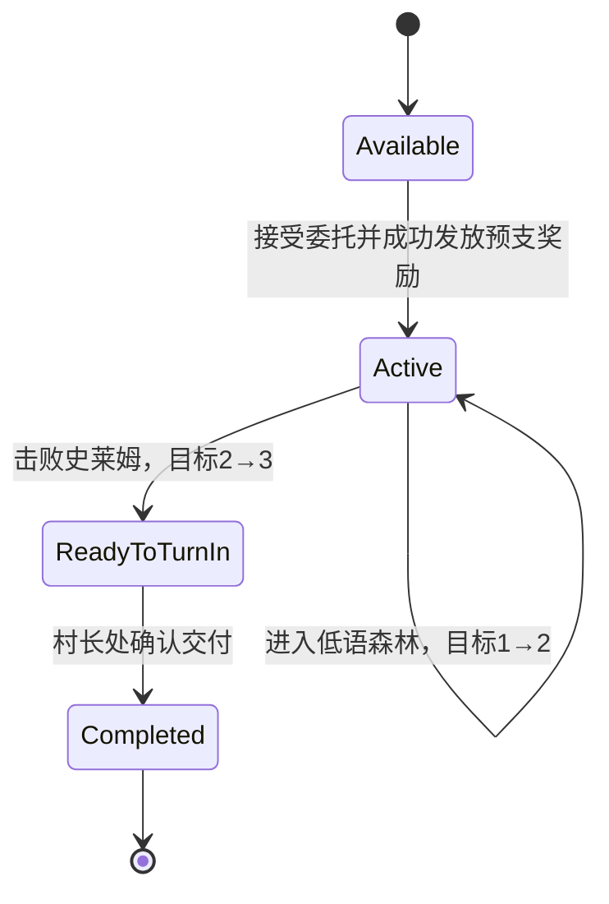

# 新手冒险垂直切片实施规格 v0.1

## 1. 文档目的

本文件规定下一轮开发必须完成的唯一目标、固定流程、数据结构、数值、代码接入点、异常处理和验收方法。

本轮不是继续扩充地图数量，也不是制作完整开放世界。目标是把目前已有的河湾村、公共市场、世界地图、低语森林、背包、战斗、主角成长和存档系统串成一条可以从头玩到尾的新手冒险流程。

实现过程中如遇到本文未覆盖的情况，优先遵守以下原则：

1. `GameData` 是跨场景数据的唯一权威来源。
2. 已提交成功的交易、任务奖励和经验不能重复发放。
3. 任务目标必须按顺序完成，不能跳步。
4. 不为了本轮目标新增第二套背包、战斗或存档。
5. 不把场景级 `QuestManager` 强行用作跨场景主线任务。

## 2. 本轮最终玩家体验

新存档首次游玩的目标完成时长为10～20分钟；功能验收不以等待凑时长，按下面的固定流程执行：

```text
河湾村与村长交谈
→ 接受“林间异响”
→ 获得8枚任务预支金币和1份治疗药品
→ 进入河湾市场
→ 购买至少1份粮食
→ 返回世界地图
→ 前往低语森林
→ 进入低语森林
→ 击败至少1只史莱姆
→ 获得史莱姆的5点战斗经验
→ 返回河湾村
→ 向村长汇报
→ 获得10枚金币和10点任务经验
→ 主角从1级升到2级
```

该流程完成后，玩家已经实际使用：

- NPC 对话。
- 跨场景任务。
- 公共市场购买。
- 背包和金币。
- 世界地图旅行。
- 低语森林随机内容。
- 自动战斗。
- 主角经验与升级。
- 场景往返与存档。

## 3. 本轮范围

### 3.1 必须完成

- 新增一条跨场景世界任务“林间异响”。
- 村长可以根据任务状态显示不同对话和按钮。
- 玩家必须在任务接受后完成一次河湾市场粮食购买。
- 购买完成后才能推进到前往低语森林。
- 玩家必须在低语森林击败一只由玩家队伍参与战斗的史莱姆。
- 击败史莱姆后必须返回村长处手动交付。
- 接受奖励和完成奖励必须进入正式背包与主角成长数据。
- 任务状态必须跨世界地图、地点、建筑和读档保存。
- 右侧任务栏必须始终显示当前主线目标。
- 每次目标推进必须有明确的左下角消息提示。
- 新存档按标准流程完成任务后，主角达到2级。

### 3.2 本轮明确不做

- 不制作新地图。
- 不增加新敌人或首领。
- 不制作伙伴招募。
- 不制作武器、护甲或职业教学。
- 不制作草药采集和药水制作任务。
- 不制作多选分支、任务失败时限或阵营选择。
- 不修改世界地图当前 `partyTravelDuration = 1.0f` 的临时旅行时长。
- 不制作完整任务日志历史页。
- 不制作图形化平滑经验条动画。
- 不制作本局纪事查看界面。
- 不删除现有旧教学任务资源。
- 不重写现有 `QuestManager`；旧任务继续保留为场景级任务。

## 4. 固定内容定义

### 4.1 主线任务

| 字段 | 固定值 |
| --- | --- |
| 任务 ID | `story_riverbend_whispering_forest_01` |
| 中文标题 | 林间异响 |
| 任务分类 | 主线任务 |
| 发布 NPC ID | `riverbend-village-chief` |
| 接取地点 ID | `riverbend` |
| 购买地点 ID | `riverbend-market` |
| 目标市场 ID | `riverbend-market` |
| 目标商品 ID | `food` |
| 目标森林 ID | `whispering-forest` |
| 目标敌人 ID | `366be2e0e40c4b4d93229a94ae7133ae` |
| 目标敌人 | 史莱姆 |
| 需求数量 | 1 |

### 4.2 使用的正式资源

| 内容 | 资源或 ID |
| --- | --- |
| 河湾村 | `Assets/StackCraft/Resources/Locations/Location_Riverbend.asset` |
| 河湾市场 | `Assets/StackCraft/Resources/Locations/Location_RiverbendMarket.asset` |
| 低语森林 | `Assets/StackCraft/Resources/Locations/Location_WhisperingForest.asset` |
| 村长 | `Assets/StackCraft/Resources/Cards/Locations/Riverbend/Card_Riverbend_VillageChief.asset` |
| 史莱姆 | `Assets/StackCraft/Resources/Cards/Mobs/Card_Slime.asset` |
| 金币 | `4bda315463bf4b73b63f1d232fb522e4` |
| 治疗药品 | `medicine` |
| 粮食商品 | `food` |

不允许为该流程复制第二份“史莱姆”“金币”“药品”或“粮食”定义。

### 4.3 固定奖励

#### 接受任务

- 金币 `8` 枚。
- 治疗药品 `1` 份。
- 不给予经验。

#### 击败史莱姆

- 使用史莱姆当前 `experienceReward = 5`。
- 使用现有战斗经验结算，不由任务系统重复发放。

#### 完成任务

- 金币 `10` 枚。
- 主角经验 `10` 点。
- 不额外发放物品。

标准新角色从零经验开始时：

```text
史莱姆战斗经验 5
+ 任务完成经验 10
= 15
= 正好升到2级
```

`Location.unity` 中不得同时激活另一条会因击败同一只史莱姆而发放额外经验的任务。现有 `training_02` 和 `ascension_02` 资源不接入本轮地点任务组，避免标准流程在交付前提前升级。

升级后应符合现有成长规则：

- 等级：2。
- 当前等级经验：0。
- 最大生命：由15提高到17。
- 攻击：由2提高到3。
- 防御：保持1。
- 当前生命只增加2点，不完全恢复。

### 4.4 市场可用性约束

任务接受时给予8枚金币，因此新存档第1天的河湾市场必须满足：

- `food` 允许玩家购买。
- `food` 可购买库存至少为1。
- 单价不得超过8枚金币。
- 购买1份后物品实际进入 `BackpackData`。
- 只有交易完全提交成功后才推进任务。

若市场报价刷新后超过8枚金币，视为本轮验收失败，不能要求玩家额外赚钱来绕过。

### 4.5 低语森林约束

低语森林随机配置必须保持：

- 史莱姆最少生成1只。
- 史莱姆最多生成3只。
- 同一自然日重复进入不重新刷新普通敌人和资源。
- 从子地点返回父地点不刷新。
- 新自然日首次进入才刷新普通随机内容。

旧文档中“每次从世界地图进入都刷新”的描述已经过时，本规格以当前按日刷新规则为准。

## 5. 玩家操作与界面反馈

### 5.1 第一步：接受任务

玩家在河湾村把主角拖到村长附近，进入现有对话互动框。

任务尚未接受时，对话必须显示：

```text
村长：
最近低语森林里总有奇怪的动静。
去市场准备一点吃的，再替村里看看发生了什么。
```

按钮：

- `接受委托`
- `暂不接受`

点击“暂不接受”：

- 结束对话。
- 不创建活动任务。
- 不发放金币和药品。

点击“接受委托”：

- 将任务设为活动状态。
- 当前目标设为“在河湾市场购买1份粮食”。
- 原子性发放8枚金币和1份治疗药品。
- 立即保存。
- 刷新背包、金币显示和任务栏。
- 左下角显示：

```text
【接受任务：林间异响】
前往河湾市场购买1份粮食。
已收到8枚预支金币和1份治疗药品。
```

重复与村长对话不得再次发放接受奖励。

### 5.2 第二步：购买粮食

玩家进入市场，打开公共市场界面，购买 `food` 商品至少1份。

计数规则：

- 只统计 `MarketTradeDirection.PlayerBuys`。
- 只统计市场 ID `riverbend-market`。
- 只统计商品 ID `food`。
- 数量大于等于1即可完成。
- 接任务前已经持有的粮食不算完成。
- 从地面捡取、NPC赠送或读档恢复的粮食不算购买。
- 交易失败、报价过期、金币不足或事务回滚时不推进。
- 一次购买多份只推进一个目标，不累计到后续目标。

成功后：

- 当前目标切换为“前往低语森林”。
- 立即保存任务状态。
- 左下角显示：

```text
【任务更新：林间异响】
补给已经准备好，前往低语森林。
```

右侧任务栏显示：

```text
林间异响
前往低语森林
```

### 5.3 第三步：进入低语森林

玩家返回世界地图，把小队移动到低语森林地点卡，并点击进入地点。

推进条件：

- 当前任务目标必须是“前往低语森林”。
- `GameDirector.EnterLocation` 已接受地点切换。
- 目标地点 ID 必须严格等于 `whispering-forest`。

不能仅通过选中地点卡或把小队停靠在地点卡上推进；必须实际进入地点。

进入成功后：

- 当前目标切换为“击败1只史莱姆”。
- 保存任务状态。
- 左下角显示：

```text
【任务更新：林间异响】
调查森林，并击败1只史莱姆。
```

### 5.4 第四步：击败史莱姆

玩家将主角卡或含主角的玩家队伍拖到史莱姆附近，触发现有自动战斗。

任务击杀归属必须和主角经验归属一致：

- 玩家阵营参与了该场战斗。
- 主角实际加入过本次战斗。
- 史莱姆通过正式死亡流程被击败。
- 同一个敌人实例只结算一次。
- 中立 NPC 单独击败史莱姆不计数。
- 编辑器直接删除史莱姆卡不计数。
- 清理随机地点内容不计数。

史莱姆死亡后：

- 主角先获得5点战斗经验。
- 任务进度从0变为1。
- 任务状态切换为“可以交付”。
- 当前目标切换为“返回河湾村向村长汇报”。
- 安全地保存任务和主角经验。
- 左下角显示：

```text
【任务更新：林间异响】
已经查明森林中的威胁。
返回河湾村向村长汇报。
```

如果玩家击败史莱姆后继续击杀其他史莱姆：

- 可以继续获得正常战斗经验。
- 不重复推进本任务。
- 不重复发放任务奖励。

### 5.5 第五步：交付任务

玩家返回河湾村，再次与村长对话。

任务可交付时显示：

```text
村长：
你平安回来就好。森林里的魔物越来越不安分了。
这份报酬收下吧，之后也许还有事情要拜托你。
```

按钮：

- `汇报调查结果`
- `稍后再说`

点击“稍后再说”：

- 结束对话。
- 任务保持可交付。
- 不发放奖励。

点击“汇报调查结果”：

- 原子性发放10枚金币和10点主角经验。
- 任务设为完成。
- 标记完成奖励已领取。
- 立即保存。
- 刷新任务栏、背包、金币、主角等级和经验。
- 左下角显示：

```text
【任务完成：林间异响】
获得10枚金币。
获得10点经验。
```

如果这次经验使主角升级，继续显示现有升级反馈，不用再制作第二个升级弹窗。

任务完成后再次与村长对话：

```text
村长：
低语森林暂时安静了下来。多谢你的帮助。
```

不得再次出现交付按钮或奖励。

## 6. 任务状态机

### 6.1 状态

新增：

```csharp
public enum WorldQuestStatus
{
    Available = 0,
    Active = 1,
    ReadyToTurnIn = 2,
    Completed = 3
}
```

本轮不增加 `Failed`。任务没有时间限制，也不会因为撤退或离开森林失败。

### 6.2 目标索引

| `ObjectiveIndex` | 当前目标 | 允许推进事件 |
| ---: | --- | --- |
| 0 | 河湾市场购买1份粮食 | 成功购买 `food` |
| 1 | 前往低语森林 | 实际进入 `whispering-forest` |
| 2 | 击败1只史莱姆 | 玩家队伍正式击败目标敌人 |
| 3 | 返回村长处交付 | 村长对话中点击交付 |

状态转换：



### 6.3 禁止跳步

- 任务未接受时购买粮食：不推进。
- 任务未接受时击败史莱姆：只给正常战斗经验。
- 未购买粮食就进入森林：不推进。
- 未进入森林就在其他地点击败史莱姆：不推进。
- 未击败史莱姆就返回村长：不允许交付。
- 任务已经完成后上报任何事件：全部忽略。

## 7. 数据结构与唯一数据源

### 7.1 新增存档字段

在 `GameData` 增加：

```csharp
public int WorldQuestStateVersion;
public List<WorldQuestStateData> WorldQuests = new();
```

新增：

```csharp
[Serializable]
public sealed class WorldQuestStateData
{
    public string QuestId;
    public WorldQuestStatus Status;
    public int ObjectiveIndex;
    public int CurrentAmount;
    public bool AcceptanceRewardClaimed;
    public bool CompletionRewardClaimed;
}
```

固定规则：

- 每个任务 ID 在列表中只能有一条状态。
- 新存档创建“林间异响”的 `Available` 状态。
- 旧存档缺少列表时，加载阶段创建空列表并补入 `Available` 状态。
- 已完成状态不因切换场景或新一天重置。
- 不把该任务写进 `SceneData.CompletedQuests` 或 `SceneData.ActiveQuests`。

### 7.2 为什么不能直接使用现有 QuestManager

当前 `QuestManager`：

- 状态保存在当前场景的 `SceneData`。
- 每个 Quest 只有一个目标。
- 没有 NPC 接取和手动交付阶段。
- 河湾村和低语森林共用 `Location` 场景，但使用不同存档作用域。

因此直接新增旧式 Quest 会造成：

- 河湾村接取状态无法可靠带入森林。
- 森林击杀进度无法可靠带回村庄。
- 无法表达有序的购买、进入、击杀和交付。

本轮新增的世界任务系统与旧 `QuestManager` 并存：

- `QuestManager`：保留旧场景教学和自动条件任务。
- `WorldQuestRuntime`：负责跨地点主线和 NPC 委托。

本轮不进行二者的大规模合并。

## 8. 本轮采用的代码结构

新增文件：

```text
Assets/StackCraft/Scripts/Quest/World/
├── WorldQuestStatus.cs
├── WorldQuestStateData.cs
├── WorldQuestDefinition.cs
├── WorldQuestProgressionService.cs
└── WorldQuestRuntime.cs

Assets/StackCraft/Resources/WorldQuests/
└── WorldQuest_RiverbendWhisperingForest01.asset
```

职责：

### `WorldQuestDefinition`

ScriptableObject，只保存静态配置：

- ID。
- 标题和描述。
- 发布 NPC ID。
- 接取地点 ID。
- 有序目标。
- 接受奖励。
- 完成奖励。

定义中的目标结构固定为：

```csharp
public enum WorldQuestObjectiveType
{
    MarketPurchase = 0,
    EnterLocation = 1,
    DefeatCard = 2,
    ReturnToNpc = 3
}

[Serializable]
public sealed class WorldQuestObjectiveDefinition
{
    public WorldQuestObjectiveType Type;
    public string TargetId;
    public string ContextId;
    public int RequiredAmount = 1;
    public string ObjectiveText;
}

[Serializable]
public sealed class WorldQuestRewardDefinition
{
    public string CardDefinitionId;
    public int Amount;
}
```

字段含义：

- `TargetId`：商品、地点、敌人或 NPC 的目标 ID。
- `ContextId`：购买目标使用市场 ID；其他目标为空。
- `RequiredAmount`：本轮四个目标全部为1。
- `ObjectiveText`：右侧任务栏直接使用的中文目标文本。

“林间异响”目标数组顺序固定为：

```text
0 MarketPurchase / TargetId=food / ContextId=riverbend-market
1 EnterLocation / TargetId=whispering-forest
2 DefeatCard / TargetId=366be2e0e40c4b4d93229a94ae7133ae
3 ReturnToNpc / TargetId=riverbend-village-chief
```

### `WorldQuestProgressionService`

纯 C# 规则层：

- 初始化和迁移状态。
- 接受任务。
- 校验并推进购买、进入地点和击杀事件。
- 校验是否可交付。
- 标记完成。
- 不查找 Unity 场景对象。
- 不直接显示 UI。
- 不直接写磁盘。

### `WorldQuestRuntime`

运行时接线层：

- 由 `GameDirector.Awake` 调用 `Ensure(gameObject)`，全局只存在一份。
- 从 `Resources/WorldQuests` 加载定义。
- 调用纯规则层。
- 发放奖励。
- 触发任务变化事件。
- 请求 `GameDirector.SaveGame()`。
- 为村长对话和任务 UI 提供当前模型。

运行时事件固定为：

```csharp
public event Action<WorldQuestViewModel> OnQuestChanged;
public event Action<WorldQuestNotification> OnNotificationRequested;
```

- `OnQuestChanged`：任务状态或目标发生变化后触发一次，用于刷新任务栏和 NPC 感叹号。
- `OnNotificationRequested`：请求左下角显示任务消息；消息对象包含标题、正文和4秒显示时长。

公开接口固定为：

```csharp
bool TryAccept(string questId);
void ReportMarketPurchase(
    string marketId,
    string commodityId,
    int quantity);
void ReportLocationEntered(string locationId);
void ReportEnemyDefeated(
    string cardDefinitionId,
    bool creditedToPlayerParty);
bool CanTurnIn(string questId, string npcDefinitionId);
bool TryTurnIn(string questId, string npcDefinitionId);
WorldQuestViewModel GetViewModel(string questId);
```

所有接口必须：

- 对 `null` 和空 ID 安全返回。
- 对重复事件保持幂等。
- 不允许越级推进。

## 9. 现有系统接入点

### 9.1 新游戏和读档

修改 `GameDirector`：

- `NewGame` 创建主角和经济状态后，初始化世界任务状态。
- `LoadGame` 修复背包、经济和主角状态后，迁移世界任务状态。
- `SaveGame` 直接序列化 `GameData.WorldQuests`，不依赖场景管理器回调。

### 9.2 市场购买

接入 `PublicMarketTradeScreen.ConfirmTrade`。

只有满足：

```csharp
result.Success &&
direction == MarketTradeDirection.PlayerBuys
```

才调用：

```csharp
WorldQuestRuntime.Instance.ReportMarketPurchase(
    session.MarketProfile.Id,
    commodity.Id,
    quantity);
```

调用位置必须在市场事务 `Commit` 成功之后。

不得在点击确认按钮时提前上报，也不得在刷新报价时上报。

本轮只要求公共市场购买能推进任务；旧 NPC 私人交易不计入该目标。

### 9.3 进入地点

接入 `GameDirector.EnterLocation`。

顺序必须是：

1. 校验地点 ID 与当前游戏数据。
2. 完成当前场景队伍保存。
3. 写入新的 `ActiveLocationId` 和转场原因。
4. 调用 `ReportLocationEntered(locationId)`。
5. 保存已经推进的任务状态。
6. 开始场景切换。

不能在地点切换被拒绝时推进。

### 9.4 击败敌人

接入 `CombatTask` 当前主角经验结算位置。

必须复用该场战斗“主角参与”的判断结果，并在敌人死亡只执行一次：

```csharp
WorldQuestRuntime.Instance.ReportEnemyDefeated(
    defeatedCard.Definition.Id,
    creditedToPlayerParty);
```

不得仅监听普通 `CardManager.OnCardKilled`，否则 NPC 战斗和编辑器清理也可能推进任务。

击杀事件发生在 `defender.Kill()` 之前，因此该事件只修改内存中的任务状态并设置 `pendingSave = true`。`WorldQuestRuntime.LateUpdate` 在当帧战斗清理完成后执行一次 `GameDirector.SaveGame()`，然后清除 `pendingSave`。

不得在 `AwardDefeatExperience` 内直接同步写盘，否则可能把尚未从卡堆和战斗列表移除的0生命敌人写进存档。

### 9.5 村长对话

不在 `CardDefinition` 中硬编码任务进度。

`DialogueManager` 开始对话时：

1. 取得 NPC 的 `Definition.Id`。
2. 向 `WorldQuestRuntime` 查询是否存在该 NPC 发布的世界任务。
3. 若存在，按任务状态生成对话文本、主按钮和退出按钮。
4. 若不存在，继续使用原有静态对话。

`DialoguePanelView` 继续复用现有两个按钮，不新增第三套对话面板。

按钮映射：

| 任务状态 | 主按钮 | 次按钮 |
| --- | --- | --- |
| Available | 接受委托 | 暂不接受 |
| Active | 无任务操作，只显示当前提示 | 告辞 |
| ReadyToTurnIn | 汇报调查结果 | 稍后再说 |
| Completed | 无任务操作 | 告辞 |

## 10. UI规格

### 10.1 右侧任务栏

在现有任务页签顶部增加固定分组：

```text
主线任务
◆ 林间异响
  当前目标文本
```

当前目标文本必须从状态生成：

| 状态 | 文本 |
| --- | --- |
| Available | 与河湾村村长交谈 |
| Active / 目标0 | 在河湾市场购买1份粮食 |
| Active / 目标1 | 前往低语森林 |
| Active / 目标2 | 击败史莱姆 0/1 |
| ReadyToTurnIn | 返回河湾村向村长汇报 |
| Completed | 已完成 |

要求：

- 切换场景后不用重新打开面板即可看到正确文本。
- 读档后显示正确文本。
- 不显示资源 ID。
- 不把“林间异响”重复显示在旧任务组中。
- 已完成任务保留在“已完成”区域并显示灰色勾选，不再占据当前目标提示位。

### 10.2 左下角消息栏

任务提示使用 `InfoPriority.Sequence`。

显示时长固定为4秒。

如果同时出现升级提示：

- 升级提示优先完整显示。
- 任务完成消息排队在升级提示之后。
- 不互相覆盖导致玩家看不到奖励。

### 10.3 村长提示

村长卡在以下状态显示蓝色感叹号：

- 任务 `Available`。
- 任务 `ReadyToTurnIn`。

以下状态不显示：

- `Active`。
- `Completed`。

本轮只做静态感叹号显隐，不制作动画。

## 11. 奖励事务与幂等规则

### 11.1 接受奖励

发放顺序：

1. 验证任务为 `Available`。
2. 记录当前背包状态。
3. 加入8枚金币。
4. 加入1份药品。
5. 设置 `AcceptanceRewardClaimed = true`。
6. 设置任务为 `Active`、目标0。
7. 通知背包变化。
8. 保存。

任何一步失败：

- 移除本次已经加入的背包条目。
- 任务保持 `Available`。
- `AcceptanceRewardClaimed` 保持 `false`。
- UI 显示“奖励发放失败，请重试”。

### 11.2 完成奖励

发放顺序：

1. 验证任务为 `ReadyToTurnIn`。
2. 验证 NPC ID 为村长。
3. 记录当前背包和主角经验。
4. 加入10枚金币。
5. 增加10点主角经验。
6. 设置 `CompletionRewardClaimed = true`。
7. 设置任务为 `Completed`。
8. 通知背包和任务变化。
9. 保存。

不得先把任务设为完成再发奖励。

重复点击、重复事件或重新读档后：

- `AcceptanceRewardClaimed` 为真时不能再发接受奖励。
- `CompletionRewardClaimed` 为真时不能再发完成奖励。
- 已完成任务的 `TryTurnIn` 返回 `false`。

## 12. 存档与转场要求

必须验证以下存档点：

- 接受任务后退出并读档。
- 购买粮食后退出并读档。
- 进入森林后退出并读档。
- 击败史莱姆后退出并读档。
- 可交付时退出并读档。
- 完成任务后退出并读档。

每个存档点恢复后：

- 任务状态与目标索引一致。
- 已领取奖励数量不增加。
- 背包物品和金币一致。
- 主角等级、经验和生命一致。
- 当前地点和地点历史一致。

如果主角在森林倒地：

- 任务保持“击败史莱姆”或“返回村长”状态。
- 撤退不会重置任务。
- 确认死亡按现有本局结束流程处理，不需要保留可继续的任务存档。

## 13. 异常与边界行为

### 13.1 森林没有史莱姆

`Location_WhisperingForest` 的史莱姆最小数量必须保持1。

若资源配置被误改为0，自动化测试必须失败；运行时不临时凭空补怪。

### 13.2 粮食售罄

新存档第1天必须保证至少1份粮食库存。

如果旧存档中已经售罄：

- 任务栏继续提示购买粮食。
- 不自动跳过目标。
- 玩家可等待市场刷新。

本轮不增加任务专属免费粮食兜底。

### 13.3 玩家先去森林

任务未推进到目标1时进入森林：

- 可以正常探索和战斗。
- 不推进“进入森林”目标。
- 击杀史莱姆不计入任务。

玩家之后购买粮食，需要重新实际进入森林一次。

### 13.4 玩家撤退

主角倒地后撤退：

- 按现有规则扣6小时和最多3枚金币。
- 任务进度不回退。
- 若史莱姆尚未被击败，仍需重新进入森林完成击杀。
- 若史莱姆已经被击败，保持可交付状态。

### 13.5 多只史莱姆同时死亡

- 第一个有效死亡将任务设为可交付。
- 后续死亡事件不能重复推进任务。
- 每只史莱姆仍分别按战斗系统发放自身经验。

## 14. 实施任务拆分

### 14.1 预期修改文件

| 文件 | 本轮改动 |
| --- | --- |
| `Assets/StackCraft/Scripts/SaveSystem/GameData.cs` | 增加世界任务版本和状态列表，并在规范化时修复空列表和重复 ID |
| `Assets/StackCraft/Scripts/Core/GameDirector.cs` | 初始化、迁移世界任务；进入地点时上报目标；确保推进后保存 |
| `Assets/StackCraft/Scripts/UI/Trading/PublicMarketTradeScreen.cs` | 成功提交玩家购买后上报市场购买事件 |
| `Assets/StackCraft/Scripts/Combat/CombatTask.cs` | 在主角参与判定处上报有效敌人击败 |
| `Assets/StackCraft/Scripts/Core/DialogueManager.cs` | 对话开始时优先查询世界任务 NPC 对话 |
| `Assets/StackCraft/Scripts/UI/DialoguePanelView.cs` | 复用现有两个按钮显示任务接受和交付操作 |
| `Assets/StackCraft/Scripts/UI/Menu/QuestsView.cs` | 增加主线任务和已完成任务显示 |
| `Assets/StackCraft/Scripts/Card/CardInstance.cs` | 根据世界任务状态控制村长感叹号表现；不保存任务数据 |
| `Assets/StackCraft/Scripts/Quest/World/*` | 新增本规格第8节规定的世界任务代码 |
| `Assets/StackCraft/Resources/WorldQuests/*` | 新增“林间异响”定义资源 |
| `Assets/CardColony/Tests/EditMode/*` | 新增纯规则和序列化测试 |
| `Assets/CardColony/Tests/UnityEditMode/*` | 新增资源、场景接线和 UI 测试 |

不要求修改 `Main.unity`、`Location.unity` 或 `UIRoot.prefab` 的序列化结构。运行时组件由代码安装，任务 UI 复用现有控件。若实现过程中确认必须修改场景或 Prefab，应先更新本规格中的文件表和原因，再进行修改。

### M1：世界任务数据和规则

必须完成：

- `GameData` 新字段。
- 状态迁移和旧存档迁移。
- `WorldQuestDefinition`。
- `WorldQuestProgressionService`。
- “林间异响”资源。
- 纯规则单元测试。

完成标准：

- 不加载 Unity 场景即可验证完整状态机。
- 非法事件不能跳步。
- 重复事件不能重复奖励。

### M2：运行时事件接线

必须完成：

- `WorldQuestRuntime`。
- 新游戏、读档和保存接入。
- 公共市场成功购买接入。
- 进入地点接入。
- 战斗击杀接入。
- 任务变化事件。

完成标准：

- 河湾村接取状态能带到森林。
- 森林击杀状态能带回村庄。

### M3：村长对话和任务 UI

必须完成：

- 村长条件对话。
- 接受和交付按钮。
- 村长感叹号。
- 右侧主线任务组。
- 左下角任务更新消息。

完成标准：

- 玩家不查看控制台也能知道下一步做什么。

### M4：奖励和数值

必须完成：

- 接受奖励事务。
- 完成奖励事务。
- 第1天市场粮食可购买约束。
- 标准流程升级到2级。

完成标准：

- 任何奖励不会因为重复点击或读档重复发放。

### M5：完整验收

必须完成：

- 自动化测试。
- Unity 编辑器内完整 Play Mode 流程。
- 六个关键存档点测试。
- 倒地撤退分支测试。
- 更新本文件实施记录。

## 15. 自动化测试清单

### 15.1 规则层

- 新存档创建 Available 状态。
- 接受任务进入 Active/目标0。
- 接受奖励只能领取一次。
- 接任务前购买不推进。
- 非河湾市场购买不推进。
- 出售粮食不推进。
- 购买非粮食不推进。
- 成功购买粮食推进到目标1。
- 未购买时进入森林不推进。
- 进入错误地点不推进。
- 正确进入森林推进到目标2。
- NPC 击杀不推进。
- 击杀哥布林不推进。
- 玩家参与击杀史莱姆推进到可交付。
- 重复击杀不重复推进。
- 未可交付时不能交付。
- 错误 NPC 不能交付。
- 村长正确交付后完成。
- 完成奖励只能领取一次。
- JSON 往返后全部字段一致。

### 15.2 Unity Edit Mode

- 世界任务资源 ID 唯一。
- 资源中的 NPC、地点、商品和敌人 ID 均存在。
- 低语森林史莱姆最小生成数为1。
- 河湾市场第1天粮食库存至少为1。
- 河湾市场粮食允许购买。
- 村长可以提供世界任务对话。
- 公共市场只在成功提交购买后上报。
- 战斗任务复用主角参与判断。
- 任务栏能显示每个目标文本。
- 已完成状态显示勾选且不再显示感叹号。

### 15.3 回归测试

必须继续通过：

- 主角成长专项测试。
- 市场经济测试。
- 背包测试。
- 世界地图和地点往返测试。
- 低语森林按日刷新测试。
- 全部 `CardColony.Tests`。

## 16. 人工 Play Mode 验收步骤

使用全新存档，严格按以下顺序：

1. 新建游戏。
2. 进入河湾村。
3. 与村长交谈。
4. 点击“暂不接受”，确认没有奖励。
5. 再次交谈并接受任务。
6. 确认背包增加8枚金币和1份药品。
7. 保存并读档，确认奖励没有增加。
8. 进入河湾市场。
9. 故意尝试出售物品，确认任务不推进。
10. 购买1份粮食。
11. 确认任务目标变为前往低语森林。
12. 保存并读档。
13. 返回世界地图并前往低语森林。
14. 进入低语森林。
15. 确认任务目标变为击败史莱姆。
16. 让主角参与并击败1只史莱姆。
17. 确认主角获得5经验。
18. 确认任务目标变为返回村长。
19. 保存并读档。
20. 返回河湾村。
21. 与村长对话，先点击“稍后再说”，确认没有奖励。
22. 再次对话并交付。
23. 确认获得10枚金币和10经验。
24. 确认主角达到2级。
25. 保存并读档。
26. 再次与村长对话，确认不能重复领取奖励。

额外分支：

1. 接受任务后不买粮食，直接进入森林并击杀史莱姆。
2. 确认任务没有跳过购买步骤。
3. 购买粮食并重新进入森林。
4. 战斗中故意让主角倒地并选择撤退。
5. 确认任务状态没有丢失或回退。

## 17. 完成定义

只有同时满足以下条件，本轮才算完成：

- 标准流程可以从接受任务玩到交付任务。
- 玩家全程能从 UI 判断下一目标。
- 主角标准流程后达到2级。
- 世界任务状态跨所有场景和读档保存。
- 市场、背包、战斗和主角成长使用现有正式系统。
- 接受和完成奖励均无法重复领取。
- 非法顺序不能跳步。
- 同一天重进森林不能无限刷新任务目标。
- 自动化测试全部通过。
- Unity Play Mode 人工验收步骤全部通过。
- 开发文档实施记录更新为实际完成状态。

## 18. 本轮之后再做什么

本轮完成后再从以下方向选择下一项，不在本轮混入：

1. 给“林间异响”增加哥布林首领后续任务。
2. 加入第一名可招募伙伴，让药品救援形成真实用途。
3. 为旅馆加入住宿恢复和夜间事件。
4. 制作图形化经验条与任务完成动画。
5. 把世界任务系统扩展到白石城委托和商队任务。

## 19. 实施记录（2026-07-30）

### 19.1 已实现

- `GameData` 已加入版本化的 `WorldQuests` 跨场景任务状态。
- 已实现“林间异响”的严格顺序状态机、重复状态合并和 JSON 往返。
- 已创建 `WorldQuestDefinition` 资源，固定四个目标、NPC、地点、商品、敌人和奖励。
- 接受任务会原子性发放8枚金币和1份治疗药品；重复点击或读档不会重复发放。
- 河湾公共市场只有在玩家购买交易成功提交后才上报任务事件。
- 实际进入低语森林后推进地点目标；保存推迟到新地点场景加载完成，避免把旧场景数据写入新地点作用域。
- 战斗沿用主角参与判定：只有主角实际参加的战斗击败史莱姆才推进任务；任务状态在敌人正式移除后延迟保存。
- 返回村长后可原子性交付，发放10枚金币和10点主角经验；标准流程中的5点史莱姆经验加10点任务经验会让新主角升到2级。
- 村长对话会按 `Available`、`Active`、`ReadyToTurnIn`、`Completed` 四种状态切换文案与操作按钮。
- 任务栏已增加“主线任务”分组并显示当前目标，已完成任务显示勾选。
- 村长卡在任务可接或可交付时显示黄色感叹号，活动中和完成后隐藏。
- 每次任务推进都会请求左下信息面板显示明确提示；进入地点的提示在新场景加载完成后显示。

### 19.2 自动化验证

- 新增世界任务专项测试9项，覆盖顺序约束、错误市场/商品/地点/敌人/NPC、主角参战归属、奖励幂等、JSON 往返、资源引用、森林史莱姆最低数量和首日粮食库存。
- `Assembly-CSharp.csproj`：0警告、0错误。
- `Assembly-CSharp-Editor.csproj`：0警告、0错误。
- Unity Edit Mode `CardColony.Tests`：314/314通过。

### 19.3 仍需在 Unity 编辑器人工确认

- 按第16节完整走一遍新存档流程，确认真实鼠标操作和场景切换体验。
- 检查村长感叹号在不同缩放级别下的位置和字号。
- 检查主线任务按钮在当前最终 UI 皮肤中的高度、截断和悬停信息。
- 检查接取、进入森林、击杀和交付四类左下提示不会被更高优先级面板长期遮挡。

在上述人工步骤通过前，本轮状态记为“代码与自动化验收完成，编辑器人工验收待执行”，不把第17节的完整完成定义标记为全部通过。
