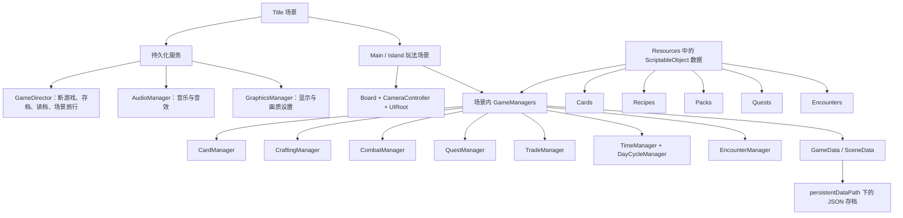

# StackCraft 模板分析与中文化说明

## 1. 结论

这是一个以“拖拽卡牌、叠放组合”为核心交互的 Unity 生存经营模板，适合制作类似卡牌堆叠、资源管理、村落发展、轻度战斗与探索结合的单机游戏。

它已经具备可运行的完整闭环，而不只是 UI 或卡牌展示样例：玩家能够开卡包、采集资源、制造物品、建设设施、养成角色、进食生存、购买和出售、完成任务、应对随机事件、战斗、保存进度，并通过配方在多个地图之间旅行。

当前工程使用 Unity `2022.3.62f3c1`、URP `14.0.12`、TextMesh Pro `3.0.7`，内置 DOTween。构建列表依次为 `Title`、`Main`、`Island`。

## 2. 这个模板可以帮你实现什么

### 已具备的玩法系统

- 卡牌拖拽、拾取、落下、自动对齐、堆叠与拆堆。
- 按卡牌类别配置堆叠规则，可限定同类或同定义卡牌才能组合。
- 数据驱动的配方制造，支持精确配方、工作站、连续生产、耐久消耗和权重随机结果。
- 探索、种植、研究和地图旅行四类特殊配方。
- 昼夜循环、每日结算、食物消耗、超出卡牌容量时强制出售。
- 卡牌商店、卡包商人、分批付款、解锁条件和收藏完成度。
- 角色、被动生物、主动敌人、仇恨追踪和自动战斗。
- 近战、远程、魔法三系克制，以及攻击、防御、速度、命中、闪避和暴击属性。
- 武器、护甲、饰品装备槽；装备可修改属性，也可触发村民转职。
- 任务链、前置条件、任务分组与多种目标类型。
- 按日期、周期、日期范围、最低日期触发的遭遇事件。
- 多存档、本地 JSON 持久化、分场景状态保存和跨地图携带卡牌。
- 分辨率、全屏、垂直同步、帧率、阴影、音乐和音效设置。
- Built-in Render Pipeline 与 URP 切换工具，以及卡牌、棋盘和背景的材质系统。

### 随包提供的示例内容

- 103 个卡牌数据资产，其中 102 个带名称的可用卡牌定义。
- 11 个卡包。
- 90 个制造/探索/种植/研究/旅行配方。
- 66 个任务。
- 3 个遭遇事件。
- `Main` 与 `Island` 两个玩法地图。

这些内容足够用来验证整套系统，但若要做成正式产品，仍需要替换美术、重做数值、扩展事件和任务，并补充产品级引导与测试。

## 3. 核心架构



### 全局层

`Title` 场景负责初始化跨场景常驻的 `GameDirector`、`AudioManager` 和 `GraphicsManager`。创建新游戏或读取存档后，`GameDirector` 再进入玩法场景。地图旅行和返回标题界面也由它统一协调。

### 场景层

`Main`、`Island` 各自拥有棋盘、镜头、UI 和一套本地 Manager。这样每个地图可以拥有不同的初始卡牌、货币、卡包、任务、遭遇和环境表现，同时共享全局存档与设置服务。

### 数据层

卡牌、配方、卡包、任务和遭遇都使用 ScriptableObject 配置。大部分新增内容不需要修改核心代码，只需要新建资产、填写引用并放入正确的 `Resources` 目录。任务和遭遇还需要在对应场景的 Manager 中登记。

## 4. 每日玩法循环

1. 玩家在当天自由拖拽卡牌，进行采集、制造、建设、交易、探索和战斗。
2. 时间结束后进入结算提示。
3. 系统按角色需要自动分配食物；没有角色存活则游戏结束。
4. 若卡牌数量超过容量上限，玩家必须出售多余卡牌。
5. `EncounterManager` 根据日期、友好模式、优先级、概率和棋盘卡牌数量选择事件。
6. 系统开始新的一天并自动保存。

这个循环已经把生存压力、空间压力和内容解锁连接起来，是模板最有价值的骨架。

## 5. 目录结构

```text
Assets/StackCraft/
├─ Scenes/                 标题、主世界、海岛场景
├─ Scripts/
│  ├─ Core/                游戏流程、时间、昼夜、输入、音频、画质、棋盘
│  ├─ Card/                卡牌实例、堆叠、物理、规则、行为与定义
│  ├─ Crafting/            配方匹配、制造任务和特殊配方
│  ├─ Combat/              战斗任务、属性、投射物和反馈 UI
│  ├─ Quest/               任务定义、实例和进度监听
│  ├─ Trading/             出售区、卡包商人与交易流程
│  ├─ Encounter/           遭遇筛选、执行和持久化
│  ├─ SaveSystem/          JSON 存档数据结构与文件读写
│  ├─ Pack/                卡包定义、卡槽与抽取逻辑
│  ├─ UI/                  标题、菜单、信息面板和游戏设置
│  ├─ Localization/        本次新增的简体中文本地化
│  └─ Editor/              自定义 Inspector 与渲染管线切换工具
├─ Resources/
│  ├─ Cards/               卡牌数据
│  ├─ Recipes/             普通和特殊配方
│  ├─ Packs/               卡包及其掉落槽
│  ├─ Quests/              任务链
│  └─ Encounters/          日期事件
├─ Prefabs/                卡牌、棋盘、交易区、UI、核心服务与特效
├─ Materials/              卡牌分类、棋盘、背景、UI 和特效材质
├─ Shaders/                卡牌叠层、描边和后处理 Shader
├─ Textures/               卡面、插画、卡包与背景贴图
├─ Models/                 卡牌、棋盘、卡包、装备面板模型
├─ Sounds/                 音乐、音效与 AudioMixer
└─ Settings/               卡牌、堆叠矩阵和 URP 设置
```

## 6. 如何扩展成自己的游戏

### 新增卡牌

在 `Create > StackCraft` 下创建卡牌或特殊卡牌资产，设置名称、描述、插画、类别、阵营、战斗类型、掉落、价格、耐久、营养、战斗属性和装备效果。卡牌定义必须位于 `Resources` 下才能被数据库自动加载。

### 新增配方

创建普通配方或探索、种植、研究、旅行配方，配置材料数量、消耗方式、结果、制作时间、是否连续生产、是否允许多余材料和随机权重。普通合成适合精确组合，工作站模式适合“建筑 + 大量材料”的连续加工。

### 新增任务

创建 Quest 资产，设置标题、说明、目标类型、目标卡牌/配方/数量和前置任务，然后把它加入目标场景 `QuestManager` 的任务组。可用目标包含拥有、获得、发现、击败、制造、出售、购买、装备、探索、时间、天数、食物、金币和容量。

### 新增事件

创建 Encounter 资产，配置提示文字、生成卡牌、数量、一次性、日期规则、优先级、概率和棋盘容量保护，再把它加入场景 `EncounterManager`。

### 新增地图

复制现有玩法场景，替换棋盘/背景/灯光，再配置本地图的初始卡牌、货币、卡包、任务和遭遇。把新场景加入 Build Settings，并用 Travel Recipe 把场景名称加入旅行环路。

## 7. 本次中文化实现

中文化采用“保留英文源数据 + 运行时中文映射”的方式，避免直接重写数百个资源资产，降低未来重新导入或升级资源商店包时的冲突。

- `ChineseLocalization.cs`：初始化中文字体回退，翻译固定 UI、场景名、任务组、配方分类和战斗类型。
- `ChineseLocalization.Cards.cs`：卡牌与卡包名称、描述。
- `ChineseLocalization.Content.cs`：配方名称、任务标题与说明、遭遇消息。
- 卡牌、配方、任务、遭遇的公开显示属性已经接入中文映射。
- 昼夜、交易、存档、设置、战斗属性、信息面板等动态文本已经改为中文。
- 全部 TextMesh Pro 文字组件和默认字体已统一替换为 `Assets/Resources/Fonts/SIMYOU SDF.asset`。运行时也会从 Resources 加载该字体并覆盖场景中的 TMP 文字组件，不再依赖玩家设备上的系统中文字体。

新增英文内容后，应在相应本地化文件中增加中文条目。没有匹配到词条时会安全回退到原英文，不影响玩法运行。

本次只处理玩家实际可见的游戏文本。代码标识符、开发者注释、自定义 Inspector 提示、第三方插件说明、许可证和原始英文 PDF 文档均保留，以便维护和查阅原厂资料。

## 8. 正式开发前应注意的风险

- `SIMYOU SDF.asset` 内嵌 8192×8192 静态图集，源文件约 138 MB，会明显增加仓库、构建包和运行时纹理内存占用；正式发布前建议按实际字库裁剪图集。
- SIMYOU 通常对应“幼圆”字体。正式发行前必须确认原字体文件与生成字体资产的再分发授权，不能仅因为已有 SDF 资产就默认具备商业发布权。
- 本地化目前是简体中文单语言映射，不是可切换的多语言系统。需要中英切换时，建议迁移到 Unity Localization 或自建表格化语言系统。
- 核心架构大量使用 Singleton 与 Manager 互相调用，便于快速开发，但大型项目中会增加耦合和测试成本。
- 内容通过 `Resources` 自动加载，内容规模很大时会增加启动和内存压力，届时可迁移到 Addressables。
- 存档是未加密的本地 JSON，便于调试但容易被修改；正式产品可增加版本号、迁移、校验和备份机制。
- 配方旅行依赖场景名称字符串；场景改名时必须同步更新 Travel Recipe。
- 卡牌、配方和任务依赖稳定 ID；上线后不要随意重建或更换 ID，否则旧存档可能失效。
- 当前交互主要面向鼠标和单人单视口，移动端、手柄、多人联机都需要额外适配。
- 模板美术与音频含第三方许可内容，发布前应再次核对 `Third Party Notices.txt` 和商店授权范围。

## 9. 运行入口

打开工程后直接进入 Play Mode。随包的编辑器启动脚本会确保从 `Title` 场景开始。选择“新游戏”后设置每日时长与友好模式，随后进入 `Main` 场景。也可以从标题界面读取已有 JSON 存档。
